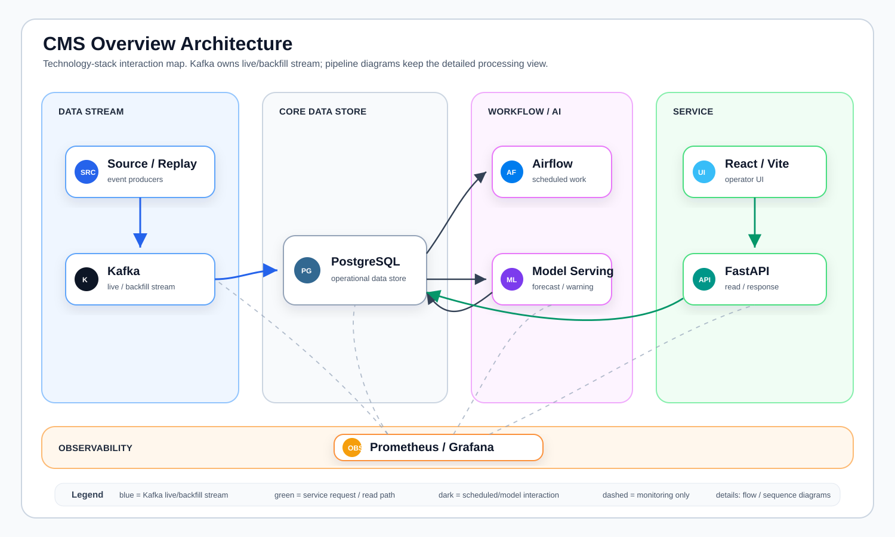

# CMS

CMS는 건물·설비의 계량 데이터를 운영자가 신뢰할 수 있는 상태 정보, 점검 후보, 보고서, 예측·경고로 활용할 수 있게 만드는 에너지 운영 지원 시스템입니다. 데이터 신뢰성, 실행 경계, 서비스 화면, 모델 서빙을 하나의 코드베이스와 명세로 연결합니다.



## Goals & Scope

CMS의 목표는 계량 데이터가 단순히 저장되는 수준을 넘어, 운영자가 에너지 사용 현황과 설비 이상 징후를 판단할 수 있는 근거 있는 서비스로 만드는 것입니다. 프로젝트는 데이터 수집, 품질 검증, 승인된 관측 데이터 관리, 모델 서빙, 보고서와 대시보드를 하나의 운영 흐름으로 묶습니다.

프로젝트가 해결하려는 핵심 문제는 다음과 같습니다.

- 여러 원천에서 들어오는 계량 시계열을 같은 기준으로 정리하고, 누락·품질·출처를 함께 기록합니다.
- 운영자가 어떤 값이 관측 사실이고 어떤 값이 예측·경고 산출물인지 구분할 수 있게 합니다.
- 에너지 사용량, 피크, 이상 징후, 점검 후보를 대시보드와 보고서에서 바로 확인할 수 있게 합니다.
- P-Max와 이상 감지 결과를 `canonical` 관측 데이터와 분리해 `mart`, `ops`, `qa` 경계에 근거와 함께 보관합니다.
- 팀원이 실행 구조, 데이터 계약, 배포 단위, 모델 artifact 경계를 저장소만 보고 추적할 수 있게 합니다.

이 저장소의 범위는 CMS source archive와 팀 공유용 설계 명세입니다. 운영 credential, 서버별 실제 `.env`, 대용량 모델 binary artifact는 포함하지 않고, `env/*.env.example`과 `artifacts/manifests/`로 필요한 계약만 남깁니다.

## Core Capabilities

- Kafka live/backfill stream과 소비자 멱등 처리 계약
- PostgreSQL `live`, `canonical`, `mart`, `ops`, `qa`, `reference` 스키마 경계
- Live rollup, bucket queue, promotion check, canonical promotion Worker
- P-Max와 이상 감지 모델 서빙 Scheduler, 산출물, 검증 근거 기록
- FastAPI 기반 ingestion, backend, model-ops API surface
- React/Vite 기반 운영 대시보드 frontend source
- Airflow DAG 기반 일간·주간·월간 보고서와 coverage QA workflow
- Grafana/Prometheus provisioning source
- Ontology, Graphify, RAG/knowledge source contract
- Mermaid/SVG 기반 architecture diagram source와 render set

## System Architecture

CMS는 데이터 처리 영역, 서비스 응답 영역, 작업 실행 영역, 운영 관측 영역을 분리합니다.



| 영역 | 책임 | 주요 구성 |
| --- | --- | --- |
| 데이터 처리 영역 | source event, Kafka event, PostgreSQL 상태 전이, QA evidence, canonical fact, mart output 관리 | Kafka, `live`, `canonical`, `mart`, `ops`, `qa`, `reference` |
| 서비스 응답 영역 | API 응답, 읽기 전용 조회, 보고서/RAG/예측 응답, frontend/dashboard surface 제공 | FastAPI, backend API, frontend, Grafana |
| 작업 실행 영역 | 예약 작업, 장시간 Worker, report generation, model-serving, 선택적 review workflow 관리 | Airflow, Scheduler, Worker container, LangGraph review |
| 운영 관측 영역 | Kafka lag, DB freshness, Worker heartbeat, exporter metric, dashboard panel 관리 | Prometheus, Grafana, exporters, `ops.worker_heartbeat` |

### Runtime Topology



| 구역 | 역할 | 주요 구성 |
| --- | --- | --- |
| PC1 | live/backfill stream, backend API, frontend, rollup, peak feature, canonical promotion, Airflow | `cms-ingestion-api`, `cms-backend-api`, `cms-agent-frontend`, Kafka consumer, rollup Worker, promotion Worker, Airflow |
| PC2 | 운영 관측 stack | `cms-grafana`, `cms-prometheus`, Kafka/node exporters |
| PC3 | model-serving과 MLOps 제어 | `pmax_scheduler`, `anomaly_scheduler`, `cms-model-ops-api`, `cms-anomaly-feature-worker`, exporters |
| AWS PostgreSQL | 운영 DB와 실행 상태 장부 | `cms` DB, TimescaleDB, `live`, `canonical`, `mart`, `ops`, `qa`, `reference` schemas |

## Data Platform Design

기본 데이터 흐름은 다음과 같습니다.

```text
Source / Replay Producer
-> Kafka measurement_live_v1 또는 measurement_backfill_v1
-> Kafka consumer
-> PostgreSQL live.measurement_event
-> live 집계 후보 / bucket queue / promotion check
-> canonical.measurement_* 또는 mart.*
-> API / Dashboard / Report / RAG Consumer
```



핵심 schema boundary는 다음 기준으로 분리합니다.

| Schema | 역할 | 대표 table |
| --- | --- | --- |
| `live` | 수집 이벤트 원장, live 집계 후보, 처리 queue, promotion check | `measurement_event`, `measurement_1min`, `measurement_15min`, `measurement_1h`, `bucket_queue`, `promotion_check` |
| `canonical` | 검증 및 승인 완료 관측 사실 데이터 | `measurement_1min`, `measurement_15min`, `measurement_1h` |
| `mart` | model-serving 입력/산출물 및 분석 mart | `peak_feature_15min`, `pmax_forecast_15min`, `anomaly_feature_1h`, `anomaly_warning_1h` |
| `ops` | worker 상태, 시스템 이벤트, 추론 로그, 보고서 메타데이터 | `worker_heartbeat`, `worker_event_log`, `pmax_log`, `anomaly_log`, `daily_report`, `weekly_report`, `monthly_report` |
| `qa` | 데이터 품질, 모델 평가, serving evidence | `bad_row`, `live_issue`, `pmax_eval`, `anomaly_eval`, `serving_evidence` |
| `reference` | 보정 및 재샘플링 기준 데이터 | `corrected_resampled_15min`, `corrected_resampled_1h` |

## Workflow and Model-Serving Design

장시간 작업은 API 요청 경로에서 직접 처리하지 않고 Airflow, scheduler, worker container가 비동기로 수행합니다.



| Workflow | 입력 | 출력 |
| --- | --- | --- |
| Replay/backfill | source archive, replay window, Kafka topic | `live.measurement_event`, replay lineage |
| Rollup | `live.measurement_event`, `live.bucket_queue` | `live.measurement_15min`, `live.measurement_1h` |
| Promotion | `live.promotion_check`, approval boundary | `canonical.measurement_*` |
| P-Max | `mart.peak_feature_15min` | `mart.pmax_forecast_15min`, `ops.pmax_log`, `qa.pmax_eval` |
| Anomaly | `mart.anomaly_feature_1h` | `mart.anomaly_warning_1h`, `ops.anomaly_log`, `qa.anomaly_eval` |
| Report | QA evidence, canonical/mart state, report context | daily/weekly/monthly report artifact and status |

LangGraph는 동기 chat path가 아니라 async review, QA recommendation, approval recommendation, report draft review 경계에서 선택적으로 사용합니다.



## Application Surface



- `src/cms/service/` — FastAPI application factory, routers, response contracts
- `src/frontend/` — React/Vite frontend dashboard source
- `src/cms/data/` — live processing, database adapter, equalization, promotion, sink logic
- `src/cms/workflow/` — Airflow interface, report workflow, LangGraph adapter, scheduler guard
- `src/cms/modeling/` — P-Max, anomaly, model artifact, model-ops logic
- `src/cms/ontology/` — ontology schema source and domain mapping helpers

## Tech Stack

| 영역 | 기술 |
| --- | --- |
| Language | Python, JavaScript |
| API | FastAPI, Pydantic |
| Frontend | React, Vite, Recharts |
| Stream | Kafka |
| Database | PostgreSQL, TimescaleDB, pgvector |
| Workflow | Airflow, scheduler worker, LangGraph |
| Observability | Grafana, Prometheus, exporters |
| Container | Docker, Docker Compose |
| Model-serving | LightGBM/CatBoost/LSTM artifact contract, P-Max, anomaly serving pipeline |
| Knowledge | Ontology TTL/OWL, Graphify, RAG/knowledge source contracts |

## Repository Structure

```text
artifacts/              External model artifact manifests and placeholder contract
configs/                Grafana and Prometheus provisioning source
dags/                   Airflow DAG definitions
docs/                   Architecture specs, diagrams, ontology, plan evidence
env/                    Non-secret .env.example templates
scripts/                Operations, database, serving, stream, verification CLI tools
src/cms/                CMS Python package
src/frontend/           React/Vite frontend source
stacks/                 Compose bundles, Dockerfile/Containerfile, stack requirements
requirements.txt        Shared Python dependency set
```

## Quick Start

이 저장소는 concrete runtime secret을 포함하지 않습니다. 실행 환경에서는 필요한 `.env.example`을 복사해 서버별 실제 값을 채운 뒤 compose bundle을 선택합니다.

```bash
# Python source syntax validation example
PYTHONDONTWRITEBYTECODE=1 python3 -m compileall -q src scripts dags

# Frontend build example
cd src/frontend
npm install
npm run build
```

Compose render는 bundle별 env contract를 채운 뒤 확인합니다.

```bash
# Example only: use a non-secret render env or server-local env file
docker compose --env-file env/compose_render.env.example -f stacks/workflow/airflow.yml config
```

## Key Documents

- [CMS Spec Overview](docs/specs/overview.md)
- [Runtime Architecture](docs/specs/runtime.md)
- [Data Platform Contract](docs/specs/data_platform.md)
- [Database Contract](docs/specs/database.md)
- [Ontology Contract](docs/specs/ontology.md)
- [Diagram Index](docs/diagrams/readme.md)

## Diagram Index

| View | Source | Render |
| --- | --- | --- |
| Overall pipeline | [flow/00_overall.mmd](docs/diagrams/flow/00_overall.mmd) | [flow/00_overall.svg](docs/diagrams/flow/00_overall.svg) |
| DB live/canonical flow | [flow/01_db.mmd](docs/diagrams/flow/01_db.mmd) | [flow/01_db.svg](docs/diagrams/flow/01_db.svg) |
| Runtime topology | [flow/02_runtime.mmd](docs/diagrams/flow/02_runtime.mmd) | [flow/02_runtime.svg](docs/diagrams/flow/02_runtime.svg) |
| Workflow/Airflow | [flow/03_airflow.mmd](docs/diagrams/flow/03_airflow.mmd) | [flow/03_airflow.svg](docs/diagrams/flow/03_airflow.svg) |
| LangGraph review | [flow/04_graph.mmd](docs/diagrams/flow/04_graph.mmd) | [flow/04_graph.svg](docs/diagrams/flow/04_graph.svg) |
| App/service | [flow/05_app.mmd](docs/diagrams/flow/05_app.mmd) | [flow/05_app.svg](docs/diagrams/flow/05_app.svg) |
| Live pipeline ERD | [erd/live_contract.dbml](docs/diagrams/erd/live_contract.dbml) | dbdiagram.io source |
| Stack overview | SVG source | [stack/overview.svg](docs/diagrams/stack/overview.svg) |

## Safety Boundary

- Concrete secrets, private keys, server-only `.env`, runtime logs, caches, generated build outputs, and large model binaries are excluded.
- `artifacts/external/` contains only placeholder guidance in Git; model payloads are externalized.
- Canonical writes, production DDL, deployment/restart, and DB mutation are controlled runtime operations and are not performed by importing this repository.
- `ALLOW_CANONICAL_WRITE`, `ALLOW_MODEL_SERVING_WRITE`, and `ALLOW_PRODUCTION_DDL` default to closed/disabled values in stack templates.

## License

Internal project.
