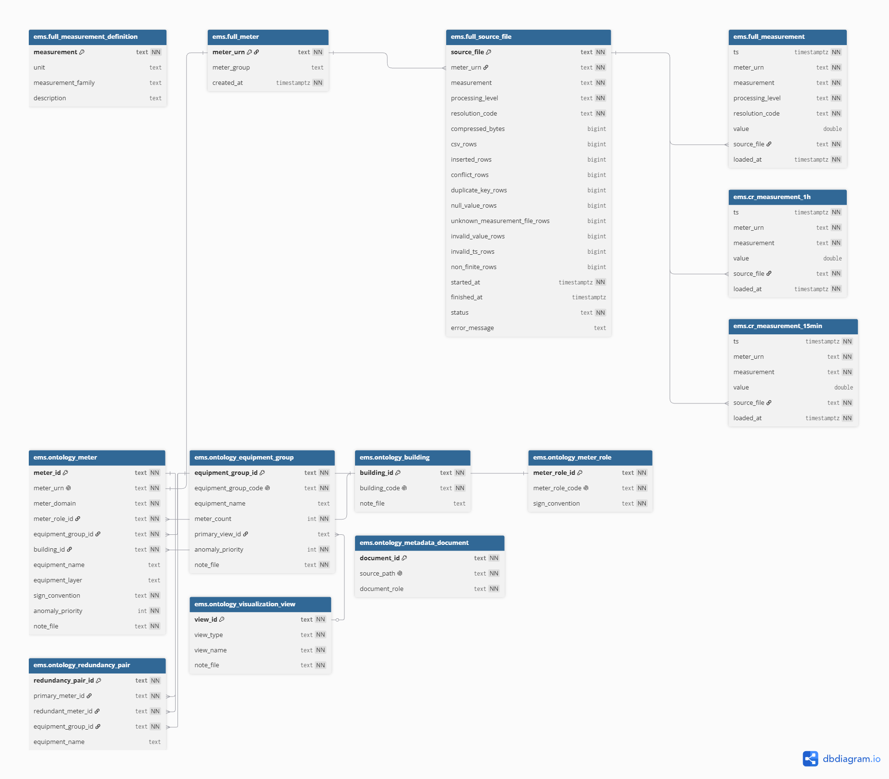

# SKN25-FINAL-4Team

## EMS 기반 FEMS 데이터 인사이트 프로젝트

본 저장소는 공개 EMS 계측 데이터를 PostgreSQL/TimescaleDB 중심으로 적재·정규화하고, FEMS 관점의 피크 위험 예측, 계량기 품질 검증, 설비 이상 후보 탐지, 에너지 비용 proxy 분석, LLM 기반 운영 지원 가능성을 검증하는 팀 프로젝트입니다.

분석 대상 데이터는 독일 Offenbach am Main 소재 Honda R&D Europe 시설의 스마트 빌딩 EMS 공개 데이터셋입니다. 데이터는 전력, 열·냉방, PV·CHP 발전, 기상, 계량기별 부하 시계열을 포함하며, 한국 제조업 FEMS 적용 가능성을 검증하기 위한 실증용 proxy로 사용합니다.

---

## 1. 프로젝트 목표

| 영역 | 목표 |
|---|---|
| 데이터 기반 | EMS 원천 데이터를 PostgreSQL/TimescaleDB `ems` schema에 적재하고 분석 기준 relation을 정리합니다. |
| 계량기 metadata | 81개 계량기 URN을 domain, role, equipment group, building, redundancy, sign convention 기준으로 정규화합니다. |
| EDA | regime 변화, measurement 관계, redundancy pair, 품질 lineage를 점검합니다. |
| 예측 모델 | 1시간 단위 A-clean target을 기준으로 baseline, LSTM, SVR, Huang2022 계열 모델을 비교합니다. |
| 이상탐지 | 계량기·데이터 품질 issue를 먼저 분리하고, 설명되지 않는 residual을 설비 운영·점검 후보로 검토합니다. |
| FEMS 인사이트 | site-level 피크 위험, 동시 고부하 설비군, PV·CHP 발전 상쇄, 비용 proxy를 분리해 해석합니다. |
| 운영 지원 | 분석 결과를 보고서, 발표 자료, 대화형 질의·요약 흐름으로 연결합니다. |

---

## 2. 기준 데이터

| 항목 | 내용 |
|---|---|
| 데이터셋 | Smart company building EMS optimization and machine learning용 실측 에너지 관리 데이터셋 |
| 논문 | Scientific Data 2025, DOI `10.1038/s41597-025-05186-3` |
| 데이터 저장소 | Dryad DOI `10.5061/dryad.73n5tb363` |
| 수집 시설 | Honda R&D Europe, Offenbach am Main, Germany |
| 수집 기간 | 2018-01-01 00:00 GMT+1 ~ 2024-01-01 00:00 GMT+1 |
| 로컬 시간대 | Europe/Berlin |
| 계측 범위 | 전력, 열·냉방, PV, CHP, 기상 |
| 계량기 수 | 81개 URN |
| 분석 기준 저장소 | PostgreSQL/TimescaleDB `ems` schema |

분석 grain은 다음 조합을 기준으로 둡니다.

```text
(ts, meter_urn, measurement, resolution_code)
```

주요 분석 해상도는 `15min`, `1h`입니다. 모델링 실험은 주로 `1h` A-clean target을 사용합니다.

---

## 3. 데이터베이스 구조

프로젝트의 기준 원천은 PostgreSQL/TimescaleDB `ems` schema입니다. 원천 CSV 파일은 재적재와 계보 검증용으로 사용하고, 분석 코드는 DB relation과 승인된 mart/view를 조회합니다.



### 주요 relation

| 계층 | Relation | 역할 |
|---|---|---|
| Registry | `ems.full_meter` | 계량기 URN registry |
| Dictionary | `ems.full_measurement_definition` | measurement code, unit, family, description 관리 |
| Source audit | `ems.full_source_file` | source file 단위 load metadata와 품질 counter |
| Metadata | `ems.meter_definition` | 계량기 domain, role, group, building, sign convention |
| Metadata | `ems.meter_redundancy` | primary/redundant 계량기 pair |
| Metadata | `ems.meter_hardware_model` | 계량기 하드웨어 모델 vocabulary |
| Metadata | `ems.meter_hardware_assignment` | 계량기별 하드웨어 모델 매핑 |
| Fact | `ems.full_measurement` | processing level과 resolution을 포함하는 canonical fact table |
| Mart | `ems.cr_measurement_1h` | corrected/resampled 1시간 분석 mart |
| Mart | `ems.cr_measurement_15min` | corrected/resampled 15분 분석 mart |
| View | `ems.cr_measurement_all` | 1h/15min CR mart union view |
| View | `ems.cr_measurement_with_metadata` | CR mart와 measurement dictionary 결합 view |

---

## 4. 분석 흐름

```text
EMS source files
  → PostgreSQL/TimescaleDB ems schema
  → corrected/resampled mart
  → metadata / redundancy / ontology validation
  → EDA / feature build / target build
  → forecasting / anomaly validation / FEMS scenario analysis
  → reports / presentation / LLM 운영 지원 후보
```

### 처리 계층

| 단계 | 의미 | 분석 사용 기준 |
|---|---|---|
| `raw` | 원시 수집값 | 원인 추적, 보정 전 상태 확인 |
| `harmonized` | 명칭, 단위, 부호 규약 정합화 | 처리 계보 확인 |
| `corrected` | issue 보정과 시간 정렬 반영 | 보정 후 native 시계열 확인 |
| `corrected_resampled` | 등간격 리샘플링 | 기본 분석 후보 |

### 모델링 split

| 구간 | 용도 |
|---|---|
| 2018-2021 | train |
| 2022 | validation |
| 2023 | test |

모델 평가는 시간 순서를 보존합니다. feature fit은 학습 구간으로 제한하고, live replay 원칙에 따라 미래 tick 정보가 feature에 들어가지 않도록 관리합니다.

---

## 5. 저장소 구조

```text
SKN25-FINAL-4Team/
├── README.md
├── pyproject.toml
├── requirements.txt
├── docker-compose.yml
├── docker/
│   └── Dockerfile
├── docs/
│   ├── specs/              # 프로젝트 기준 명세
│   ├── reference/          # 도메인 개념 및 정책 맥락 참조
│   └── ontology/           # RDF/OWL/SHACL ontology artifact
├── images/                 # README 및 공유 문서용 이미지
├── notebooks/
│   ├── H1.Z16/             # 계량기별 EDA notebook
│   └── overview/           # overview EDA notebook
├── reports/                # 분석·발표·모델링 결과 문서
├── scripts/
│   ├── ontology/           # ontology 생성·검증·질의
│   ├── modeling/           # target build 및 forecasting 실험
│   ├── insights/           # FEMS/이상탐지 insight 분석
│   └── reporting/          # 보고서 후처리
└── src/
    └── ems/                # 재사용 가능한 EMS helper 모듈
```

### Git 추적 기준

| 경로 | 기준 |
|---|---|
| `docs/specs/`, `docs/reference/`, `docs/ontology/` | 공유 기준 문서 및 ontology artifact |
| `notebooks/` | 공유 가능한 EDA notebook. checkpoint는 제외 |
| `reports/` | Markdown/HTML 중심 결과 문서. zip 등 패키지 파일은 제외 |
| `scripts/` | 재실행 가능한 분석·모델링·ontology 코드 |
| `outputs/figures/energy_flow/`, `outputs/tables/profiling/` | dev 기준 선별 산출물 허용 |
| `outputs/modeling/`, `outputs/runpod/`, `outputs/logs/` | 대량 재생성 산출물로 Git 제외 |
| `.env`, `.venv`, `data/`, `**/_archive/`, `HERMES.md` | 로컬 환경·원천·보존 자료로 Git 제외 |

---

## 6. 주요 분석 영역

### 6.1 EDA

- regime 변화 후보와 계절성 확인
- 전력, 열·냉방, PV·CHP, 기상 measurement 관계 점검
- redundancy pair의 상관, MAE, 부호 일관성 검증
- source file load balance와 품질 lineage 점검

### 6.2 예측 모델링

- A-clean 1h target 생성
- baseline, LSTM, SVR, Huang2022 계열 모델 비교
- 1h, 24h, 168h horizon 실험
- target별 RMSE/MAE와 residual pattern 비교

### 6.3 이상탐지 및 FEMS 인사이트

- 계량기 물리 범위와 데이터 품질 issue 분리
- 알려진 issue, zero/gap, meter replacement, redundancy mismatch 확인
- 계량기 issue로 설명되지 않는 residual을 설비 점검 후보로 분류
- grid boundary peak, building/equipment contribution, PV·CHP 발전 상태 분리 해석
- 비용 해석은 Netzentgelt proxy, total electricity bill benchmark, demand charge, energy charge를 구분

---

## 7. 실행 환경

### Python

```bash
python --version
# Python 3.12 권장
```

### 의존성 설치

```bash
python -m venv .venv
source .venv/bin/activate
pip install -r requirements.txt
```

RunPod CUDA image에서는 `torch`, `torchvision`, `torchaudio`를 image 기본 제공 패키지로 관리합니다. 공통 `requirements.txt`에는 CUDA stack을 덮어쓰는 PyTorch wheel을 포함하지 않습니다.

### Docker compose 검증

```bash
docker compose config --quiet
```

---

## 8. 검증 명령

### Python syntax check

```bash
python - <<'PY'
from pathlib import Path
for base in ['scripts', 'src']:
    for path in Path(base).rglob('*.py'):
        if '__pycache__' in path.parts or '_archive' in path.parts:
            continue
        compile(path.read_text(encoding='utf-8'), str(path), 'exec')
print('syntax ok')
PY
```

### Ontology artifact 생성 및 검증

```bash
uv run --with rdflib --with pyshacl --with 'psycopg[binary]' --with python-dotenv \
  python scripts/ontology/generate_ontology.py

uv run --with rdflib --with pyshacl \
  python scripts/ontology/validate_ontology.py

uv run --with rdflib --with pyshacl \
  python scripts/ontology/query_ontology.py
```

기준 검증 결과는 다음 조건을 만족해야 합니다.

```text
triples = 3006
meters = 81
equipment_groups = 17
redundancy_pairs = 12
hardware_assignments = 81
SHACL conforms = True
```

---

## 9. 주요 문서

| 경로 | 내용 |
|---|---|
| `docs/specs/프로젝트_개요.md` | 목적, 기준 데이터, 분석 범위, live replay 원칙 |
| `docs/specs/데이터_계약.md` | 분석 입력 grain, timestamp, 품질 기준, 저장소 경계 |
| `docs/specs/데이터베이스_구조.md` | `ems` schema relation, column, index, function 기준 |
| `docs/specs/계량기_메타데이터.md` | meter classification, equipment group, redundancy, sign convention |
| `docs/specs/피처_명세.md` | feature 입력, naming, redundancy 처리, live replay 누수 방지 |
| `docs/specs/온톨로지_스키마.md` | ontology class/property/artifact coverage 기준 |
| `docs/reference/도메인_개념.md` | EMS 전기 measurement와 전력 개념 참조 |
| `reports/eda_summary/report.md` | overview EDA 요약 |
| `reports/midterm_presentation/slide_script.md` | 발표 흐름 및 대본 |

---

## 10. 보안 및 운영 경계

1. `.env`, DB password, SSH key, token은 Git에 커밋하지 않습니다.
2. DB write, destructive SQL, 대용량 적재 작업은 명시적 승인 후 실행합니다.
3. 로컬 `data/` 디렉터리는 Git 추적 대상에서 제외합니다.
4. `outputs/modeling/`, `outputs/runpod/`는 재생성 가능한 대량 산출물로 관리합니다.
5. 비용 관련 해석은 공식 tariff 확정값, Netzentgelt proxy, Eurostat total-bill benchmark, 임의 threshold를 구분합니다.
6. PV, CHP, grid import/export, reverse flow, generation status는 해석 층위별로 분리합니다.

---

## 11. 현재 산출 방향

- EMS DB 구조와 계량기 metadata를 기준으로 분석 계약을 고정합니다.
- A-clean 1h target 기반 예측 실험을 문서화합니다.
- 피크 위험, 설비군 동시 고부하, 계량기 품질 issue를 분리합니다.
- 발표 자료와 보고서를 통해 FEMS 데이터 인사이트 서비스의 적용 가능성을 정리합니다.
