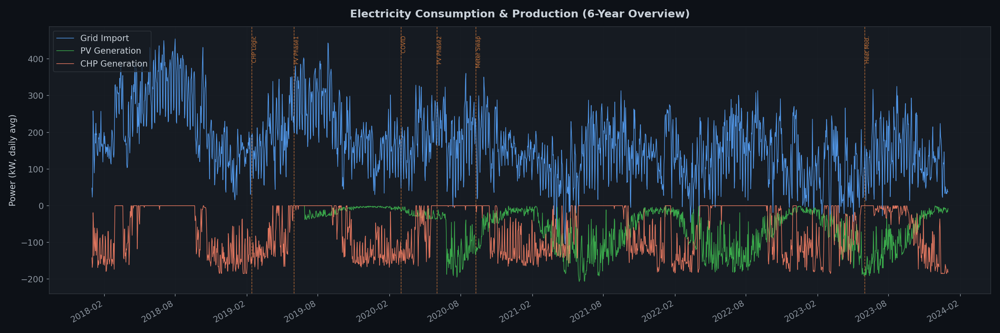
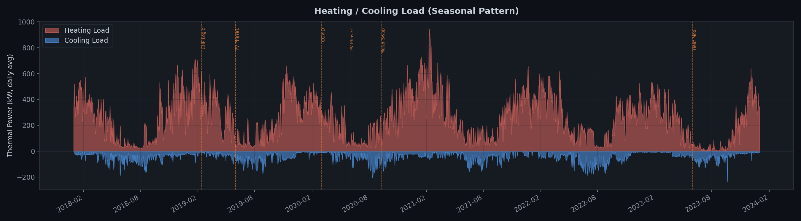
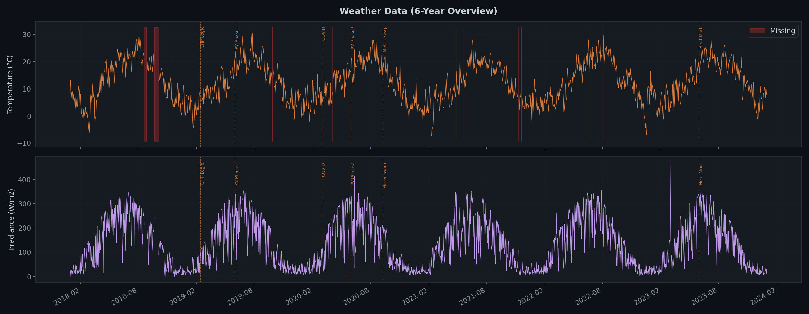
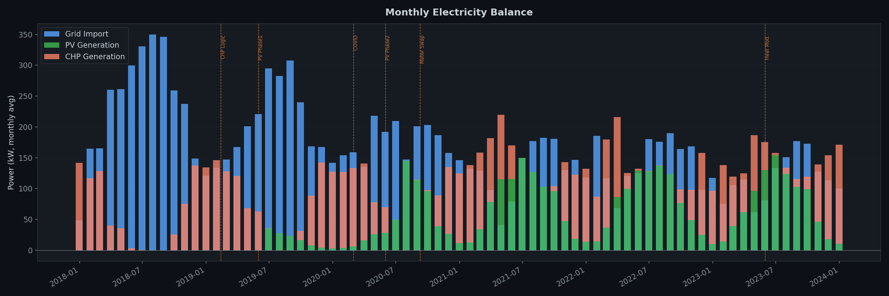
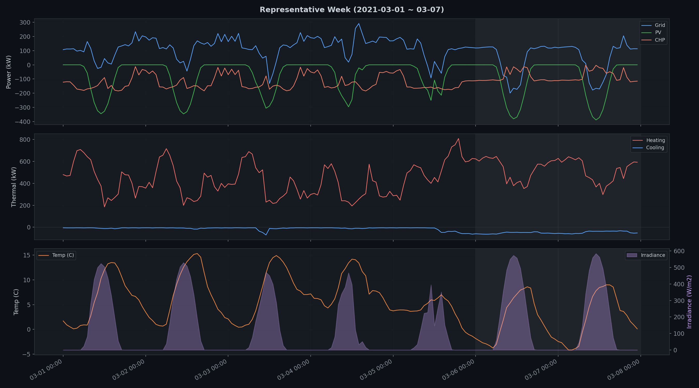
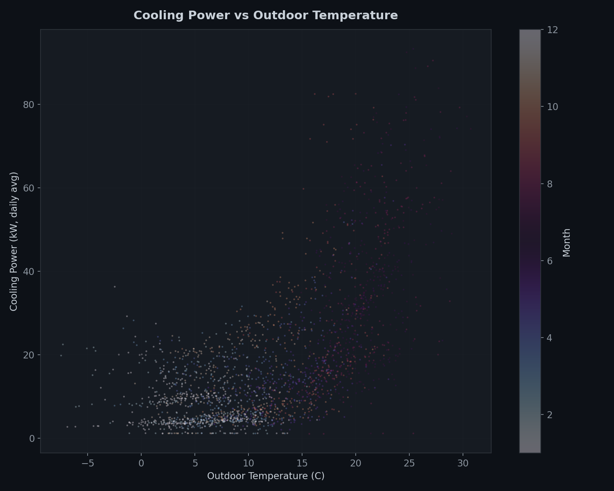

# 🏢 스마트 건물 에너지 관리 시스템 (EMS)

> Honda R&D Europe 시설의 6년간 에너지 데이터를 분석하여, AI 기반 에너지 관리 플랫폼을 구축하기 위한 프로젝트

[](https://doi.org/10.1038/s41597-024-04263-x)
[](https://www.timescale.com/)
[](https://www.python.org/)

---

## 📋 프로젝트 개요

독일 Offenbach에 위치한 Honda R&D Europe 시설의 **81개 계량기 × 6년(2018~2024)** 에너지 데이터를 기반으로:

1. **데이터 프로파일링** — 전수 품질 진단 및 결측/이상 패턴 파악
2. **에너지 흐름 시각화** — 전기/난방/냉방/기상 데이터의 거시적 패턴 검증
3. **AI 에이전트 플랫폼** — Text-to-SQL 대화형 분석, 이상 탐지, 자동 리포팅 (예정)

### 기준 논문

> Gruner et al., *"Six years of multi-modal energy monitoring data from a commercial building in Germany"*  
> Scientific Data, 2025 — [DOI](https://doi.org/10.1038/s41597-024-04263-x)

---

## 🔍 핵심 발견 (Key Findings)

| 항목 | 내용 |
|------|------|
| **데이터 완결성** | 에너지 미터 결측률 **0.03%** — 보정 파이프라인이 Gap을 과거 데이터 복사로 채움 |
| **기상 데이터 결측** | 기상 관측소만 **2.35% 결측** (2018년 7.11%로 집중) |
| **설비 Regime 변화** | 6년간 **6회 주요 변경** (PV 설치/증설, CHP 로직, COVID, 계량기 교체, 난방 현대화) |
| **냉각-기온 상관** | 외기온 10°C 이상부터 냉각 전력 비선형 증가 — 예측 모델 핵심 피처 |
| **자체 발전 증가** | PV Phase2(2020-06) 이후 Grid 의존도 감소 추세 |

---

## 📊 에너지 흐름 시각화

6년간의 건물 에너지 흐름을 6개 차트로 시각화했습니다.

<table>
<tr>
<td><b>전기 소비/생산 6년 추이</b><br></td>
<td><b>난방/냉방 계절 패턴</b><br></td>
</tr>
<tr>
<td><b>기상 데이터 (기온+일사량)</b><br></td>
<td><b>월별 전기 에너지 수지</b><br></td>
</tr>
<tr>
<td><b>대표 주간 상세 (2021-03)</b><br></td>
<td><b>냉각 전력 vs 외기온 상관</b><br></td>
</tr>
</table>

> 📄 상세 해석: [`docs/분석_기획/05_에너지_흐름_시각화.md`](docs/분석_기획/05_에너지_흐름_시각화.md)

---

## 📁 프로젝트 구조

```
EMS/
├── docs/
│   ├── 분석_기획/                          # 분석 및 기획 문서
│   │   ├── 00_진행현황.md                  #   전체 현황 요약 (인덱스)
│   │   ├── 01_데이터_분석_전략.md           #   분석 3대 원칙 & Regime 분할
│   │   ├── 02_기획서_갭분석.md              #   기획서 vs 현재 자산 갭 분석
│   │   ├── 03_프로파일링_결과.md            #   81개 미터 품질 진단 리포트
│   │   ├── 04_뷰생성_및_보완_결과.md        #   Reduced View & DWD 보완
│   │   ├── 05_에너지_흐름_시각화.md         #   6개 차트 해석 리포트
│   │   ├── 06_계량기별_상세_분석.md         #   개별/그룹 미터 심층 분석 리포트
│   │   ├── EMS_데이터_분석_보고서.html      #   종합 분석 보고서 (최종 발표용)
│   │   └── report_style.css                #   보고서용 CSS 스타일
│   ├── paper.pdf                           # 기준 논문 원본
│   └── 스마트 건물 에너지...기획서.md       # AI 플랫폼 기획서
│
├── scripts/
│   ├── profiling/
│   │   ├── meter_profiling.py              # 81개 미터 전수 프로파일링
│   │   ├── visualize_energy_flow.py        # 에너지 흐름 시각화 (6개 차트)
│   │   └── generate_report_html.py         # 마크다운 → HTML 변환 스크립트
│   └── ingest/
│       ├── sql/reduced_view.sql            # Reduced 합산 뷰 DDL
│       └── dwd_weather_ingest.py           # DWD 기상 데이터 보완
│
├── outputs/
│   ├── figures/energy_flow/                # 시각화 차트 PNG (6개)
│   └── profiling/                          # 프로파일링 CSV (6개)
│
└── README.md
```

---

## 🗄️ 데이터 아키텍처

```
┌─────────────────────────────────────────────────┐
│              TimescaleDB (PostgreSQL)            │
├─────────────────────────────────────────────────┤
│  Registry Layer                                  │
│    full_meter (81개 미터 메타데이터)              │
│                                                  │
│  CR Mart Layer                                   │
│    cr_measurement_15min (15분 해상도)             │
│    cr_measurement_1h    (1시간 해상도)            │
│                                                  │
│  Reduced Layer (신규 생성)                        │
│    reduced_measurement_15min  ← 범주별 합산 뷰   │
│    reduced_measurement_1h     ← 범주별 합산 뷰   │
│      ├── electricity (total/pv/chp/...)          │
│      ├── heating (total/gas_boiler/chp/...)      │
│      ├── cooling (total/chiller/...)             │
│      └── weather (Ta/Igm/...)                    │
└─────────────────────────────────────────────────┘
```

---

## 🚀 실행 방법

### 사전 요구사항

- Python 3.11+
- Docker (TimescaleDB 컨테이너)
- [uv](https://github.com/astral-sh/uv) 패키지 매니저

### 프로파일링 실행

```bash
# 81개 미터 전수 프로파일링
uv run --with pandas --with "psycopg[binary]" --with python-dotenv \
  python scripts/profiling/meter_profiling.py

# 에너지 흐름 시각화 (6개 차트 생성)
uv run --with pandas --with "psycopg[binary]" --with python-dotenv --with matplotlib \
  python scripts/profiling/visualize_energy_flow.py
```

### Reduced View 생성 (DB)

```bash
# TimescaleDB에 합산 뷰 생성
psql -h localhost -U ems -d ems -f scripts/ingest/sql/reduced_view.sql
```

### 환경 변수 (.env)

```env
DB_HOST=localhost
DB_PORT=5432
DB_NAME=ems
DB_USER=ems
DB_PASSWORD=<your_password>
```

---

## 📈 진행 현황

| Phase | 작업 | 상태 |
|-------|------|------|
| **Phase 0** | 데이터 프로파일링 (81개 미터 전수) | ✅ 완료 |
| **Phase 1** | Reduced 합산 뷰 생성 | ✅ 완료 |
| **Phase 1** | 에너지 흐름 시각화 검증 (6개 차트) | ✅ 완료 |
| **Phase 1** | DWD 기상 데이터 보완 스크립트 | ✅ 완료 |
| **Phase 2** | Text-to-SQL 에이전트 개발 | 🔜 예정 |
| **Phase 3** | 역률/비용 최적화 | 🔜 예정 |
| **Phase 4** | 이상 탐지 모델링 | 🔜 예정 |
| **Phase 5** | 자동 리포팅 | 🔜 예정 |

> 📄 상세: [`docs/분석_기획/00_진행현황.md`](docs/분석_기획/00_진행현황.md)

---

## 👥 Team

**SKN25-FINAL-4Team**

---

## 📚 참고 자료

- [Honda R&D Energy Dataset (Scientific Data, 2025)](https://doi.org/10.1038/s41597-024-04263-x)
- [TimescaleDB Documentation](https://docs.timescale.com/)
- [DWD Climate Data Center](https://opendata.dwd.de/climate_environment/CDC/)