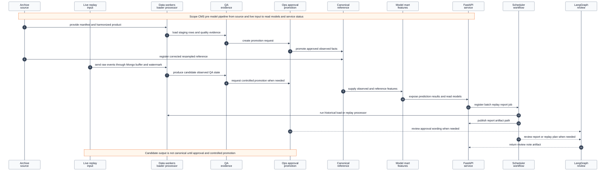

```mermaid
%%{init: {"theme": "base", "sequence": {"showSequenceNumbers": true, "wrap": false, "mirrorActors": true, "rightAngles": true, "messageAlign": "center", "actorMargin": 70, "width": 180, "height": 52, "boxMargin": 12, "boxTextMargin": 6, "noteMargin": 10, "messageMargin": 42}, "themeVariables": {"background": "#ffffff", "mainBkg": "#ffffff", "primaryColor": "#f8fafc", "primaryBorderColor": "#64748b", "primaryTextColor": "#0f172a", "actorBkg": "#f8fafc", "actorBorder": "#64748b", "actorTextColor": "#0f172a", "actorLineColor": "#64748b", "signalColor": "#334155", "signalTextColor": "#0f172a", "noteBkgColor": "#fff7ed", "noteTextColor": "#0f172a", "noteBorderColor": "#ea580c", "loopTextColor": "#0f172a", "activationBkgColor": "#e0f2fe", "activationBorderColor": "#0284c7", "fontFamily": "Arial, sans-serif", "fontSize": "15px"}} }%%
sequenceDiagram
    autonumber
    participant A as Archive<br/>source
    participant L as Live replay<br/>input
    participant D as Data workers<br/>loader processor
    participant Q as QA<br/>evidence
    participant O as Ops approval<br/>promotion
    participant C as Canonical<br/>reference
    participant M as Model mart<br/>features
    participant API as FastAPI<br/>service
    participant W as Scheduler<br/>workflow
    participant G as LangGraph<br/>review

    Note over A,API: Scope CMS pre model pipeline from source and live input to read models and service status
    A->>D: provide manifest and harmonized product
    D->>Q: load staging rows and quality evidence
    Q->>O: create promotion request
    O->>C: promote approved observed facts
    A->>C: register corrected resampled reference

    L->>D: send raw events through Mongo buffer and watermark
    D->>Q: produce candidate observed QA state
    Q->>O: request controlled promotion when needed

    C->>M: supply observed and reference features
    M->>API: expose prediction results and read models
    API->>W: register batch replay report job
    W->>D: run historical load or replay processor
    W->>API: publish report artifact path

    O-->>G: review approval wording when needed
    W-->>G: review report or replay plan when needed
    G-->>API: return review note artifact
    Note over L,O: Candidate output is not canonical until approval and controlled promotion

```
