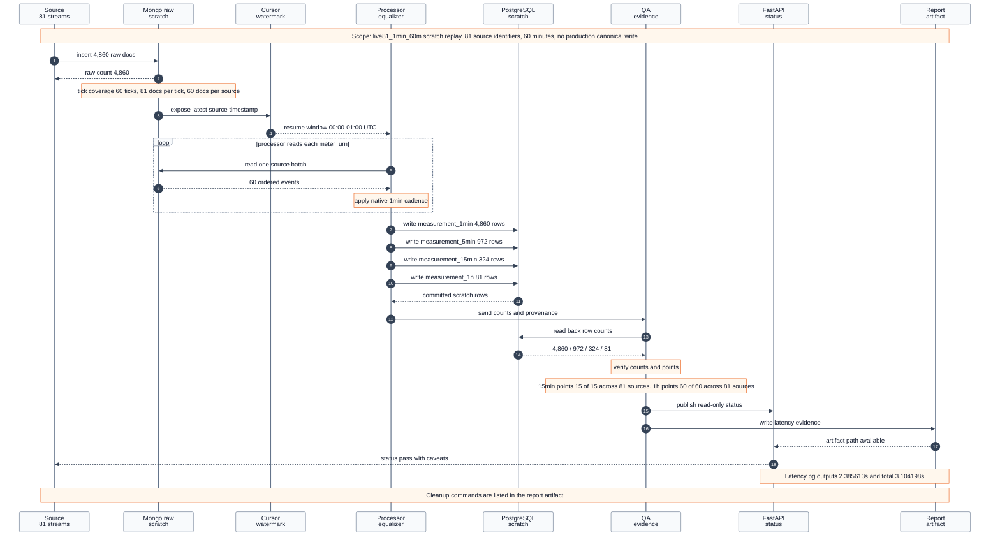

```mermaid
%%{init: {"theme": "base", "sequence": {"showSequenceNumbers": true, "wrap": false, "mirrorActors": true, "rightAngles": true, "messageAlign": "center", "actorMargin": 70, "width": 180, "height": 52, "boxMargin": 12, "boxTextMargin": 6, "noteMargin": 10, "messageMargin": 42}, "themeVariables": {"background": "#ffffff", "mainBkg": "#ffffff", "primaryColor": "#f8fafc", "primaryBorderColor": "#64748b", "primaryTextColor": "#0f172a", "actorBkg": "#f8fafc", "actorBorder": "#64748b", "actorTextColor": "#0f172a", "actorLineColor": "#64748b", "signalColor": "#334155", "signalTextColor": "#0f172a", "noteBkgColor": "#fff7ed", "noteTextColor": "#0f172a", "noteBorderColor": "#ea580c", "loopTextColor": "#0f172a", "activationBkgColor": "#e0f2fe", "activationBorderColor": "#0284c7", "fontFamily": "Arial, sans-serif", "fontSize": "15px"}} }%%
sequenceDiagram
    autonumber
    participant SRC as Source<br/>81 streams
    participant M as Mongo raw<br/>scratch
    participant C as Cursor<br/>watermark
    participant P as Processor<br/>equalizer
    participant PG as PostgreSQL<br/>scratch
    participant Q as QA<br/>evidence
    participant API as FastAPI<br/>status
    participant R as Report<br/>artifact

    Note over SRC,R: Scope: live81_1min_60m scratch replay, 81 source identifiers, 60 minutes, no production canonical write
    SRC->>M: insert 4,860 raw docs
    M-->>SRC: raw count 4,860
    Note over M: tick coverage 60 ticks, 81 docs per tick, 60 docs per source
    M->>C: expose latest source timestamp
    C-->>P: resume window 00:00-01:00 UTC

    loop processor reads each meter_urn
        P->>M: read one source batch
        M-->>P: 60 ordered events
        Note over P: apply native 1min cadence
    end

    P->>PG: write measurement_1min 4,860 rows
    P->>PG: write measurement_5min 972 rows
    P->>PG: write measurement_15min 324 rows
    P->>PG: write measurement_1h 81 rows
    PG-->>P: committed scratch rows

    P->>Q: send counts and provenance
    Q->>PG: read back row counts
    PG-->>Q: 4,860 / 972 / 324 / 81
    Note over Q: verify counts and points
    Note over Q: 15min points 15 of 15 across 81 sources. 1h points 60 of 60 across 81 sources

    Q->>API: publish read-only status
    Q->>R: write latency evidence
    R-->>API: artifact path available
    API-->>SRC: status pass with caveats

    Note over API,R: Latency pg outputs 2.385613s and total 3.104198s
    Note over SRC,R: Cleanup commands are listed in the report artifact

```
