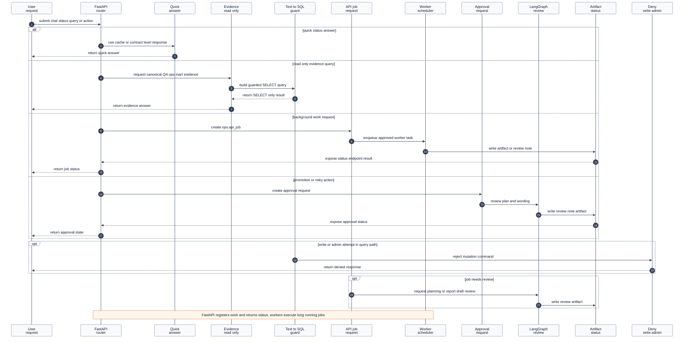

```mermaid
%%{init: {"theme": "base", "sequence": {"showSequenceNumbers": true, "wrap": false, "mirrorActors": true, "rightAngles": true, "messageAlign": "center", "actorMargin": 70, "width": 180, "height": 52, "boxMargin": 12, "boxTextMargin": 6, "noteMargin": 10, "messageMargin": 42}, "themeVariables": {"background": "#ffffff", "mainBkg": "#ffffff", "primaryColor": "#f8fafc", "primaryBorderColor": "#64748b", "primaryTextColor": "#0f172a", "actorBkg": "#f8fafc", "actorBorder": "#64748b", "actorTextColor": "#0f172a", "actorLineColor": "#64748b", "signalColor": "#334155", "signalTextColor": "#0f172a", "noteBkgColor": "#fff7ed", "noteTextColor": "#0f172a", "noteBorderColor": "#ea580c", "loopTextColor": "#0f172a", "activationBkgColor": "#e0f2fe", "activationBorderColor": "#0284c7", "fontFamily": "Arial, sans-serif", "fontSize": "15px"}} }%%
sequenceDiagram
    autonumber
    participant U as User<br/>request
    participant R as FastAPI<br/>router
    participant Q as Quick<br/>answer
    participant E as Evidence<br/>read only
    participant T as Text to SQL<br/>guard
    participant J as API job<br/>request
    participant S as Worker<br/>scheduler
    participant A as Approval<br/>request
    participant G as LangGraph<br/>review
    participant X as Artifact<br/>status
    participant D as Deny<br/>write admin

    U->>R: submit chat status query or action
    alt quick status answer
        R->>Q: use cache or contract level response
        Q-->>U: return quick answer
    else read only evidence query
        R->>E: request canonical QA ops mart evidence
        E->>T: build guarded SELECT query
        T-->>E: return SELECT only result
        E-->>U: return evidence answer
    else background work request
        R->>J: create ops.api_job
        J->>S: enqueue approved worker task
        S->>X: write artifact or review note
        X-->>R: expose status endpoint result
        R-->>U: return job status
    else promotion or risky action
        R->>A: create approval request
        A->>G: review plan and wording
        G->>X: write review note artifact
        X-->>R: expose approval status
        R-->>U: return approval state
    end

    opt write or admin attempt in query path
        T->>D: reject mutation command
        D-->>U: return denied response
    end

    opt job needs review
        J->>G: request planning or report draft review
        G->>X: write review artifact
    end
    Note over R,S: FastAPI registers work and returns status, workers execute long running jobs

```
