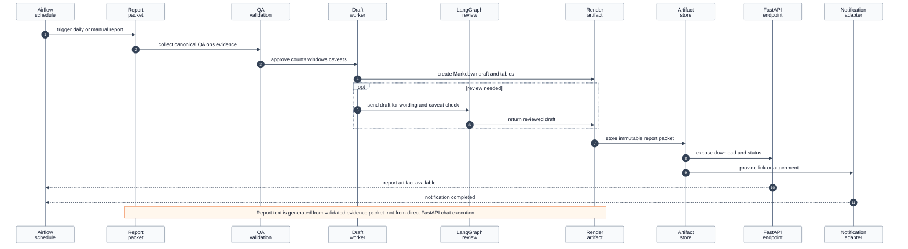

```mermaid
%%{init: {"theme": "base", "sequence": {"showSequenceNumbers": true, "wrap": false, "mirrorActors": true, "rightAngles": true, "messageAlign": "center", "actorMargin": 70, "width": 180, "height": 52, "boxMargin": 12, "boxTextMargin": 6, "noteMargin": 10, "messageMargin": 42}, "themeVariables": {"background": "#ffffff", "mainBkg": "#ffffff", "primaryColor": "#f8fafc", "primaryBorderColor": "#64748b", "primaryTextColor": "#0f172a", "actorBkg": "#f8fafc", "actorBorder": "#64748b", "actorTextColor": "#0f172a", "actorLineColor": "#64748b", "signalColor": "#334155", "signalTextColor": "#0f172a", "noteBkgColor": "#fff7ed", "noteTextColor": "#0f172a", "noteBorderColor": "#ea580c", "loopTextColor": "#0f172a", "activationBkgColor": "#e0f2fe", "activationBorderColor": "#0284c7", "fontFamily": "Arial, sans-serif", "fontSize": "15px"}} }%%
sequenceDiagram
    autonumber
    participant S as Airflow<br/>schedule
    participant P as Report<br/>packet
    participant Q as QA<br/>validation
    participant D as Draft<br/>worker
    participant G as LangGraph<br/>review
    participant R as Render<br/>artifact
    participant A as Artifact<br/>store
    participant API as FastAPI<br/>endpoint
    participant N as Notification<br/>adapter

    S->>P: trigger daily or manual report
    P->>Q: collect canonical QA ops evidence
    Q->>D: approve counts windows caveats
    D->>R: create Markdown draft and tables

    opt review needed
        D->>G: send draft for wording and caveat check
        G->>R: return reviewed draft
    end

    R->>A: store immutable report packet
    A->>API: expose download and status
    A->>N: provide link or attachment
    API-->>S: report artifact available
    N-->>S: notification completed
    Note over P,R: Report text is generated from validated evidence packet, not from direct FastAPI chat execution

```
