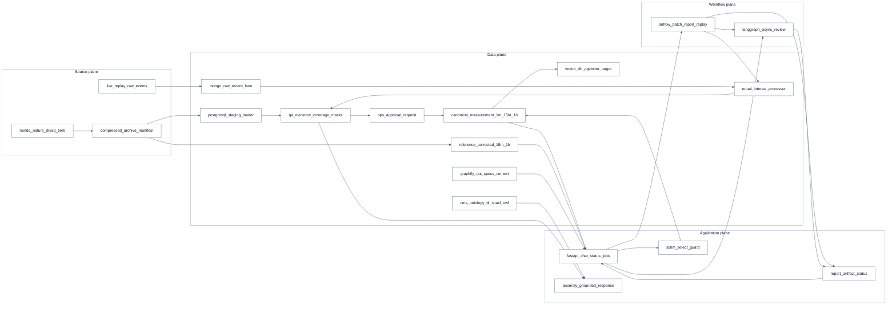

# Flow 00 Overall Pipeline

```mermaid
%%{init: {"theme": "base", "flowchart": {"htmlLabels": false, "curve": "basis", "nodeSpacing": 60, "rankSpacing": 75}, "themeVariables": {"background": "#ffffff", "mainBkg": "#ffffff", "primaryColor": "#f8fafc", "primaryBorderColor": "#64748b", "primaryTextColor": "#0f172a", "secondaryColor": "#f1f5f9", "secondaryBorderColor": "#94a3b8", "secondaryTextColor": "#0f172a", "tertiaryColor": "#ffffff", "tertiaryBorderColor": "#cbd5e1", "tertiaryTextColor": "#0f172a", "clusterBkg": "#ffffff", "clusterBorder": "#94a3b8", "edgeLabelBackground": "#ffffff", "lineColor": "#475569", "fontFamily": "Arial, sans-serif", "fontSize": "15px"}} }%%
flowchart LR
    subgraph S["Source plane"]
      A["honda_nature_dryad_tier0"]
      B["compressed_archive_manifest"]
      L["live_replay_raw_events"]
    end
    subgraph D["Data plane"]
      M["mongo_raw_recent_lane"]
      ST["postgresql_staging_loader"]
      P["equal_interval_processor"]
      QA["qa_evidence_coverage_masks"]
      PR["ops_approval_request"]
      C["canonical_measurement_1m_15m_1h"]
      R["reference_corrected_15m_1h"]
      V["vector_db_pgvector_target"]
      G["graphify_out_specs_context"]
      O["cms_ontology_ttl_shacl_owl"]
    end
    subgraph W["Workflow plane"]
      AF["airflow_batch_report_replay"]
      LG["langgraph_async_review"]
    end
    subgraph APP["Application plane"]
      API["fastapi_chat_status_jobs"]
      SQL["sqllm_select_guard"]
      ANO["anomaly_grounded_response"]
      ART["report_artifact_status"]
    end
    A --> B --> ST --> QA
    L --> M --> P --> QA
    QA --> PR --> C
    B --> R
    C --> API
    R --> API
    C --> V
    O --> ANO
    G --> API
    API --> SQL --> C
    API --> AF --> P
    AF --> ART --> API
    AF --> LG --> ART
    API --> LG
    QA --> ANO
```
