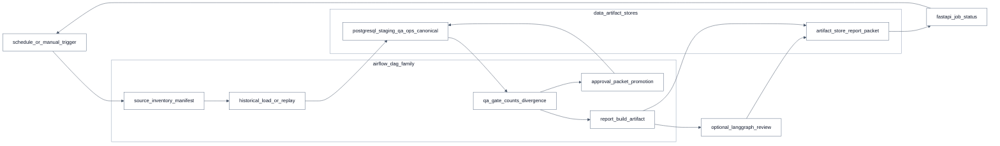

# Flow 02 Airflow Pipeline

```mermaid
%%{init: {"theme": "base", "flowchart": {"htmlLabels": false, "curve": "basis", "nodeSpacing": 60, "rankSpacing": 75}, "themeVariables": {"background": "#ffffff", "mainBkg": "#ffffff", "primaryColor": "#f8fafc", "primaryBorderColor": "#64748b", "primaryTextColor": "#0f172a", "secondaryColor": "#f1f5f9", "secondaryBorderColor": "#94a3b8", "secondaryTextColor": "#0f172a", "tertiaryColor": "#ffffff", "tertiaryBorderColor": "#cbd5e1", "tertiaryTextColor": "#0f172a", "clusterBkg": "#ffffff", "clusterBorder": "#94a3b8", "edgeLabelBackground": "#ffffff", "lineColor": "#475569", "fontFamily": "Arial, sans-serif", "fontSize": "15px"}} }%%
flowchart LR
    TR["schedule_or_manual_trigger"]
    subgraph AF["airflow_dag_family"]
      INV["source_inventory_manifest"]
      LOAD["historical_load_or_replay"]
      QA["qa_gate_counts_divergence"]
      REQ["approval_packet_promotion"]
      REP["report_build_artifact"]
    end
    subgraph STORE["data_artifact_stores"]
      PG["postgresql_staging_qa_ops_canonical"]
      ART["artifact_store_report_packet"]
    end
    LG["optional_langgraph_review"]
    API["fastapi_job_status"]
    TR --> INV --> LOAD --> PG --> QA
    QA --> REQ --> PG
    QA --> REP --> LG --> ART
    REP --> ART --> API
    API --> TR
```
