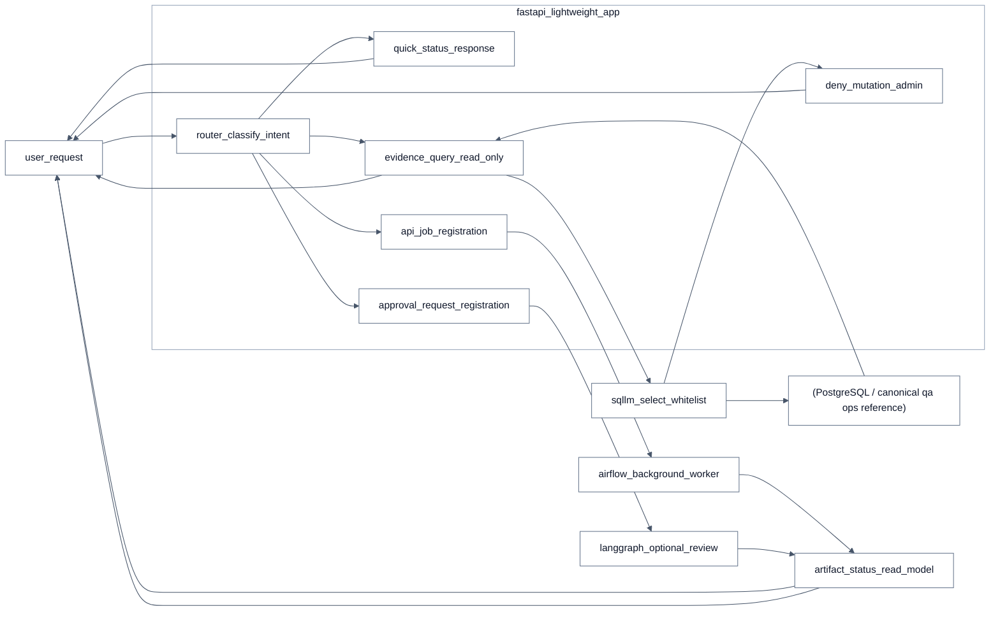

# Flow 04 App Pipeline

```mermaid
%%{init: {"theme": "base", "flowchart": {"htmlLabels": false, "curve": "basis", "nodeSpacing": 60, "rankSpacing": 75}, "themeVariables": {"background": "#ffffff", "mainBkg": "#ffffff", "primaryColor": "#f8fafc", "primaryBorderColor": "#64748b", "primaryTextColor": "#0f172a", "secondaryColor": "#f1f5f9", "secondaryBorderColor": "#94a3b8", "secondaryTextColor": "#0f172a", "tertiaryColor": "#ffffff", "tertiaryBorderColor": "#cbd5e1", "tertiaryTextColor": "#0f172a", "clusterBkg": "#ffffff", "clusterBorder": "#94a3b8", "edgeLabelBackground": "#ffffff", "lineColor": "#475569", "fontFamily": "Arial, sans-serif", "fontSize": "15px"}} }%%
flowchart LR
    U["user_request"]
    subgraph API["fastapi_lightweight_app"]
      ROUTE["router_classify_intent"]
      QUICK["quick_status_response"]
      EVID["evidence_query_read_only"]
      JOB["api_job_registration"]
      APPR["approval_request_registration"]
      DENY["deny_mutation_admin"]
    end
    SQL["sqllm_select_whitelist"]
    DB["(PostgreSQL / canonical qa ops reference)"]
    WF["airflow_background_worker"]
    LG["langgraph_optional_review"]
    ART["artifact_status_read_model"]
    U --> ROUTE
    ROUTE --> QUICK --> U
    ROUTE --> EVID --> SQL --> DB --> EVID --> U
    ROUTE --> JOB --> WF --> ART --> U
    ROUTE --> APPR --> LG --> ART --> U
    SQL --> DENY --> U
```
