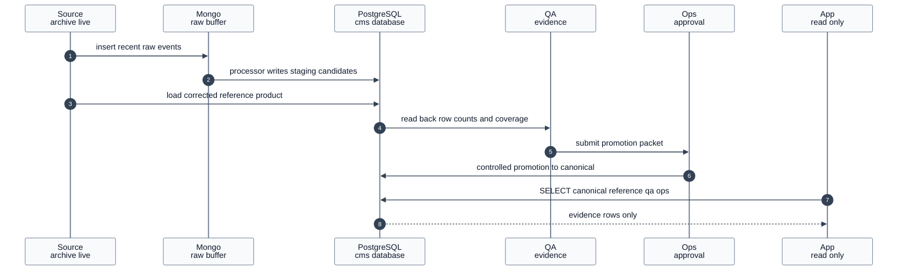

# Sequence 01 Database Pipeline

```mermaid
%%{init: {"theme": "base", "sequence": {"showSequenceNumbers": true, "wrap": false, "mirrorActors": true, "rightAngles": true, "messageAlign": "center", "actorMargin": 95, "width": 180, "height": 54, "boxMargin": 14, "boxTextMargin": 8, "noteMargin": 12, "messageMargin": 48}, "themeVariables": {"background": "#ffffff", "mainBkg": "#ffffff", "primaryColor": "#f8fafc", "primaryBorderColor": "#64748b", "primaryTextColor": "#0f172a", "actorBkg": "#f8fafc", "actorBorder": "#64748b", "actorTextColor": "#0f172a", "actorLineColor": "#64748b", "signalColor": "#334155", "signalTextColor": "#0f172a", "noteBkgColor": "#fff7ed", "noteTextColor": "#0f172a", "noteBorderColor": "#ea580c", "loopTextColor": "#0f172a", "activationBkgColor": "#e0f2fe", "activationBorderColor": "#0284c7", "fontFamily": "Arial, sans-serif", "fontSize": "15px"}} }%%
sequenceDiagram
    autonumber
    participant SRC as Source<br/>archive live
    participant M as Mongo<br/>raw buffer
    participant PG as PostgreSQL<br/>cms database
    participant QA as QA<br/>evidence
    participant OPS as Ops<br/>approval
    participant APP as App<br/>read only
    SRC->>M: insert recent raw events
    M->>PG: processor writes staging candidates
    SRC->>PG: load corrected reference product
    PG->>QA: read back row counts and coverage
    QA->>OPS: submit promotion packet
    OPS->>PG: controlled promotion to canonical
    APP->>PG: SELECT canonical reference qa ops
    PG-->>APP: evidence rows only
```
