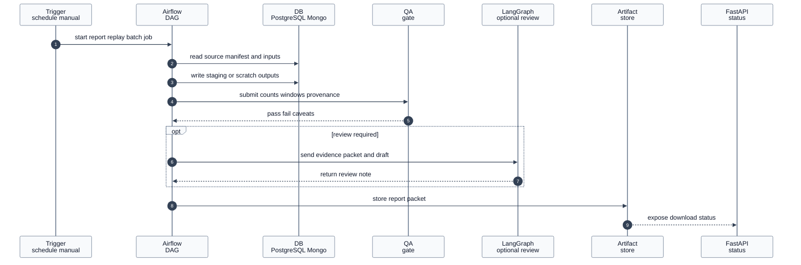

# Sequence 02 Airflow Pipeline

```mermaid
%%{init: {"theme": "base", "sequence": {"showSequenceNumbers": true, "wrap": false, "mirrorActors": true, "rightAngles": true, "messageAlign": "center", "actorMargin": 95, "width": 180, "height": 54, "boxMargin": 14, "boxTextMargin": 8, "noteMargin": 12, "messageMargin": 48}, "themeVariables": {"background": "#ffffff", "mainBkg": "#ffffff", "primaryColor": "#f8fafc", "primaryBorderColor": "#64748b", "primaryTextColor": "#0f172a", "actorBkg": "#f8fafc", "actorBorder": "#64748b", "actorTextColor": "#0f172a", "actorLineColor": "#64748b", "signalColor": "#334155", "signalTextColor": "#0f172a", "noteBkgColor": "#fff7ed", "noteTextColor": "#0f172a", "noteBorderColor": "#ea580c", "loopTextColor": "#0f172a", "activationBkgColor": "#e0f2fe", "activationBorderColor": "#0284c7", "fontFamily": "Arial, sans-serif", "fontSize": "15px"}} }%%
sequenceDiagram
    autonumber
    participant T as Trigger<br/>schedule manual
    participant AF as Airflow<br/>DAG
    participant DB as DB<br/>PostgreSQL Mongo
    participant QA as QA<br/>gate
    participant LG as LangGraph<br/>optional review
    participant ART as Artifact<br/>store
    participant API as FastAPI<br/>status
    T->>AF: start report replay batch job
    AF->>DB: read source manifest and inputs
    AF->>DB: write staging or scratch outputs
    AF->>QA: submit counts windows provenance
    QA-->>AF: pass fail caveats
    opt review required
      AF->>LG: send evidence packet and draft
      LG-->>AF: return review note
    end
    AF->>ART: store report packet
    ART-->>API: expose download status
```
