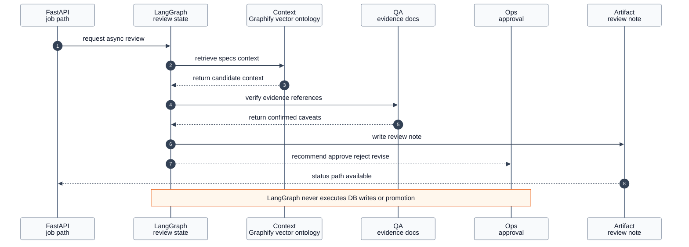

# Sequence 03 Langgraph Pipeline

```mermaid
%%{init: {"theme": "base", "sequence": {"showSequenceNumbers": true, "wrap": false, "mirrorActors": true, "rightAngles": true, "messageAlign": "center", "actorMargin": 95, "width": 180, "height": 54, "boxMargin": 14, "boxTextMargin": 8, "noteMargin": 12, "messageMargin": 48}, "themeVariables": {"background": "#ffffff", "mainBkg": "#ffffff", "primaryColor": "#f8fafc", "primaryBorderColor": "#64748b", "primaryTextColor": "#0f172a", "actorBkg": "#f8fafc", "actorBorder": "#64748b", "actorTextColor": "#0f172a", "actorLineColor": "#64748b", "signalColor": "#334155", "signalTextColor": "#0f172a", "noteBkgColor": "#fff7ed", "noteTextColor": "#0f172a", "noteBorderColor": "#ea580c", "loopTextColor": "#0f172a", "activationBkgColor": "#e0f2fe", "activationBorderColor": "#0284c7", "fontFamily": "Arial, sans-serif", "fontSize": "15px"}} }%%
sequenceDiagram
    autonumber
    participant API as FastAPI<br/>job path
    participant LG as LangGraph<br/>review state
    participant KG as Context<br/>Graphify vector ontology
    participant QA as QA<br/>evidence docs
    participant OPS as Ops<br/>approval
    participant ART as Artifact<br/>review note
    API->>LG: request async review
    LG->>KG: retrieve specs context
    KG-->>LG: return candidate context
    LG->>QA: verify evidence references
    QA-->>LG: return confirmed caveats
    LG->>ART: write review note
    LG-->>OPS: recommend approve reject revise
    ART-->>API: status path available
    Note over LG,OPS: LangGraph never executes DB writes or promotion
```
