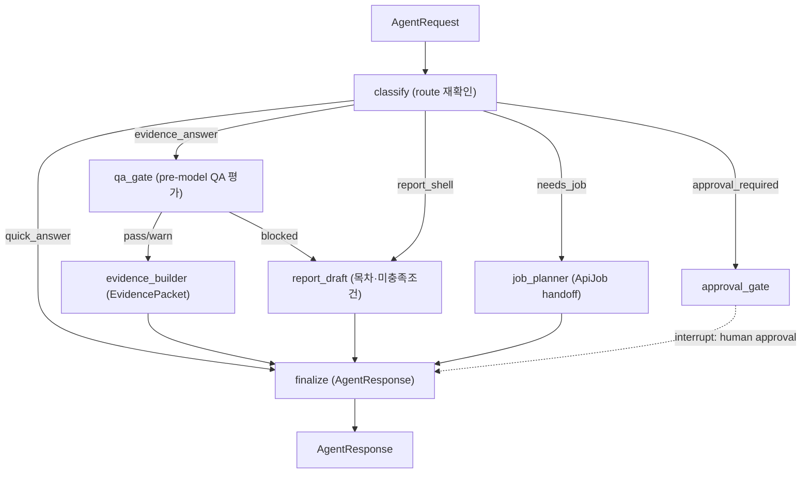

# LangGraph 비동기 Review 워크플로 설계

**Updated:** 2026-06-01
**Status:** Review-layer 그래프 구조 설계 (import-safe skeleton)

## 1. 목적과 경계

이 문서는 CMS의 LangGraph review workflow 구조를 정의한다. LangGraph는 일반 chat path의 필수 의존성이 아니라 **선택적 비동기 review layer**다. 1차 routing은 FastAPI lightweight router가 수행하고, LangGraph는 비동기 branch(evidence packet review, report draft, background job handoff, human approval)만 담당한다. Graph node는 모두 결정론적이며 DB/Mongo/network I/O, mart 생성, side effect를 수행하지 않는다.

관련 문서:
- Route policy: [`qa_report_chat_policy.md`](../qa/qa_report_chat_policy.md) (§6 evidence packet, §7 route table, §10 response requirements)
- Routing diagram: [`diagrams/flow_04_app_pipeline.md`](diagrams/flow_04_app_pipeline.md), [`diagrams/sequence_04_app_pipeline.md`](diagrams/sequence_04_app_pipeline.md) (`LangGraph` branch가 비동기 review path로 분리됨)
- Responsibility boundary: [`application_skeleton.md`](application_skeleton.md)
- QA contract: [`anomaly_service_data_qa_contract.md`](../qa/anomaly_service_data_qa_contract.md)

## 2. 2단계 라우팅

```
사용자 → FastAPI lightweight router
          │  classify_route() (공유 결정론 분류기, 5-route)
          ├─ quick_answer        → 즉시 응답 (fast path, LangGraph 미사용)
          ├─ evidence_answer(얕음) → read-only evidence query (fast path)
          ├─ evidence_answer(깊음) ┐
          ├─ needs_job            ├→  LangGraph review 그래프 (비동기)
          ├─ approval_required    │
          └─ report_shell         ┘
```

`classify_route()`는 service plane(FastAPI router)과 workflow plane(LangGraph entry node)이 **공유**한다. plane-neutral 위치인 `src/cms/contracts/agent.py`에 두어 workflow → service 역의존을 방지한다.

### 우선순위 규칙 (정책 §7.1)

1. 보안/승인/side-effect keyword 또는 `route_hint=approval_required` → **approval_required**
2. `context.qa_blocked` → **report_shell**
3. 장시간/비동기(report·aggregate·replay·backfill 등) → **needs_job**
4. 시간/계량기/metric 범위 근거 가능 → **evidence_answer**
5. 그 외 일반 질문 → **quick_answer**

## 3. Review 서브그래프



구현 위치는 `src/cms/workflow/langgraph_skeleton.py`다. 결정론 orchestrator인 `run_review(state)`가 위 topology를 그대로 따른다(테스트되는 path). `make_langgraph(enabled=True)`는 동일 구조의 `langgraph.StateGraph`를 구성하며, 이때만 `langgraph`를 import한다.

### GraphState (frozen dataclass)

| 필드 | 타입 | 설명 |
|---|---|---|
| `request` | `AgentRequest` | 입력 |
| `route` / `route_reason` | `ChatRoute` / `str` | classify 결과 |
| `qa_summary` | `QaSummary \| None` | qa_gate 결과 |
| `evidence_packet` | `EvidencePacket \| None` | evidence_builder 결과 |
| `report_draft` | `ReportRequest \| None` | report_draft 결과 |
| `approval` | `ApprovalRequest \| None` | approval_gate 결과 |
| `job` | `ApiJob \| None` | job_planner 결과 |
| `messages` | `tuple[str, ...]` | 누적 messages |
| `needs_human` | `bool` | approval interrupt 여부 |
| `response` | `AgentResponse \| None` | finalize 산출 |
| `side_effects_executed` | `bool` | 항상 `False` invariant |

### 노드 (모두 side-effect 없음)

| 노드 | 역할 | 재사용 계약 |
|---|---|---|
| `classify_node` | route 결정 | `classify_route()` (`contracts/agent.py`) |
| `qa_gate_node` | context 기반 QA 평가 → `QaSummary` (pass/warn/blocked) | `assess_qa()`, `QaSummary`, `QaWarning` |
| `evidence_node` | `EvidencePacket` 조립 | `EvidencePacket`, `MetricEvidence` |
| `report_draft_node` | report shell(목차), mart 보류 | `ReportRequest` (`contracts/core.py`) |
| `job_node` | `ApiJob` queued handoff | `ApiJob`, `JobType` (`contracts/job.py`) |
| `approval_node` | `ApprovalRequest` + `needs_human=True` | `ApprovalRequest` (`contracts/core.py`) |
| `finalize_node` | `AgentResponse` 조립 | `AgentResponse` (`contracts/agent.py`) |

### qa_gate context 입력 키

`assess_qa()`는 data I/O 없이 `request.context` flags로 QA 상태를 도출한다.

- `qa_blocked` (bool) → blocked
- `qa_checks` (name → `pass|warn|fail`); 하나라도 `fail`이면 blocked
- `coverage_ratio` (float); `< 0.80`(`COVERAGE_MIN`, QA-COV-003)이면 warn + `coverage_gap`
- `quarantined_count` (int)

## 4. Human-in-the-loop

`approval_required` path는 `approval_node`에서 `needs_human=True`로 멈추고 side effect를 실행하지 않는다. `make_langgraph(enabled=True)` graph를 compile할 때는 `interrupt_before=["approval"]`와 checkpointer를 두어 승인자 조치 전에 정지시키도록 한다. Deterministic fallback(`run_review`)도 동일하게 승인 전 종료한다.

## 5. EvidencePacket / AgentResponse 계약

- `EvidencePacket` (정책 §6 최소화): `packet_id`, `request_id`, `created_at`, `qa_summary` 필수.
  §6.1 규칙 — `qa_summary.status=blocked`이면 `output_status ∈ {blocked, approval_required}` (위반 시 `ValueError`).
- `MetricEvidence.is_assertable` — confidence가 `low`/`unavailable`이면 확정 수치로 표현 금지(정책 §9).
- `AgentResponse` (정책 §10 최소 response fields): `route`, `qa_status`, `message`, `next_action`, `limitations`,
  `needs_human`, `job_ref`, `side_effects_executed(=False)`.

## 6. Import-safe / LLM-optional 불변식

- Module import 시 `langgraph`, `langchain*`, `openai`, `anthropic`, DB/network client를 import하지 않는다.
- `make_langgraph(enabled=False)`(기본값)는 `LangGraphSkeleton` descriptor를 반환한다 — `langgraph`를 import하지 않는다.
- LLM 호출은 client가 명시적으로 주입될 때만 동작하는 optional hook이며 기본 동작은 deterministic이다.
- 모든 node는 `side_effects_executed=False`; mart 생성·DB write·network call 없음.

## 7. 검증

```bash
PYTHONPATH=src python scripts/verify/verify_skeleton_contracts.py   # "cms skeleton contracts ok"
PYTHONPATH=src pytest tests/workflow/test_langgraph_review.py -q
```

`route_request()`는 `classify_route()`의 backward-compatible alias로 유지된다. 기존 3-route(`query/report/approval`) label은 `AgentRoute`로 보존되지만, 신규 decision은 5-route `ChatRoute`를 사용한다.
