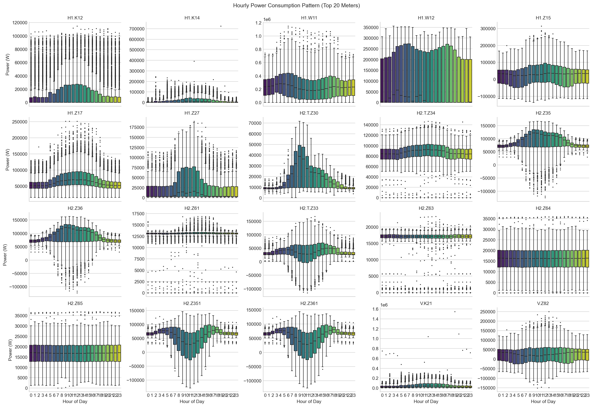
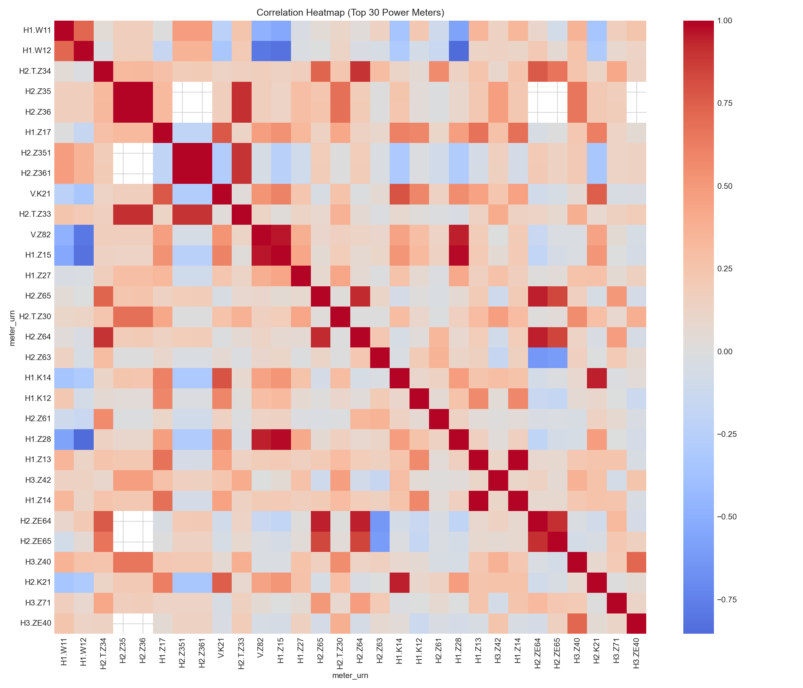
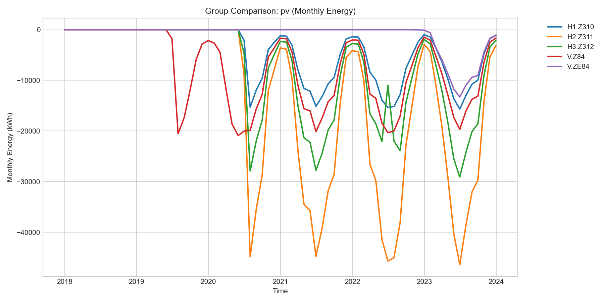
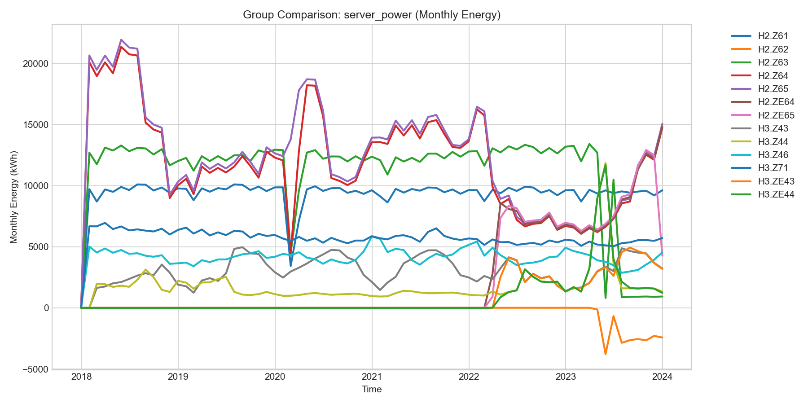
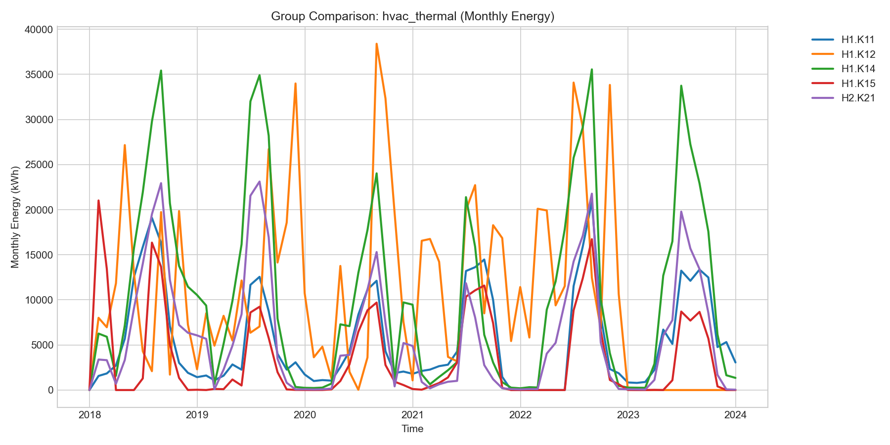

# 06. 계량기별 상세 분석 (Meter-level Analysis)

본 문서는 Honda R&D Europe 시설에 설치된 81개의 개별 계량기(Meter) 데이터를 바탕으로 한 상세 분석 결과를 요약합니다. 건물 전체를 통틀어 합산한 데이터만으로는 파악하기 힘든 **개별 설비의 가동 패턴, 상호 연관성, 그룹별 트렌드**를 식별하는 것을 목적으로 합니다.

---

## 1. 개별 계량기 기초 통계 (Descriptive Stats)

- **산출물**: `outputs/profiling/07_meter_statistics.csv`
- 81개 계량기에 대한 측정항목(전력 P, 열에너지 E, 유량 V 등) 별 평균, 최대, 최소, 표준편차 및 무부하(0) 비율을 계산했습니다.
- 주요 발견점:
  - 전체 계량기 중 일부(예: 공조/HVAC 장비)는 야간에 가동을 멈추어 0(Zero) 비율이 높은 반면, 서버(Server)용 전력 계량기는 24시간 내내 높은 기저부하(Base load)를 유지하며 무부하 비율이 0%에 수렴합니다.

---

## 2. 시간대별 가동 패턴 (Seasonality)

- **산출물**: `outputs/figures/meters/seasonality_top20.png`

평균 전력 소모량이 가장 높은 상위 20개 계량기의 24시간(0~23시) 패턴을 박스플롯으로 시각화한 결과, 크게 두 가지 유형으로 분류됩니다.

1. **주간 운영형 (Daytime Load)**
   - 오전 8시에 급증하여 오후 5~6시에 급격히 하락하는 전형적인 오피스 근무 시간 패턴. (예: `H1.W11` 등 사무공간 분전반 및 일반 공조기)
2. **상시 운영형 (Base Load)**
   - 시간에 관계없이 24시간 내내 일정한 대역폭의 전력을 소모하는 패턴. (예: `H1.K16` 등 서버 전력 및 냉각 장비)

이러한 패턴 분리는 향후 "이상 탐지(Anomaly Detection)" 모델링 시 **시간대 정보를 필수적인 피처(Feature)로 활용해야 함**을 시사합니다. (예: 주간 운영형 설비가 새벽에 높은 전력을 소모하면 이상으로 탐지)

---

## 3. 계량기 간 상관관계 (Correlation Analysis)

- **산출물**: `outputs/figures/meters/meter_correlation_heatmap.png`

상위 30개 전력 계량기들을 대상으로 피어슨 상관계수를 도출한 히트맵입니다. 
- 붉은색(양의 상관관계) 블록으로 묶인 계량기들은 **동시에 켜지고 켜지는** 설비들입니다.
- 이를 통해 물리적으로 떨어져 있더라도, 하나의 공정이나 같은 냉난방 시스템에 묶여 유기적으로 돌아가는 장비군을 식별할 수 있습니다.
- 특정 장비 하나만 튀는(상관관계에서 벗어나는) 움직임을 보인다면 **설비 고장 및 비정상 운전**을 의심할 수 있습니다.

---

## 4. 설비 그룹별 월간 트렌드 (Group Trends)

`equipment_group` 기준 장비들의 사용량 트렌드를 월별(Monthly)로 시각화했습니다.

### 4.1 태양광 발전 (PV)

- **분석**: 기획서에 명시된 "PV Phase 1 (2019.06)", "PV Phase 2 (2020.06)" 이벤트 시점에 발전량이 점프하는 현상이 뚜렷하게 관측됩니다. 발전량은 여름철에 피크를 찍는 계절성을 보입니다.

### 4.2 서버 전력 (Server Power)

- **분석**: 6년 내내 큰 계절적 변동 없이 꾸준히 증가하는 추세를 보입니다. 서버 증설 및 IT 장비 확충이 지속적으로 이루어졌음을 암시합니다.

### 4.3 공조 설비 (HVAC Thermal)

- **분석**: 외부 기온에 가장 큰 영향을 받는 그룹으로, 여름/겨울철에 피크가 극명히 갈라집니다. COVID 기간(2020년 3월 이후) 동안 변동성이 다소 나타나는 것을 확인할 수 있습니다.

---

## 5. 결론 및 Next Step

개별 계량기 분석을 통해 **각 설비의 특징적인 시계열 패턴(주간형 vs 상시형)**과 **설비 간의 군집(상관) 관계**를 명확히 파악했습니다. 

1. **Feature Engineering 적용**: 향후 이상 탐지 및 예측 모델을 구축할 때, 상관관계가 높은 설비의 상태를 피처(Feature)로 교차 활용할 수 있습니다.
2. **에이전트 지식(Context) 활용**: 멀티 에이전트(LLM)가 특정 설비의 이상을 감지했을 때, 상관관계가 높은 다른 설비의 동시 점검을 권고하도록 프롬프트/Rule을 구성할 수 있습니다.
