# 07. 개별 계량기 상세 분석 리포트

본 문서는 Honda R&D Europe 건물에 설치된 81개 개별 계량기(Meter) 각각의 **기초 통계량**과 **주간(Weekly) 전력(P) 사용량 트렌드**를 요약한 자동 생성 리포트입니다.

---

## H1.Z11 (central_cooling)

### 기초 통계량 (1h 해상도)

| 측정 항목 | 기록 수(시간) | 평균 | 최소 | 최대 | 무부하(0) 비율 |
|-----------|---------------|------|------|------|----------------|
| W_out | 52,062 | 0.35 | 0.00 | 0.64 | 23.00% |
| WQ_in | 52,583 | 145984.78 | 9980.65 | 276371.79 | 0.00% |
| PF2 | 52,584 | 0.78 | -0.42 | 0.90 | 0.33% |
| P2 | 52,584 | 1966.61 | -6.19 | 27725.37 | 0.30% |
| W_in | 52,583 | 172608.87 | 11968.09 | 319043.74 | 0.00% |
| U2 | 52,584 | 229.64 | 221.94 | 236.55 | 0.00% |
| PF1 | 52,584 | 0.85 | -0.60 | 0.95 | 1.34% |
| U1 | 52,584 | 229.91 | 222.45 | 235.97 | 0.00% |
| I1 | 52,584 | 11.45 | 0.00 | 139.64 | 1.34% |
| PF3 | 52,523 | 0.15 | -0.88 | 0.88 | 43.37% |
| WQ | 52,585 | 145989.71 | 9980.65 | 276371.78 | 0.00% |
| P | 52,584 | 5806.44 | -27.25 | 82207.26 | 0.30% |
| WQ_out | 52,062 | 0.02 | 0.00 | 0.03 | 23.00% |
| Q | 52,584 | 5018.89 | 0.00 | 57866.43 | 0.30% |
| P3 | 52,523 | 1861.14 | -20.78 | 27089.52 | 43.37% |
| f | 52,584 | 50.05 | 49.49 | 50.13 | 0.00% |
| I2 | 52,584 | 11.66 | 0.00 | 141.89 | 0.30% |
| I3 | 52,523 | 11.08 | 0.00 | 139.66 | 43.35% |
| W | 52,585 | 172614.10 | 11968.09 | 319043.27 | 0.00% |
| U3 | 52,584 | 230.37 | 222.77 | 236.62 | 0.00% |
| PF | 52,584 | 0.92 | -0.76 | 1.00 | 0.32% |
| P1 | 52,584 | 1923.20 | -14.31 | 27391.20 | 1.34% |

### 주간(Weekly) 전력(Power) 트렌드

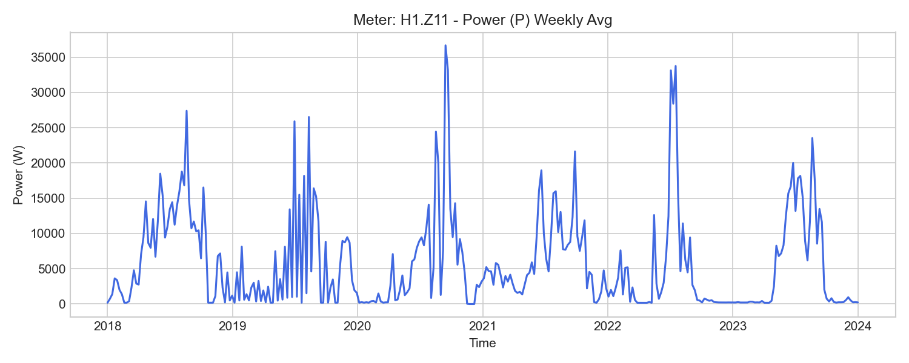

---

## H1.Z12 (central_cooling)

### 기초 통계량 (1h 해상도)

| 측정 항목 | 기록 수(시간) | 평균 | 최소 | 최대 | 무부하(0) 비율 |
|-----------|---------------|------|------|------|----------------|
| PF | 52,584 | 0.93 | -0.12 | 1.00 | 0.02% |
| WQ | 52,585 | 147948.63 | 10201.05 | 279779.99 | 0.00% |
| P | 52,584 | 5818.58 | -1.35 | 82421.62 | 0.02% |
| Q | 52,584 | 5078.49 | -25.18 | 57938.45 | 0.02% |
| U3 | 52,584 | 230.42 | 222.68 | 236.70 | 0.00% |
| f | 52,584 | 50.04 | 49.05 | 50.14 | 0.00% |
| P1 | 52,584 | 1902.96 | -0.51 | 27253.52 | 1.44% |
| W | 52,585 | 173015.63 | 12025.78 | 319665.92 | 0.00% |
| PF3 | 52,584 | 0.23 | -0.30 | 0.88 | 4.29% |
| P2 | 52,584 | 1977.24 | 0.00 | 27750.55 | 0.14% |
| WQ_in | 52,583 | 147942.71 | 10201.41 | 279783.42 | 0.00% |
| I1 | 52,584 | 11.39 | 0.00 | 139.87 | 1.44% |
| U1 | 52,584 | 229.98 | 222.44 | 236.10 | 0.00% |
| W_in | 52,584 | 173007.01 | 12025.60 | 319665.79 | 0.00% |
| I3 | 52,584 | 11.42 | 0.00 | 141.74 | 4.33% |
| WQ_out | 52,159 | -0.91 | -5.97 | 3.43 | 0.00% |
| PF2 | 52,584 | 0.80 | 0.00 | 0.90 | 0.14% |
| P3 | 52,584 | 1882.98 | -3.99 | 27419.20 | 4.26% |
| W_out | 52,062 | 0.02 | 0.00 | 0.03 | 23.00% |
| U2 | 52,584 | 229.77 | 221.97 | 236.78 | 0.00% |
| PF1 | 52,584 | 0.85 | -0.03 | 0.93 | 1.44% |
| I2 | 52,584 | 11.65 | 0.00 | 141.87 | 0.14% |

### 주간(Weekly) 전력(Power) 트렌드

---

## H1.Z24 (central_cooling)

### 기초 통계량 (1h 해상도)

| 측정 항목 | 기록 수(시간) | 평균 | 최소 | 최대 | 무부하(0) 비율 |
|-----------|---------------|------|------|------|----------------|
| P3 | 52,584 | 1182.15 | -65.32 | 19160.46 | 13.39% |
| P2 | 52,584 | 1237.11 | 34.13 | 19733.59 | 0.00% |
| P | 52,584 | 3446.70 | 3.84 | 57372.90 | 0.00% |
| W_in | 52,583 | 101339.61 | 12133.33 | 193498.07 | 0.00% |
| U1 | 52,584 | 229.77 | 207.88 | 235.85 | 0.00% |
| I3 | 52,584 | 6.87 | -0.00 | 100.93 | 13.40% |
| PF2 | 52,584 | 0.64 | 0.24 | 0.95 | 0.00% |
| W | 52,062 | 102226.61 | 13172.96 | 193498.07 | 0.00% |
| WQ_out | 52,062 | 0.05 | 0.00 | 0.06 | 23.00% |
| WQ | 52,062 | 83741.27 | 10176.47 | 158515.28 | 0.00% |
| I1 | 52,584 | 6.87 | 0.21 | 97.16 | 0.00% |
| U3 | 52,584 | 230.20 | 195.88 | 236.52 | 0.00% |
| f | 52,584 | 50.06 | 49.49 | 50.15 | 0.00% |
| W_out | 52,062 | 0.00 | 0.00 | 0.00 | 100.00% |
| U2 | 52,584 | 229.54 | 221.64 | 236.56 | 0.00% |
| PF1 | 52,584 | 0.54 | -0.29 | 1.00 | 0.00% |
| I2 | 52,584 | 7.38 | 0.18 | 102.28 | 0.00% |
| Q | 52,584 | 2836.42 | 1.28 | 38773.75 | 0.00% |
| PF3 | 52,584 | 0.35 | -1.00 | 0.96 | 13.38% |
| P1 | 52,584 | 1149.62 | -43.62 | 18590.55 | 0.00% |
| PF | 52,584 | 0.94 | 0.72 | 1.00 | 0.00% |
| WQ_in | 52,583 | 83008.34 | 9268.48 | 158515.35 | 0.00% |

### 주간(Weekly) 전력(Power) 트렌드

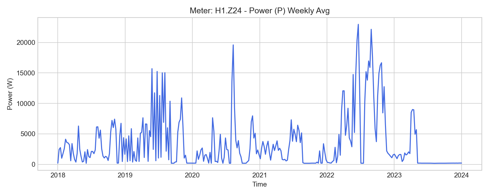

---

## H1.Z25 (central_cooling)

### 기초 통계량 (1h 해상도)

| 측정 항목 | 기록 수(시간) | 평균 | 최소 | 최대 | 무부하(0) 비율 |
|-----------|---------------|------|------|------|----------------|
| PF | 52,584 | 0.96 | -0.19 | 1.00 | 0.00% |
| PF3 | 52,584 | -0.03 | -0.89 | 1.00 | 13.62% |
| W | 52,062 | 98567.87 | 12826.59 | 186263.25 | 0.00% |
| Q | 52,584 | 2130.91 | -74.60 | 28856.69 | 0.00% |
| WQ_out | 52,583 | -9.69 | -76.37 | 48.60 | 0.00% |
| f | 52,584 | 50.06 | 48.10 | 50.14 | 0.00% |
| P3 | 52,584 | 964.87 | -101.94 | 15826.21 | 13.58% |
| I3 | 52,584 | 4.74 | 0.00 | 69.70 | 13.60% |
| U3 | 52,584 | 230.25 | 222.52 | 236.56 | 0.00% |
| PF2 | 52,584 | 0.70 | -0.50 | 0.97 | 0.00% |
| WQ_in | 52,582 | 63751.69 | 8110.39 | 120385.68 | 0.00% |
| U1 | 52,584 | 229.81 | 222.27 | 235.88 | 0.00% |
| P1 | 52,584 | 1232.28 | 7.75 | 18584.25 | 0.00% |
| U2 | 52,584 | 229.65 | 221.80 | 236.61 | 0.00% |
| I1 | 52,584 | 7.08 | 0.20 | 96.79 | 0.00% |
| W_in | 52,584 | 97712.18 | 11813.98 | 186263.28 | 0.00% |
| I2 | 52,584 | 7.13 | 0.17 | 102.78 | 0.00% |
| W_out | 52,062 | 0.02 | 0.00 | 0.03 | 23.00% |
| P | 52,584 | 3315.41 | 3.97 | 54263.56 | 0.00% |
| PF1 | 52,584 | 0.88 | -0.22 | 0.99 | 0.00% |
| WQ | 52,582 | 63761.38 | 8105.44 | 120340.43 | 0.00% |
| P2 | 52,584 | 1234.43 | 3.66 | 19813.19 | 0.00% |

### 주간(Weekly) 전력(Power) 트렌드

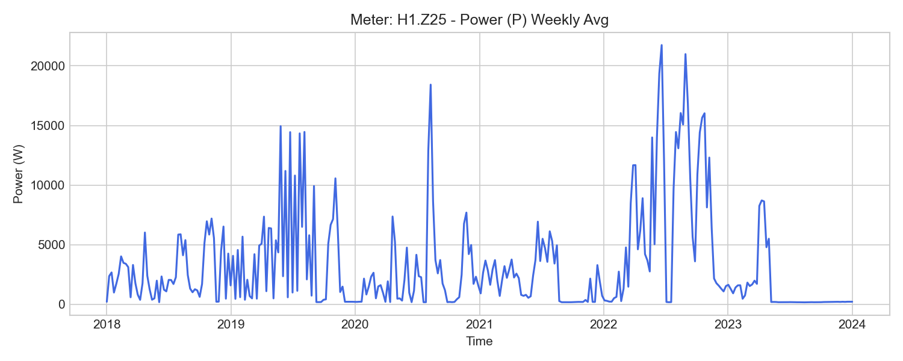

---

## H1.Z20 (chp)

### 기초 통계량 (1h 해상도)

| 측정 항목 | 기록 수(시간) | 평균 | 최소 | 최대 | 무부하(0) 비율 |
|-----------|---------------|------|------|------|----------------|
| I3 | 52,584 | -91.34 | -276.21 | 0.00 | 0.03% |
| P3 | 52,584 | -20490.44 | -60798.78 | 6873.65 | 0.03% |
| I1 | 52,584 | -101.68 | -300.72 | 0.00 | 0.03% |
| WQ_in | 52,584 | 9485.79 | 1000.22 | 17746.21 | 0.00% |
| P1 | 52,584 | -22826.64 | -67210.94 | 6392.38 | 0.03% |
| PF2 | 52,584 | -0.11 | -1.00 | 0.89 | 0.03% |
| P | 52,584 | -64429.84 | -239655.81 | 21529.43 | 0.03% |
| PF | 52,584 | 0.10 | -1.00 | 0.97 | 0.03% |
| I2 | 52,584 | -94.07 | -278.62 | 0.00 | 0.03% |
| P2 | 52,584 | -21219.50 | -62705.73 | 8261.30 | 0.03% |
| W_in | 52,584 | 8890.30 | 1219.42 | 15922.03 | 0.00% |
| PF1 | 52,584 | 0.01 | -0.99 | 0.95 | 0.03% |
| W_out | 52,583 | 1855021.80 | 152100.85 | 3556811.28 | 0.00% |
| U3 | 52,584 | 230.20 | 222.61 | 236.45 | 0.00% |
| f | 52,584 | 50.05 | 49.46 | 50.12 | 0.00% |
| W | 52,585 | -1846195.82 | -3541065.41 | -150880.91 | 0.00% |
| PF3 | 52,584 | -0.11 | -0.99 | 0.86 | 0.03% |
| U2 | 52,584 | 229.64 | 221.89 | 236.60 | 0.00% |
| WQ | 52,585 | -154524.49 | -285776.24 | -14707.43 | 0.00% |
| WQ_out | 52,583 | 164005.45 | 15708.34 | 303515.76 | 0.00% |
| U1 | 52,584 | 229.85 | 222.38 | 235.90 | 0.00% |
| Q | 52,584 | -5139.85 | -29165.73 | 20467.20 | 0.03% |

### 주간(Weekly) 전력(Power) 트렌드

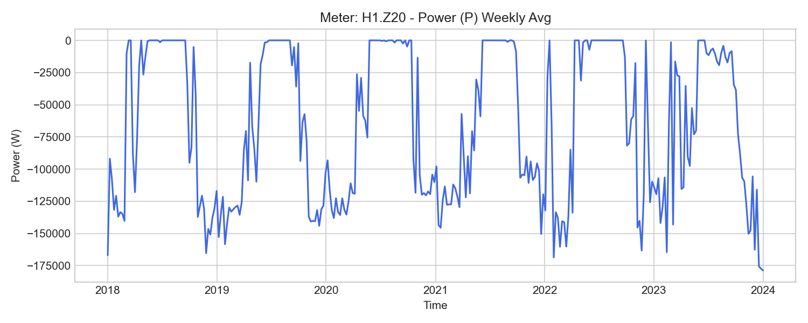

---

## H1.ZE20 (chp)

### 기초 통계량 (1h 해상도)

| 측정 항목 | 기록 수(시간) | 평균 | 최소 | 최대 | 무부하(0) 비율 |
|-----------|---------------|------|------|------|----------------|
| PF | 9,519 | -0.10 | -1.00 | 1.01 | 0.00% |
| W_in | 9,510 | 2406.04 | 861.83 | 4009.40 | 0.00% |
| U3 | 9,519 | 230.60 | 222.96 | 236.18 | 0.00% |
| P2 | 9,519 | -23594.92 | -61981.32 | 863.55 | 0.00% |
| P3 | 9,519 | -22592.37 | -59953.74 | 407.84 | 0.00% |
| I3 | 9,519 | -100.84 | -266.26 | -0.16 | 0.00% |
| P1 | 9,519 | -25163.52 | -66431.31 | 1559.18 | 0.00% |
| f | 9,519 | 50.00 | 49.95 | 50.07 | 0.00% |
| I2 | 9,519 | -104.80 | -273.37 | -0.11 | 0.00% |
| I1 | 9,519 | -112.54 | -291.97 | -0.20 | 0.00% |
| PF1 | 9,519 | 0.08 | -1.00 | 0.99 | 0.00% |
| U2 | 9,519 | 229.92 | 222.80 | 236.28 | 0.00% |
| W | 9,518 | -564139.24 | -918697.18 | -239641.65 | 0.00% |
| W2 | 9,518 | -185895.05 | -303189.64 | -78632.78 | 0.00% |
| PF3 | 9,519 | 0.09 | -1.00 | 1.00 | 0.00% |
| W_out | 9,518 | 566552.02 | 240505.99 | 922716.23 | 0.00% |
| W1 | 9,518 | -199448.01 | -324377.44 | -84888.60 | 0.00% |
| W3 | 9,518 | -178796.19 | -291130.09 | -76118.58 | 0.00% |
| PF2 | 9,519 | 0.10 | -1.00 | 1.00 | 0.00% |
| P | 9,519 | -71350.81 | -186628.49 | 2830.58 | 0.00% |
| U1 | 9,519 | 230.22 | 222.78 | 235.65 | 0.00% |

### 주간(Weekly) 전력(Power) 트렌드

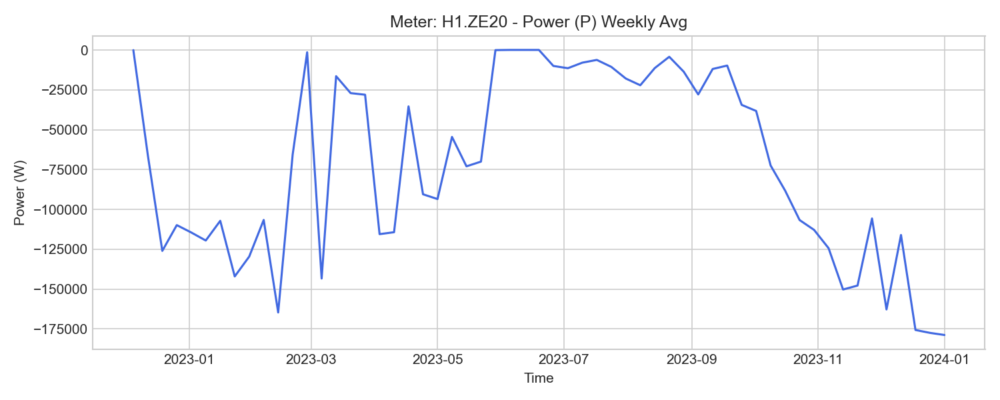

---

## H1.W12 (chp_heat_generation)

### 기초 통계량 (1h 해상도)

| 측정 항목 | 기록 수(시간) | 평균 | 최소 | 최대 | 무부하(0) 비율 |
|-----------|---------------|------|------|------|----------------|
| qv | 52,584 | 8.14 | 0.00 | 17.90 | 47.81% |
| Tvl | 52,584 | 58.96 | 5.00 | 87.00 | 0.00% |
| Trl | 52,584 | 51.02 | 3.00 | 81.45 | 0.00% |
| W | 52,583 | 2918666.97 | 153516.67 | 5736030.00 | 0.00% |
| P | 52,584 | 106099.27 | 0.00 | 355942.53 | 49.05% |
| Tdiff | 52,584 | 7936.72 | -5205.00 | 31554.83 | 0.00% |
| V | 52,584 | 232819080.79 | 19063270.00 | 448349840.00 | 0.00% |

### 주간(Weekly) 전력(Power) 트렌드

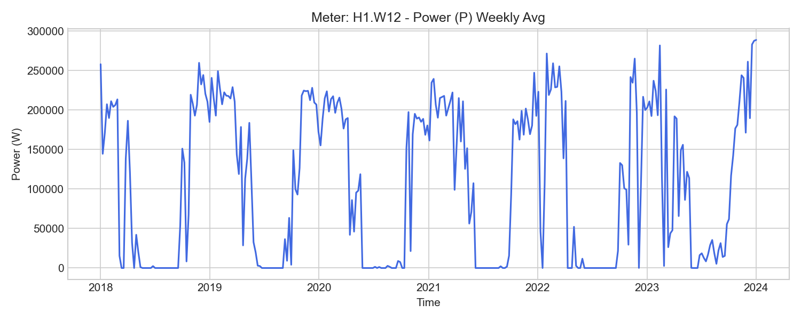

---

## V.K21 (cooling_thermal)

### 기초 통계량 (1h 해상도)

| 측정 항목 | 기록 수(시간) | 평균 | 최소 | 최대 | 무부하(0) 비율 |
|-----------|---------------|------|------|------|----------------|
| W | 52,523 | 1231156.53 | 75400.00 | 2345533.46 | 0.00% |
| Tdiff | 52,584 | -1500.00 | -9879.50 | 7454.42 | 0.00% |
| qv | 52,584 | 24.95 | 0.00 | 87.26 | 3.23% |
| P | 52,584 | 43053.61 | 0.00 | 1547997.50 | 3.54% |
| Trl | 52,539 | 10.08 | -1.57 | 37.00 | 0.00% |
| V | 52,583 | 740595508.64 | 71615300.00 | 1386073197.07 | 0.00% |
| Tvl | 52,550 | 8.53 | -2.00 | 37.00 | 0.00% |

### 주간(Weekly) 전력(Power) 트렌드

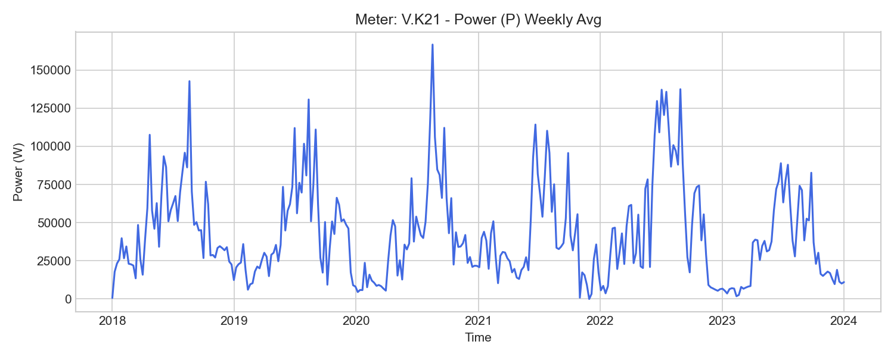

---

## H2.T.Z33 (design_studio)

### 기초 통계량 (1h 해상도)

| 측정 항목 | 기록 수(시간) | 평균 | 최소 | 최대 | 무부하(0) 비율 |
|-----------|---------------|------|------|------|----------------|
| WQ_out | 51,840 | 34838.19 | 4321.70 | 68714.18 | 0.00% |
| U2 | 51,840 | 231.40 | 224.82 | 239.11 | 0.00% |
| WQ_in | 51,839 | 238720.58 | 26617.35 | 411767.59 | 0.00% |
| I2 | 51,840 | 61.50 | 7.85 | 250.83 | 0.00% |
| W | 52,585 | 1101671.22 | 110296.49 | 1961416.05 | 0.00% |
| P2 | 51,840 | 11386.35 | -39424.98 | 53915.12 | 0.00% |
| WQ | 52,585 | 201317.88 | 22292.58 | 343059.33 | 0.00% |
| P | 51,840 | 35917.00 | -115177.70 | 167897.50 | 0.00% |
| W_in | 51,840 | 1165159.20 | 110296.49 | 2104828.19 | 0.00% |
| f | 51,840 | 50.09 | 49.25 | 50.17 | 0.00% |
| W_out | 49,886 | 51243.74 | 0.00 | 143461.22 | 19.64% |
| PF1 | 51,816 | 0.81 | -1.00 | 1.00 | 0.00% |
| PF | 51,840 | 0.81 | -1.00 | 1.00 | 0.00% |
| U1 | 51,840 | 231.63 | 225.10 | 238.55 | 0.00% |
| U3 | 51,840 | 232.01 | 225.37 | 237.61 | 0.00% |
| I3 | 51,840 | 63.14 | 8.16 | 260.93 | 0.00% |
| PF2 | 51,815 | 0.80 | -1.00 | 1.00 | 0.00% |
| I1 | 51,840 | 67.04 | 8.19 | 275.46 | 0.00% |
| P1 | 51,840 | 12745.91 | -37828.55 | 59796.04 | 0.00% |
| PF3 | 51,815 | 0.80 | -1.00 | 1.00 | 0.00% |
| Q | 51,840 | 6179.78 | -13735.07 | 87165.94 | 0.00% |
| P3 | 51,840 | 11814.77 | -37920.61 | 54178.80 | 0.00% |

### 주간(Weekly) 전력(Power) 트렌드

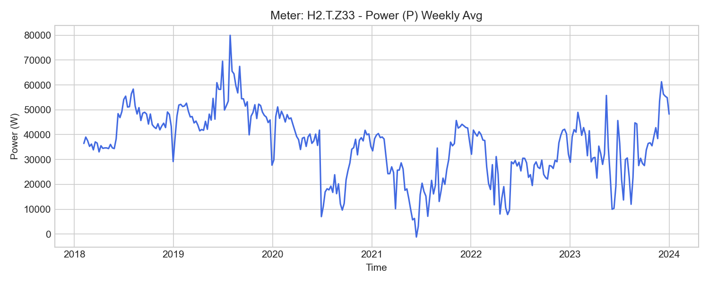

---

## H3.Z40 (design_studio)

### 기초 통계량 (1h 해상도)

| 측정 항목 | 기록 수(시간) | 평균 | 최소 | 최대 | 무부하(0) 비율 |
|-----------|---------------|------|------|------|----------------|
| W_out | 49,886 | 158.61 | 0.00 | 197.38 | 19.64% |
| W | 52,585 | 254178.29 | 28828.08 | 475900.58 | 0.00% |
| I1 | 51,840 | 13.90 | 0.00 | 33.12 | 0.00% |
| U3 | 51,840 | 231.98 | 225.47 | 237.59 | 0.00% |
| U2 | 51,840 | 231.45 | 224.98 | 239.15 | 0.00% |
| Q | 51,840 | -2599.97 | -5018.27 | 4994.58 | 0.00% |
| WQ | 52,585 | -84794.37 | -146147.40 | -10586.55 | 0.00% |
| PF1 | 51,840 | 0.90 | 0.00 | 0.99 | 0.00% |
| I3 | 51,840 | 12.61 | 0.00 | 28.42 | 0.00% |
| PF | 51,840 | 0.92 | 0.00 | 1.00 | 0.00% |
| P | 51,840 | 8637.25 | 0.00 | 19845.32 | 0.00% |
| f | 51,840 | 50.10 | 49.27 | 50.17 | 0.00% |
| PF3 | 51,840 | 0.94 | 0.00 | 0.99 | 0.00% |
| WQ_out | 51,840 | 90834.13 | 10612.72 | 160409.71 | 0.00% |
| W_in | 51,840 | 257552.22 | 28828.08 | 476092.75 | 0.00% |
| U1 | 51,840 | 231.67 | 225.19 | 238.58 | 0.00% |
| PF2 | 51,840 | 0.90 | 0.00 | 0.99 | 0.00% |
| I2 | 51,840 | 14.13 | 0.00 | 34.90 | 0.00% |
| P1 | 51,840 | 2906.48 | 0.00 | 7130.96 | 0.00% |
| WQ_in | 51,568 | 5004.66 | 26.17 | 14264.62 | 0.00% |
| P3 | 51,840 | 2751.46 | 0.00 | 6477.65 | 0.00% |
| P2 | 51,840 | 2968.20 | 0.00 | 7256.33 | 0.00% |

### 주간(Weekly) 전력(Power) 트렌드

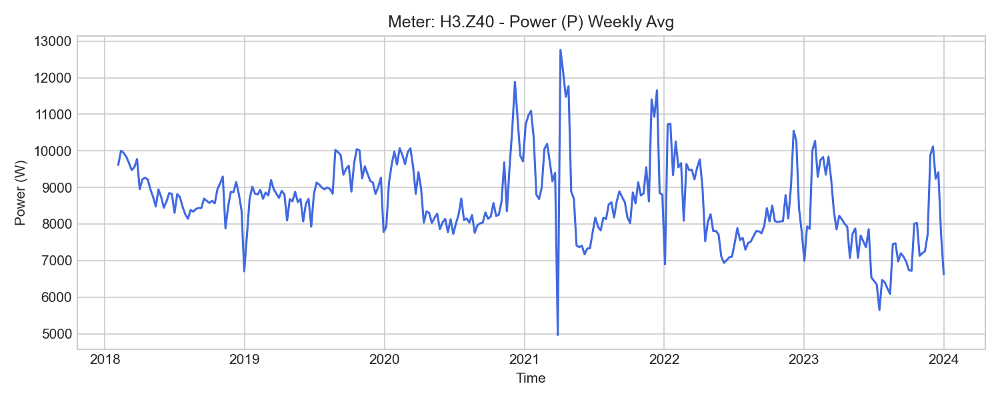

---

## H3.Z41 (design_studio)

### 기초 통계량 (1h 해상도)

| 측정 항목 | 기록 수(시간) | 평균 | 최소 | 최대 | 무부하(0) 비율 |
|-----------|---------------|------|------|------|----------------|
| PF3 | 51,840 | 0.95 | 0.00 | 1.00 | 0.00% |
| WQ | 52,585 | -59354.33 | -108921.72 | -2426.05 | 0.00% |
| I3 | 51,840 | 4.94 | 0.00 | 20.90 | 0.00% |
| W | 52,585 | 188582.61 | 22745.76 | 316328.74 | 0.00% |
| U1 | 51,840 | 231.47 | 224.95 | 238.37 | 0.00% |
| P | 51,840 | 5671.63 | -243.03 | 22399.72 | 0.00% |
| PF2 | 51,840 | 0.86 | 0.00 | 1.00 | 0.00% |
| WQ_out | 51,840 | 60541.60 | 2426.05 | 109349.71 | 0.00% |
| I1 | 51,840 | 12.66 | 0.00 | 67.43 | 0.00% |
| I2 | 51,840 | 9.47 | 0.00 | 30.14 | 0.00% |
| P3 | 51,840 | 1095.26 | 0.00 | 4721.59 | 0.00% |
| WQ_in | 49,886 | 387.88 | 0.00 | 429.52 | 9.67% |
| P2 | 51,840 | 1932.70 | 0.00 | 6602.11 | 0.00% |
| U3 | 51,840 | 231.91 | 225.25 | 237.50 | 0.00% |
| Q | 51,840 | -2058.33 | -4414.29 | 28.91 | 0.00% |
| P1 | 51,840 | 2644.21 | 0.00 | 15106.80 | 0.00% |
| W_in | 51,840 | 191135.48 | 22745.76 | 316559.95 | 0.00% |
| PF1 | 51,840 | 0.86 | 0.00 | 1.00 | 0.00% |
| PF | 51,840 | 0.89 | 0.00 | 1.00 | 0.00% |
| W_out | 49,886 | 188.02 | 0.00 | 233.97 | 19.64% |
| f | 51,840 | 50.03 | 48.78 | 50.11 | 0.00% |
| U2 | 51,840 | 231.26 | 224.73 | 238.94 | 0.00% |

### 주간(Weekly) 전력(Power) 트렌드

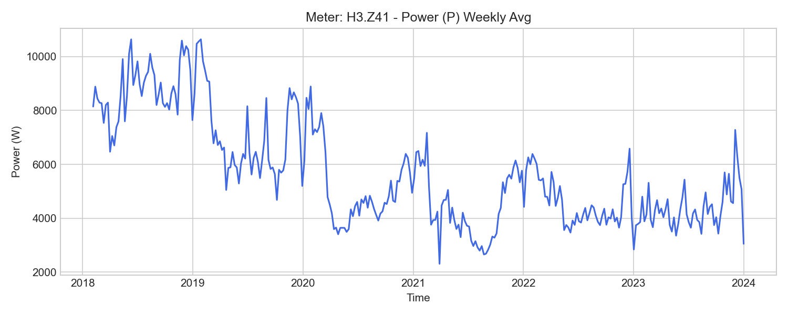

---

## H3.Z47 (design_studio)

### 기초 통계량 (1h 해상도)

| 측정 항목 | 기록 수(시간) | 평균 | 최소 | 최대 | 무부하(0) 비율 |
|-----------|---------------|------|------|------|----------------|
| W_out | 25,575 | 0.00 | 0.00 | 0.00 | 100.00% |
| f | 30,697 | 50.07 | 48.39 | 50.14 | 0.00% |
| U2 | 30,697 | 231.51 | 224.86 | 239.03 | 0.00% |
| P1 | 30,697 | 1536.39 | 355.67 | 7054.73 | 0.00% |
| PF3 | 30,697 | 0.79 | 0.44 | 0.97 | 0.00% |
| I2 | 30,697 | 6.33 | 3.04 | 25.32 | 0.00% |
| WQ_in | 30,697 | 3.10 | 3.10 | 3.10 | 0.00% |
| P2 | 30,697 | 1188.66 | 326.00 | 5630.67 | 0.00% |
| W_in | 30,697 | 96632.69 | 34758.82 | 158559.60 | 0.00% |
| PF1 | 30,697 | 0.69 | 0.29 | 1.00 | 0.00% |
| W | 52,585 | 70883.00 | 34758.82 | 158562.16 | 0.00% |
| U1 | 30,697 | 231.78 | 225.11 | 238.50 | 0.00% |
| U3 | 30,697 | 232.02 | 225.34 | 237.47 | 0.00% |
| I1 | 30,697 | 8.96 | 3.95 | 31.39 | 0.00% |
| I3 | 30,697 | 6.89 | 3.46 | 29.74 | 0.00% |
| P3 | 30,697 | 1308.21 | 377.92 | 6590.26 | 0.00% |
| P | 30,697 | 4033.82 | -1163.57 | 19244.19 | 0.00% |
| Q | 30,697 | -2579.45 | -3470.91 | -859.46 | 0.00% |
| PF | 30,697 | 0.75 | 0.38 | 0.99 | 0.00% |
| PF2 | 30,697 | 0.75 | 0.43 | 0.98 | 0.00% |
| WQ | 52,585 | -45419.63 | -102068.92 | -22505.76 | 0.00% |
| WQ_out | 30,697 | 61755.91 | 22508.86 | 102069.33 | 0.00% |

### 주간(Weekly) 전력(Power) 트렌드

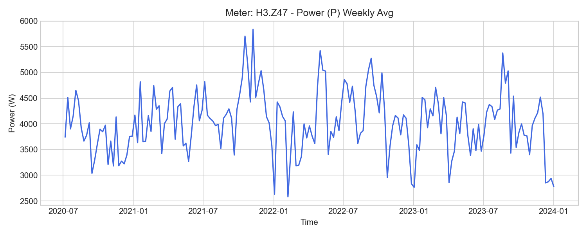

---

## H3.Z48 (design_studio)

### 기초 통계량 (1h 해상도)

| 측정 항목 | 기록 수(시간) | 평균 | 최소 | 최대 | 무부하(0) 비율 |
|-----------|---------------|------|------|------|----------------|
| WQ_in | 30,697 | 19778.84 | 10231.97 | 29522.42 | 0.00% |
| I2 | 30,697 | 1.76 | -0.00 | 19.36 | 69.05% |
| W | 52,585 | 25497.88 | 16542.33 | 47434.93 | 0.00% |
| I3 | 30,697 | 1.77 | -0.00 | 18.77 | 72.17% |
| P | 30,697 | 1007.32 | -13.37 | 15537.89 | 65.25% |
| U2 | 30,697 | 231.28 | 224.57 | 238.76 | 0.00% |
| U3 | 30,697 | 231.82 | 225.11 | 237.26 | 0.00% |
| WQ_out | 30,697 | 2358.37 | 2358.08 | 2358.70 | 0.00% |
| f | 30,697 | 50.08 | 49.24 | 50.15 | 0.00% |
| W_out | 30,697 | 2.12 | 0.82 | 4.10 | 0.00% |
| WQ | 52,585 | 13447.54 | 7873.89 | 27163.77 | 0.00% |
| P1 | 30,697 | 331.43 | -8.44 | 3458.64 | 86.68% |
| PF2 | 30,697 | 0.07 | -0.55 | 0.87 | 69.16% |
| P2 | 30,697 | 342.64 | -5.33 | 3582.65 | 69.16% |
| W_in | 30,697 | 31883.59 | 16543.19 | 47438.97 | 0.00% |
| I1 | 30,697 | 1.72 | 0.00 | 18.70 | 86.68% |
| PF3 | 30,697 | 0.09 | -0.35 | 0.85 | 72.34% |
| P3 | 30,697 | 339.89 | -3.47 | 3552.53 | 72.21% |
| Q | 30,697 | 628.93 | -8.00 | 9945.61 | 65.34% |
| PF1 | 30,697 | 0.08 | -0.78 | 0.86 | 86.65% |
| U1 | 30,697 | 231.59 | 224.91 | 238.27 | 0.00% |
| PF | 30,697 | 0.07 | -0.99 | 0.93 | 65.22% |

### 주간(Weekly) 전력(Power) 트렌드

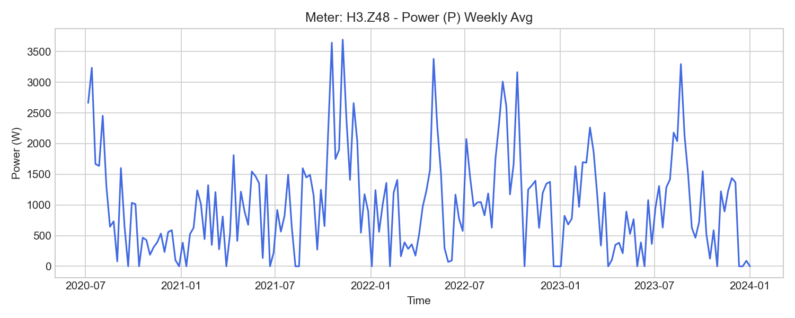

---

## H3.Z49 (design_studio)

### 기초 통계량 (1h 해상도)

| 측정 항목 | 기록 수(시간) | 평균 | 최소 | 최대 | 무부하(0) 비율 |
|-----------|---------------|------|------|------|----------------|
| PF2 | 30,697 | 0.26 | 0.12 | 0.88 | 0.00% |
| I2 | 30,697 | 1.17 | 0.52 | 10.71 | 0.00% |
| P2 | 30,697 | 144.92 | 14.22 | 2101.97 | 0.00% |
| P1 | 30,697 | 116.88 | -4.97 | 1911.49 | 0.00% |
| PF3 | 30,697 | 0.15 | -0.00 | 0.86 | 0.00% |
| PF | 30,697 | 0.18 | 0.03 | 0.95 | 0.00% |
| WQ_in | 30,697 | 940.05 | 582.05 | 1292.62 | 0.00% |
| U1 | 30,697 | 231.73 | 224.93 | 238.42 | 0.00% |
| Q | 30,697 | -273.59 | -504.46 | 504.54 | 0.00% |
| WQ_out | 30,697 | 7900.01 | 3399.19 | 12408.63 | 0.00% |
| U2 | 30,697 | 231.44 | 224.77 | 238.93 | 0.00% |
| WQ | 52,585 | -5235.87 | -11116.30 | -2817.14 | 0.00% |
| P | 30,697 | 386.41 | 2.60 | 6000.04 | 0.00% |
| I3 | 30,697 | 1.10 | 0.45 | 10.37 | 0.00% |
| I1 | 30,697 | 1.08 | 0.45 | 9.97 | 0.00% |
| PF1 | 30,697 | 0.11 | -0.05 | 0.86 | 0.00% |
| U3 | 30,697 | 231.95 | 225.31 | 237.40 | 0.00% |
| f | 30,697 | 50.05 | 49.22 | 50.12 | 0.00% |
| P3 | 30,697 | 127.32 | 0.25 | 1986.39 | 0.00% |
| W_out | 25,575 | -0.00 | -0.00 | 0.00 | 0.01% |
| W | 52,585 | 12024.06 | 8471.97 | 20426.30 | 0.00% |
| W_in | 30,697 | 14556.04 | 8471.97 | 20426.26 | 0.00% |

### 주간(Weekly) 전력(Power) 트렌드

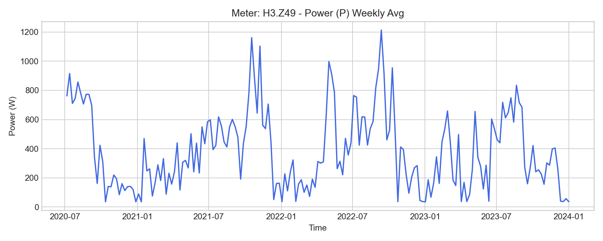

---

## H3.ZE40 (design_studio)

### 기초 통계량 (1h 해상도)

| 측정 항목 | 기록 수(시간) | 평균 | 최소 | 최대 | 무부하(0) 비율 |
|-----------|---------------|------|------|------|----------------|
| I1 | 15,686 | 12.16 | 2.81 | 26.85 | 0.00% |
| P3 | 15,686 | 2411.62 | -2931.61 | 5958.49 | 0.00% |
| U2 | 15,686 | 231.37 | 224.90 | 238.74 | 0.00% |
| PF3 | 15,686 | 0.90 | -0.79 | 1.00 | 0.00% |
| PF | 15,686 | 0.90 | -0.05 | 0.99 | 0.00% |
| W_out | 10,503 | 24.37 | 4.18 | 24.81 | 0.00% |
| I2 | 15,686 | 14.15 | 5.38 | 34.23 | 0.00% |
| PF2 | 15,686 | 0.93 | 0.86 | 1.00 | 0.00% |
| W1 | 15,685 | 18327.21 | -681.46 | 38604.10 | 0.00% |
| P1 | 15,686 | 2473.31 | -3244.99 | 6168.99 | 0.00% |
| U3 | 15,686 | 231.96 | 225.62 | 237.32 | 0.00% |
| PF1 | 15,686 | 0.89 | -0.71 | 1.00 | 0.00% |
| W3 | 15,685 | 17789.20 | -1314.13 | 37522.16 | 0.00% |
| U1 | 15,686 | 231.77 | 225.32 | 238.17 | 0.00% |
| f | 15,686 | 50.00 | 49.95 | 50.07 | 0.00% |
| P | 15,686 | 7889.19 | -590.94 | 18015.26 | 0.00% |
| W2 | 15,685 | 24358.07 | 586.66 | 47697.92 | 0.00% |
| W_in | 15,685 | 62448.13 | 586.68 | 125820.82 | 0.00% |
| W | 15,685 | 60474.47 | 91.64 | 123824.19 | 0.00% |
| I3 | 15,686 | 11.84 | 1.44 | 26.07 | 0.00% |
| P2 | 15,686 | 3004.25 | 1110.36 | 7286.25 | 0.00% |

### 주간(Weekly) 전력(Power) 트렌드

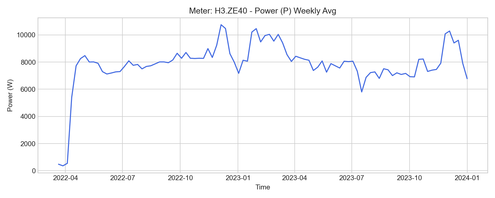

---

## H3.ZE41 (design_studio)

### 기초 통계량 (1h 해상도)

| 측정 항목 | 기록 수(시간) | 평균 | 최소 | 최대 | 무부하(0) 비율 |
|-----------|---------------|------|------|------|----------------|
| P2 | 15,686 | 1606.96 | 641.01 | 5257.42 | 0.00% |
| U3 | 15,686 | 231.94 | 225.59 | 237.32 | 0.00% |
| I1 | 15,686 | 9.32 | 4.26 | 33.90 | 0.00% |
| I2 | 15,686 | 7.99 | 4.59 | 23.80 | 0.00% |
| PF1 | 15,686 | 0.85 | -0.36 | 1.00 | 0.00% |
| PF2 | 15,686 | 0.88 | 0.81 | 0.97 | 0.00% |
| U2 | 15,686 | 231.35 | 224.93 | 238.74 | 0.00% |
| PF3 | 15,686 | 0.92 | -0.72 | 1.00 | 0.00% |
| W1 | 15,685 | 13212.55 | -520.60 | 28040.44 | 0.00% |
| I3 | 15,686 | 3.95 | 1.29 | 18.73 | 0.00% |
| P | 15,686 | 4231.06 | -2162.23 | 13766.84 | 0.00% |
| W3 | 15,685 | 5826.80 | -340.10 | 12954.25 | 0.00% |
| W_out | 502 | 147.12 | 49.93 | 277.26 | 0.00% |
| U1 | 15,686 | 231.73 | 225.26 | 238.13 | 0.00% |
| W | 15,685 | 31290.62 | -20.70 | 66429.24 | 0.00% |
| W_in | 15,685 | 32180.67 | 238.86 | 67331.19 | 0.00% |
| P3 | 15,686 | 831.03 | -1693.47 | 4268.67 | 0.00% |
| f | 15,686 | 50.00 | 49.95 | 50.07 | 0.00% |
| PF | 15,686 | 0.85 | -0.22 | 0.98 | 0.00% |
| P1 | 15,686 | 1791.34 | -2060.83 | 7913.57 | 0.00% |
| W2 | 15,685 | 12251.23 | 231.09 | 25434.55 | 0.00% |

### 주간(Weekly) 전력(Power) 트렌드

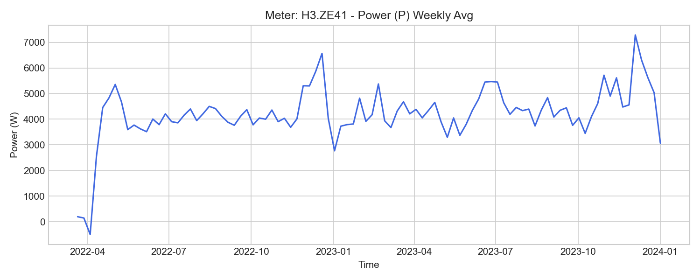

---

## H1.Z10 (emission_lab)

### 기초 통계량 (1h 해상도)

| 측정 항목 | 기록 수(시간) | 평균 | 최소 | 최대 | 무부하(0) 비율 |
|-----------|---------------|------|------|------|----------------|
| I1 | 52,584 | 6.02 | 0.10 | 45.44 | 0.00% |
| U2 | 52,584 | 229.71 | 221.88 | 236.71 | 0.00% |
| P2 | 52,584 | 1849.10 | -1683.82 | 8661.99 | 0.00% |
| W | 52,585 | 129207.33 | 9648.42 | 244456.49 | 0.00% |
| U3 | 52,584 | 230.31 | 222.54 | 236.58 | 0.00% |
| WQ_in | 52,380 | 1081.34 | 83.73 | 1940.02 | 0.00% |
| P1 | 52,584 | 1269.10 | -2416.82 | 9035.88 | 0.00% |
| Q | 52,584 | -1000.88 | -2433.71 | 3289.34 | 0.00% |
| WQ | 52,585 | -29247.63 | -53847.78 | -1812.80 | 0.00% |
| W_out | 52,062 | 9.81 | 0.00 | 42.02 | 23.00% |
| PF2 | 52,584 | 0.90 | -0.85 | 1.00 | 0.00% |
| WQ_out | 52,583 | 30324.18 | 1896.49 | 55786.82 | 0.00% |
| P3 | 52,584 | 1407.96 | -1805.94 | 8459.22 | 0.00% |
| I2 | 52,584 | 8.76 | 0.15 | 44.17 | 0.00% |
| PF | 52,584 | 0.92 | -0.89 | 1.00 | 0.00% |
| U1 | 52,584 | 229.89 | 222.37 | 235.95 | 0.00% |
| f | 52,584 | 50.09 | 49.53 | 50.19 | 0.00% |
| I3 | 52,584 | 6.63 | 0.18 | 43.31 | 0.00% |
| W_in | 52,584 | 129210.38 | 9648.26 | 244494.85 | 0.00% |
| PF3 | 52,584 | 0.90 | -0.86 | 0.99 | 0.00% |
| PF1 | 52,584 | 0.91 | -0.89 | 1.00 | 0.00% |
| P | 52,584 | 4468.42 | -5664.69 | 25976.33 | 0.00% |

### 주간(Weekly) 전력(Power) 트렌드

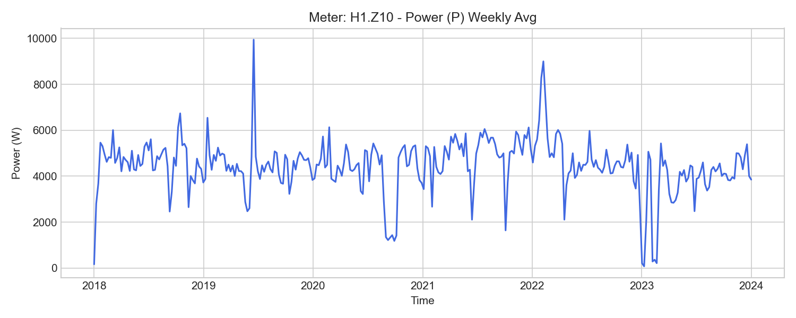

---

## H1.Z13 (emission_lab)

### 기초 통계량 (1h 해상도)

| 측정 항목 | 기록 수(시간) | 평균 | 최소 | 최대 | 무부하(0) 비율 |
|-----------|---------------|------|------|------|----------------|
| U1 | 52,584 | 229.85 | 222.37 | 235.96 | 0.00% |
| PF2 | 52,584 | 0.71 | 0.42 | 0.91 | 0.00% |
| I3 | 52,584 | 25.48 | 0.00 | 76.30 | 0.04% |
| P2 | 52,584 | 4096.87 | 43.57 | 13247.40 | 0.00% |
| PF | 52,584 | 0.70 | 0.33 | 0.94 | 0.00% |
| I2 | 52,584 | 25.08 | 0.29 | 75.36 | 0.00% |
| P1 | 52,584 | 3926.41 | -20.53 | 13002.98 | 0.00% |
| f | 52,584 | 50.06 | 49.51 | 50.16 | 0.00% |
| Q | 52,584 | 11705.54 | 2.01 | 33554.81 | 0.00% |
| PF3 | 52,584 | 0.71 | -0.03 | 0.93 | 0.04% |
| WQ | 52,585 | 358332.37 | 38129.48 | 653265.37 | 0.00% |
| PF1 | 52,584 | 0.69 | -0.88 | 0.99 | 0.00% |
| U2 | 52,584 | 229.76 | 221.98 | 236.79 | 0.00% |
| W_in | 52,584 | 407576.59 | 55941.41 | 696811.07 | 0.00% |
| W_out | 52,062 | 0.01 | 0.00 | 0.05 | 23.00% |
| W | 52,585 | 407594.26 | 55958.82 | 696818.04 | 0.00% |
| WQ_out | 52,062 | 0.09 | 0.00 | 0.12 | 23.00% |
| P3 | 52,584 | 4183.93 | -2.33 | 13395.96 | 0.04% |
| U3 | 52,584 | 230.35 | 222.63 | 236.62 | 0.00% |
| WQ_in | 52,584 | 358315.15 | 38121.14 | 653261.15 | 0.00% |
| P | 52,584 | 12195.53 | 3.87 | 39603.83 | 0.00% |
| I1 | 52,584 | 24.47 | 0.05 | 74.51 | 0.00% |

### 주간(Weekly) 전력(Power) 트렌드

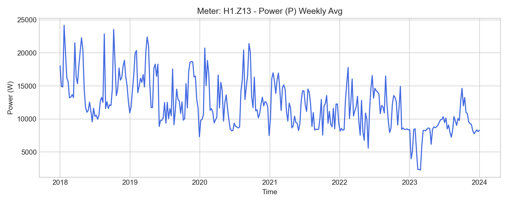

---

## H1.Z14 (emission_lab)

### 기초 통계량 (1h 해상도)

| 측정 항목 | 기록 수(시간) | 평균 | 최소 | 최대 | 무부하(0) 비율 |
|-----------|---------------|------|------|------|----------------|
| WQ_out | 52,062 | 0.09 | 0.00 | 0.14 | 23.00% |
| I2 | 52,584 | 23.85 | 0.32 | 71.29 | 0.00% |
| WQ | 52,585 | 342499.75 | 36510.41 | 624415.41 | 0.00% |
| P3 | 52,584 | 3954.78 | 0.00 | 12630.36 | 0.07% |
| PF | 52,584 | 0.70 | 0.38 | 0.94 | 0.00% |
| Q | 52,584 | 11191.57 | -12.55 | 31944.69 | 0.00% |
| PF3 | 52,584 | 0.71 | 0.00 | 0.95 | 0.07% |
| PF2 | 52,584 | 0.70 | 0.40 | 0.91 | 0.00% |
| I3 | 52,584 | 24.10 | 0.00 | 71.93 | 0.06% |
| I1 | 52,584 | 23.29 | 0.00 | 70.72 | 0.00% |
| W_out | 52,062 | 0.01 | 0.00 | 0.01 | 23.00% |
| P1 | 52,584 | 3722.56 | 0.45 | 12278.16 | 0.00% |
| PF1 | 52,584 | 0.69 | 0.03 | 1.00 | 0.00% |
| P | 52,584 | 11518.25 | 3.87 | 37283.32 | 0.00% |
| U3 | 52,584 | 230.15 | 222.53 | 236.39 | 0.00% |
| WQ_in | 52,584 | 342483.30 | 36502.41 | 624411.38 | 0.00% |
| f | 52,584 | 50.08 | 48.99 | 50.17 | 0.00% |
| U2 | 52,584 | 229.61 | 221.93 | 236.60 | 0.00% |
| U1 | 52,584 | 229.77 | 222.31 | 235.85 | 0.00% |
| W_in | 52,584 | 384495.83 | 52663.94 | 657679.38 | 0.00% |
| W | 52,585 | 384512.52 | 52680.28 | 657686.01 | 0.00% |
| P2 | 52,584 | 3851.05 | 54.62 | 12406.43 | 0.00% |

### 주간(Weekly) 전력(Power) 트렌드

---

## H1.Z15 (emission_lab)

### 기초 통계량 (1h 해상도)

| 측정 항목 | 기록 수(시간) | 평균 | 최소 | 최대 | 무부하(0) 비율 |
|-----------|---------------|------|------|------|----------------|
| W_in | 52,575 | 1608407.35 | 412229.92 | 2639211.58 | 0.00% |
| U2 | 52,584 | 229.63 | 222.30 | 236.25 | 0.00% |
| W3 | 52,583 | 399579.27 | 112405.02 | 599125.51 | 0.00% |
| U1 | 52,584 | 229.90 | 222.69 | 235.62 | 0.00% |
| f | 52,584 | 50.00 | 49.95 | 50.07 | 0.00% |
| PF | 52,584 | 0.21 | -0.98 | 1.00 | 0.00% |
| I3 | 52,584 | -144.64 | -522.57 | -11.57 | 0.00% |
| W1 | 52,583 | 376920.36 | 97153.79 | 598730.86 | 0.00% |
| PF3 | 52,584 | 0.23 | -0.99 | 1.00 | 0.00% |
| W2 | 52,583 | 305499.58 | 100015.62 | 437491.89 | 0.00% |
| PF2 | 52,584 | 0.15 | -0.98 | 1.00 | 0.00% |
| P2 | 52,584 | 5433.28 | -46390.09 | 100002.41 | 0.00% |
| I2 | 52,584 | -117.85 | -444.25 | 154.26 | 0.00% |
| U3 | 52,584 | 230.20 | 222.61 | 236.13 | 0.00% |
| PF1 | 52,584 | 0.25 | -0.99 | 1.00 | 0.00% |
| I1 | 52,584 | -125.14 | -446.58 | 259.20 | 0.00% |
| P1 | 52,584 | 8674.04 | -45086.86 | 98806.57 | 0.00% |
| W | 52,583 | 1081957.91 | 309574.46 | 1635257.35 | 0.00% |
| W_out | 52,583 | 1014101.00 | 71454.29 | 72035748.00 | 0.00% |
| P | 52,584 | 22476.78 | -137383.01 | 315070.42 | 0.00% |
| P3 | 52,584 | 8370.55 | -48164.30 | 116261.44 | 0.00% |

### 주간(Weekly) 전력(Power) 트렌드

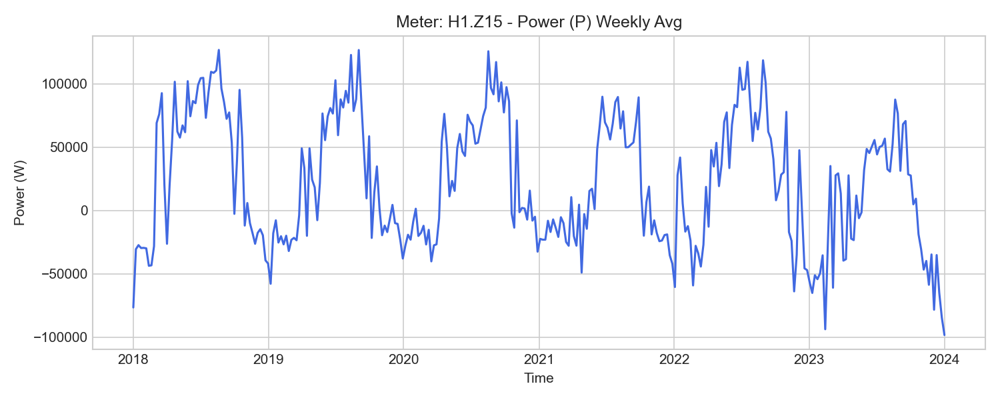

---

## H1.Z16 (emission_lab)

### 기초 통계량 (1h 해상도)

| 측정 항목 | 기록 수(시간) | 평균 | 최소 | 최대 | 무부하(0) 비율 |
|-----------|---------------|------|------|------|----------------|
| P3 | 52,523 | 215.65 | 0.00 | 12599.15 | 91.92% |
| P2 | 52,584 | 417.86 | 38.37 | 12827.80 | 0.00% |
| f | 52,584 | 50.07 | 49.99 | 50.15 | 0.00% |
| PF | 52,583 | 0.99 | 0.20 | 1.00 | 0.00% |
| P1 | 52,584 | 442.37 | 43.56 | 12742.70 | 0.00% |
| PF1 | 52,584 | 0.91 | 0.17 | 0.92 | 0.00% |
| WQ_out | 51,895 | 0.00 | 0.00 | 0.00 | 100.00% |
| I2 | 52,584 | 2.37 | 0.21 | 67.65 | 0.00% |
| W_out | 51,895 | 0.00 | 0.00 | 0.00 | 100.00% |
| W | 52,585 | 23050.24 | 1286.01 | 57772.43 | 0.00% |
| I1 | 52,584 | 2.35 | 0.22 | 66.50 | 0.00% |
| WQ | 52,585 | 10485.23 | 135.81 | 32825.33 | 0.00% |
| PF3 | 52,523 | 0.02 | 0.00 | 0.83 | 91.92% |
| I3 | 52,523 | 1.27 | -0.00 | 66.62 | 91.92% |
| P | 52,584 | 1073.46 | 1.81 | 38167.58 | 0.00% |
| Q | 52,584 | 620.54 | 0.00 | 25688.24 | 0.01% |
| W_in | 52,583 | 23048.92 | 1286.01 | 57769.40 | 0.00% |
| U1 | 52,584 | 229.84 | 222.38 | 235.05 | 0.00% |
| U2 | 52,584 | 229.66 | 222.03 | 234.95 | 0.00% |
| PF2 | 52,584 | 0.80 | 0.16 | 0.83 | 0.00% |
| U3 | 52,584 | 230.20 | 222.42 | 235.78 | 0.00% |
| WQ_in | 52,583 | 10484.39 | 135.81 | 32822.93 | 0.00% |

### 주간(Weekly) 전력(Power) 트렌드

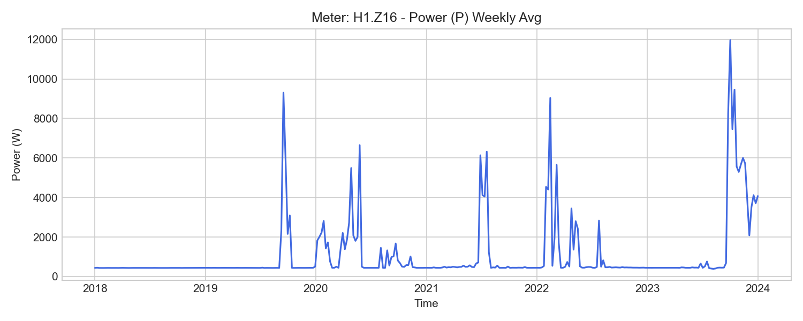

---

## H1.Z17 (emission_lab)

### 기초 통계량 (1h 해상도)

| 측정 항목 | 기록 수(시간) | 평균 | 최소 | 최대 | 무부하(0) 비율 |
|-----------|---------------|------|------|------|----------------|
| U2 | 52,584 | 229.63 | 222.26 | 236.26 | 0.00% |
| f | 52,584 | 50.00 | 49.95 | 50.07 | 0.00% |
| W1 | 52,583 | 805843.60 | 188436.20 | 1370783.76 | 0.00% |
| U1 | 52,584 | 229.91 | 222.70 | 235.63 | 0.00% |
| P3 | 52,584 | 20681.29 | 3452.71 | 82680.99 | 0.00% |
| P1 | 52,584 | 22498.74 | 5476.75 | 86093.40 | 0.00% |
| W | 52,583 | 2381591.44 | 564143.73 | 3993859.38 | 0.00% |
| PF | 52,584 | 0.90 | 0.73 | 0.99 | 0.00% |
| I3 | 52,584 | 100.09 | -42.92 | 424.60 | 0.00% |
| P | 52,584 | 65261.29 | 13956.47 | 251694.76 | 0.00% |
| PF3 | 52,584 | 0.89 | 0.72 | 1.00 | 0.00% |
| U3 | 52,584 | 230.20 | 222.61 | 236.15 | 0.00% |
| P2 | 52,584 | 22079.81 | 4781.25 | 85295.76 | 0.00% |
| W_out | 30,301 | 6874.00 | 6874.00 | 6874.00 | 0.00% |
| PF1 | 52,584 | 0.92 | 0.74 | 1.00 | 0.00% |
| W3 | 52,583 | 770494.93 | 187922.93 | 1274935.63 | 0.00% |
| W_in | 52,583 | 595994750.29 | 571017715.20 | 597701114.66 | 0.00% |
| PF2 | 52,584 | 0.91 | 0.74 | 1.00 | 0.00% |
| I2 | 52,584 | 102.10 | -164.43 | 427.69 | 0.00% |
| I1 | 52,584 | 109.29 | 24.98 | 429.07 | 0.00% |
| W2 | 52,583 | 805252.82 | 187784.60 | 1348139.92 | 0.00% |

### 주간(Weekly) 전력(Power) 트렌드

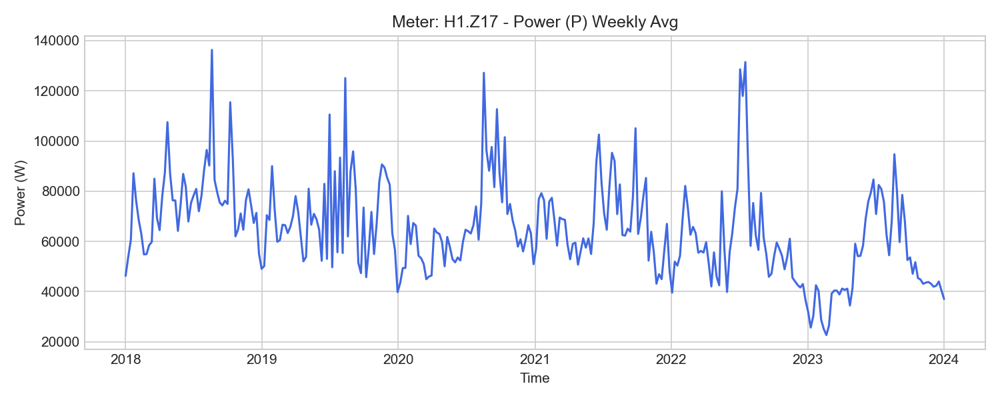

---

## H1.Z18 (emission_lab)

### 기초 통계량 (1h 해상도)

| 측정 항목 | 기록 수(시간) | 평균 | 최소 | 최대 | 무부하(0) 비율 |
|-----------|---------------|------|------|------|----------------|
| U2 | 52,584 | 229.73 | 221.95 | 236.75 | 0.00% |
| PF2 | 52,584 | 0.92 | 0.85 | 1.00 | 0.00% |
| P1 | 52,584 | 403.78 | 0.00 | 4524.65 | 3.76% |
| PF3 | 52,584 | 0.84 | -0.02 | 0.97 | 0.00% |
| WQ_in | 52,583 | 9342.18 | 1072.14 | 16089.45 | 0.00% |
| P | 52,584 | 1668.84 | 3.80 | 15336.68 | 0.00% |
| WQ | 52,585 | 9338.65 | 1072.14 | 16079.12 | 0.00% |
| I2 | 52,584 | 1.34 | 0.22 | 26.11 | 0.00% |
| W | 52,585 | 53425.81 | 5470.41 | 93209.91 | 0.00% |
| f | 52,584 | 50.08 | 49.01 | 50.19 | 0.00% |
| I1 | 52,584 | 2.20 | -0.00 | 22.09 | 3.74% |
| I3 | 52,584 | 4.59 | 0.24 | 27.44 | 0.00% |
| U3 | 52,584 | 230.31 | 222.69 | 236.65 | 0.00% |
| W_out | 52,062 | 0.00 | 0.00 | 0.00 | 100.00% |
| U1 | 52,584 | 229.85 | 222.44 | 235.94 | 0.00% |
| WQ_out | 52,062 | 3.82 | 0.00 | 10.59 | 23.00% |
| P3 | 52,584 | 976.61 | -1.47 | 5765.27 | 0.00% |
| W_in | 52,583 | 53424.30 | 5470.41 | 93209.83 | 0.00% |
| P2 | 52,584 | 284.94 | 43.94 | 5758.47 | 0.00% |
| Q | 52,584 | 285.34 | -59.10 | 9002.72 | 0.00% |
| PF | 52,584 | 0.89 | 0.36 | 1.00 | 0.00% |
| PF1 | 52,584 | 0.70 | 0.00 | 0.91 | 3.76% |

### 주간(Weekly) 전력(Power) 트렌드

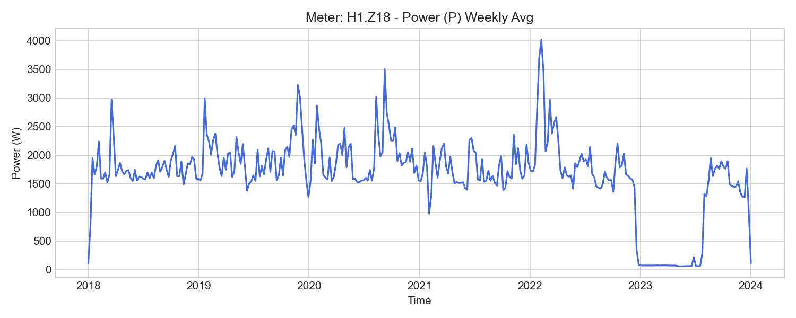

---

## H1.Z19 (emission_lab)

### 기초 통계량 (1h 해상도)

| 측정 항목 | 기록 수(시간) | 평균 | 최소 | 최대 | 무부하(0) 비율 |
|-----------|---------------|------|------|------|----------------|
| f | 52,584 | 50.04 | 49.46 | 50.12 | 0.00% |
| PF | 52,584 | 0.41 | -0.96 | 0.97 | 3.11% |
| PF3 | 52,584 | 0.59 | -0.96 | 0.95 | 3.11% |
| P2 | 52,584 | 1197.40 | -5746.71 | 5893.90 | 18.05% |
| WQ_out | 52,062 | 2704.63 | 0.00 | 3823.58 | 0.32% |
| I2 | 52,584 | 7.41 | 0.00 | 31.60 | 18.05% |
| U3 | 52,584 | 230.36 | 222.65 | 236.70 | 0.00% |
| U1 | 52,584 | 229.94 | 222.37 | 236.08 | 0.00% |
| I3 | 52,584 | 6.90 | 0.00 | 31.85 | 3.09% |
| WQ_in | 52,583 | 7284.98 | 176.34 | 11991.86 | 0.00% |
| Q | 52,584 | 152.45 | -278.44 | 1240.70 | 30.63% |
| P1 | 52,584 | 1167.16 | -25.67 | 5913.72 | 8.22% |
| U2 | 52,584 | 229.81 | 222.03 | 236.85 | 0.00% |
| PF2 | 52,584 | 0.29 | -0.86 | 0.86 | 18.05% |
| W_in | 52,583 | 81394.25 | 155.40 | 140143.88 | 0.00% |
| W_out | 52,062 | 1348.47 | 0.00 | 1373.22 | 1.78% |
| P3 | 52,584 | 1068.20 | -74.98 | 6052.95 | 3.10% |
| P | 52,584 | 2610.09 | -15.71 | 25292.51 | 30.62% |
| WQ | 52,585 | 4607.28 | -148.82 | 8168.28 | 0.00% |
| PF1 | 52,584 | 0.21 | -0.55 | 0.94 | 8.22% |
| I1 | 52,584 | 7.31 | -0.00 | 31.12 | 8.22% |
| W | 52,585 | 80061.37 | -161.20 | 138770.66 | 0.00% |

### 주간(Weekly) 전력(Power) 트렌드

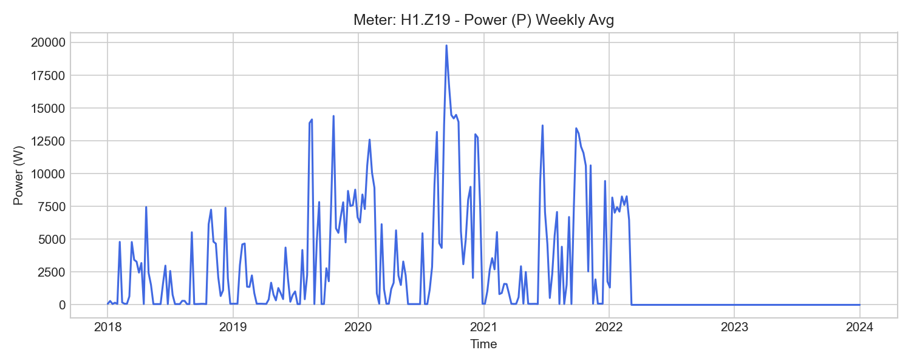

---

## H1.Z21 (emission_lab)

### 기초 통계량 (1h 해상도)

| 측정 항목 | 기록 수(시간) | 평균 | 최소 | 최대 | 무부하(0) 비율 |
|-----------|---------------|------|------|------|----------------|
| PF | 52,584 | 0.86 | -1.00 | 1.00 | 1.78% |
| U2 | 52,584 | 229.59 | 221.84 | 236.49 | 0.00% |
| PF1 | 52,584 | 0.74 | -0.62 | 1.00 | 1.90% |
| P2 | 52,584 | 172.13 | -41.95 | 5959.77 | 1.78% |
| I1 | 52,584 | 1.04 | -0.00 | 53.85 | 1.90% |
| WQ | 52,585 | 3926.93 | 579.25 | 5880.72 | 0.00% |
| WQ_in | 52,584 | 4341.64 | 582.22 | 6563.88 | 0.00% |
| I3 | 52,584 | 0.33 | 0.00 | 51.08 | 9.23% |
| P1 | 52,584 | 194.14 | -10.63 | 6439.62 | 1.90% |
| Q | 52,584 | 100.43 | -135.35 | 25475.96 | 1.78% |
| I2 | 52,584 | 1.03 | 0.00 | 56.24 | 1.78% |
| P3 | 52,584 | 48.94 | -540.41 | 5046.44 | 9.17% |
| f | 52,584 | 50.08 | 48.99 | 50.16 | 0.00% |
| W_in | 52,584 | 14621.58 | 1659.79 | 23441.62 | 0.00% |
| PF3 | 52,584 | 0.61 | -0.81 | 0.98 | 9.22% |
| WQ_out | 52,522 | 415.34 | 3.01 | 683.18 | 0.00% |
| U1 | 52,584 | 229.75 | 222.23 | 235.73 | 0.00% |
| W | 52,585 | 14546.67 | 1655.45 | 23336.15 | 0.00% |
| W_out | 52,501 | 75.61 | 4.59 | 105.70 | 0.00% |
| U3 | 52,584 | 230.14 | 222.47 | 236.33 | 0.00% |
| P | 52,584 | 412.46 | -12.26 | 17417.82 | 1.79% |
| PF2 | 52,584 | 0.66 | -0.96 | 0.94 | 1.78% |

### 주간(Weekly) 전력(Power) 트렌드

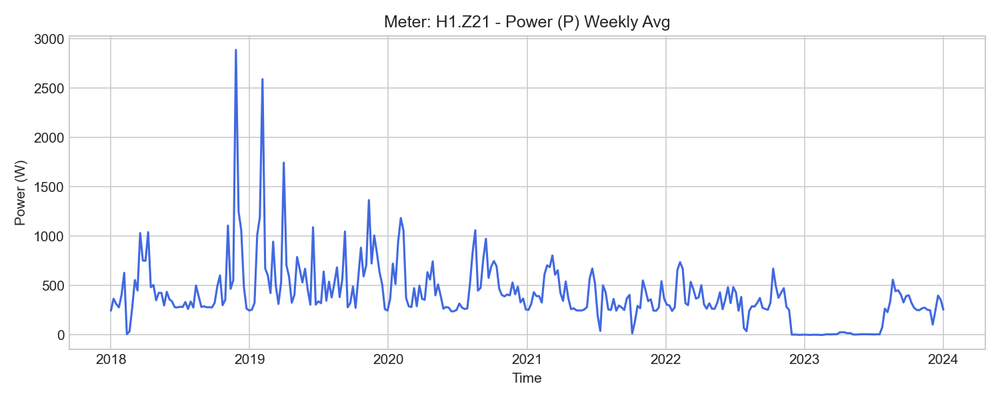

---

## H1.Z22 (emission_lab)

### 기초 통계량 (1h 해상도)

| 측정 항목 | 기록 수(시간) | 평균 | 최소 | 최대 | 무부하(0) 비율 |
|-----------|---------------|------|------|------|----------------|
| I2 | 52,584 | 1.04 | -0.00 | 57.20 | 4.28% |
| P | 52,584 | 390.18 | -197.71 | 17548.13 | 2.13% |
| U2 | 52,584 | 229.70 | 221.91 | 236.71 | 0.00% |
| f | 52,584 | 50.06 | 49.48 | 50.14 | 0.00% |
| U1 | 52,584 | 229.90 | 222.42 | 236.02 | 0.00% |
| W_out | 52,501 | 101.48 | 5.70 | 200.03 | 0.00% |
| Q | 52,584 | 122.41 | -45.19 | 25981.69 | 2.13% |
| PF3 | 52,584 | -0.24 | -0.97 | 0.96 | 32.15% |
| I1 | 52,584 | 1.01 | -0.00 | 54.12 | 2.46% |
| WQ_in | 52,583 | 4754.52 | 679.92 | 7309.15 | 0.00% |
| U3 | 52,584 | 230.29 | 222.60 | 236.57 | 0.00% |
| W_in | 52,583 | 14000.97 | 1554.42 | 22270.83 | 0.00% |
| PF | 52,584 | 0.77 | -1.00 | 1.00 | 2.12% |
| P1 | 52,584 | 191.48 | -77.81 | 6358.96 | 2.47% |
| PF1 | 52,584 | 0.71 | -0.99 | 0.99 | 2.46% |
| W | 52,585 | 13899.95 | 1548.72 | 22071.01 | 0.00% |
| P3 | 52,584 | 22.97 | -604.98 | 5118.05 | 32.15% |
| PF2 | 52,584 | 0.74 | -0.87 | 0.94 | 4.28% |
| P2 | 52,584 | 177.99 | -17.12 | 6051.71 | 4.28% |
| I3 | 52,584 | 0.30 | -0.00 | 52.25 | 32.17% |
| WQ_out | 52,062 | 132.35 | 0.00 | 179.82 | 0.63% |
| WQ | 52,585 | 4623.58 | 679.92 | 7129.34 | 0.00% |

### 주간(Weekly) 전력(Power) 트렌드

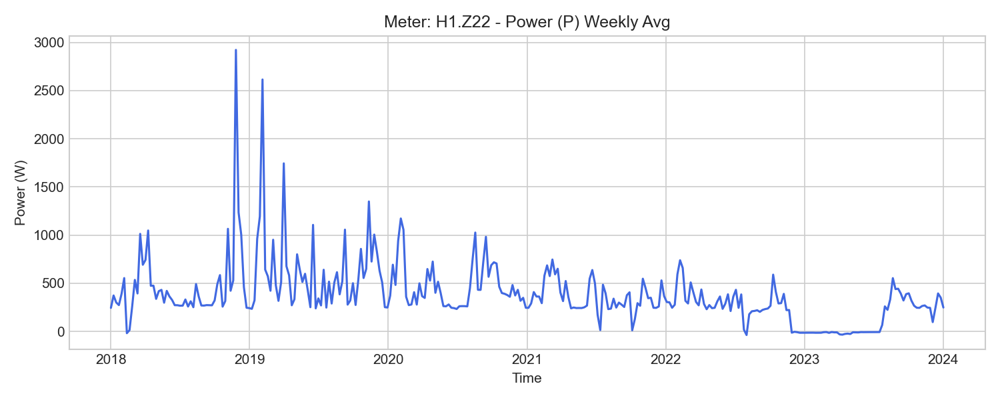

---

## H1.Z23 (emission_lab)

### 기초 통계량 (1h 해상도)

| 측정 항목 | 기록 수(시간) | 평균 | 최소 | 최대 | 무부하(0) 비율 |
|-----------|---------------|------|------|------|----------------|
| P1 | 52,584 | 957.28 | -2.68 | 40479.56 | 17.49% |
| P | 52,584 | 2481.00 | -0.38 | 122604.83 | 17.30% |
| I1 | 52,584 | 5.03 | 0.00 | 193.31 | 17.49% |
| WQ_in | 52,584 | 65428.36 | 14595.82 | 98924.84 | 0.00% |
| U1 | 52,584 | 229.88 | 222.48 | 235.98 | 0.00% |
| f | 52,584 | 50.02 | 48.90 | 50.10 | 0.00% |
| WQ | 52,267 | 65169.35 | 14643.30 | 97491.92 | 0.00% |
| U2 | 52,584 | 229.71 | 222.00 | 236.71 | 0.00% |
| W_in | 52,584 | 94856.19 | 19669.05 | 152220.26 | 0.00% |
| W | 52,062 | 95608.24 | 20026.82 | 152220.26 | 0.00% |
| WQ_out | 52,267 | 567.15 | 5.11 | 1851.05 | 0.00% |
| W_out | 52,062 | 0.00 | 0.00 | 0.00 | 100.00% |
| Q | 52,584 | 1538.53 | -1985.25 | 58114.78 | 17.26% |
| PF2 | 52,584 | 0.28 | -0.50 | 0.99 | 17.35% |
| PF | 52,584 | 0.79 | -0.03 | 1.00 | 17.21% |
| I2 | 52,584 | 3.85 | 0.00 | 195.44 | 17.34% |
| P2 | 52,584 | 664.36 | -8.62 | 40673.78 | 17.34% |
| P3 | 52,584 | 847.85 | -0.12 | 41212.84 | 17.41% |
| PF3 | 52,584 | 0.50 | -0.03 | 1.00 | 17.40% |
| U3 | 52,584 | 230.25 | 222.62 | 236.56 | 0.00% |
| I3 | 52,584 | 4.69 | 0.00 | 197.28 | 17.41% |
| PF1 | 52,584 | 0.81 | -0.15 | 1.00 | 17.48% |

### 주간(Weekly) 전력(Power) 트렌드

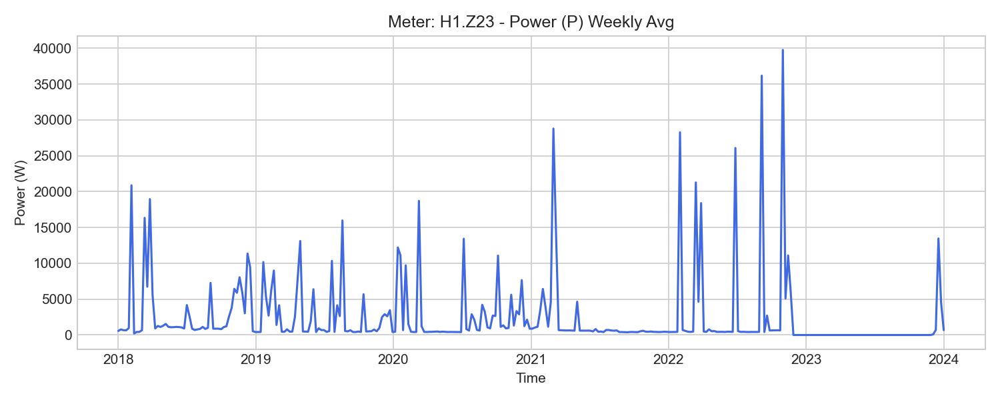

---

## H1.Z26 (emission_lab)

### 기초 통계량 (1h 해상도)

| 측정 항목 | 기록 수(시간) | 평균 | 최소 | 최대 | 무부하(0) 비율 |
|-----------|---------------|------|------|------|----------------|
| PF2 | 52,584 | 0.04 | -0.18 | 0.92 | 1.20% |
| I2 | 52,584 | 172.00 | -3.66 | 213.02 | 0.56% |
| W3 | 52,583 | 45567.00 | 876.24 | 91546.69 | 0.00% |
| I3 | 52,584 | 169.12 | -177.98 | 211.78 | 0.59% |
| PF1 | 52,584 | 0.06 | -0.18 | 1.00 | 1.25% |
| P3 | 52,584 | 1720.99 | -4462.74 | 20793.28 | 1.57% |
| f | 52,584 | 50.00 | 49.95 | 50.07 | 0.00% |
| P2 | 52,584 | 1221.11 | -7842.78 | 16968.31 | 1.27% |
| I1 | 52,584 | 167.82 | -0.37 | 197.13 | 0.55% |
| PF | 52,584 | 0.05 | -0.15 | 0.97 | 1.18% |
| W1 | 52,583 | 46931.82 | 725.36 | 98357.92 | 0.00% |
| W_in | 52,583 | 142409.75 | 2757.34 | 2732899.50 | 0.00% |
| W2 | 52,583 | 31137.36 | 596.73 | 64848.54 | 0.00% |
| P | 52,584 | 4801.53 | -18955.56 | 54735.24 | 1.25% |
| W | 52,583 | 123651.93 | 2198.33 | 254771.48 | 0.00% |
| W_out | 52,331 | 554.10 | 37.86 | 1085.27 | 0.00% |
| U3 | 52,584 | 230.27 | 222.66 | 236.20 | 0.00% |
| U1 | 52,584 | 230.00 | 222.79 | 235.72 | 0.00% |
| P1 | 52,584 | 1856.81 | -7018.35 | 16973.65 | 1.25% |
| U2 | 52,584 | 229.70 | 222.34 | 236.31 | 0.00% |
| PF3 | 52,584 | 0.05 | -0.11 | 0.94 | 1.51% |

### 주간(Weekly) 전력(Power) 트렌드

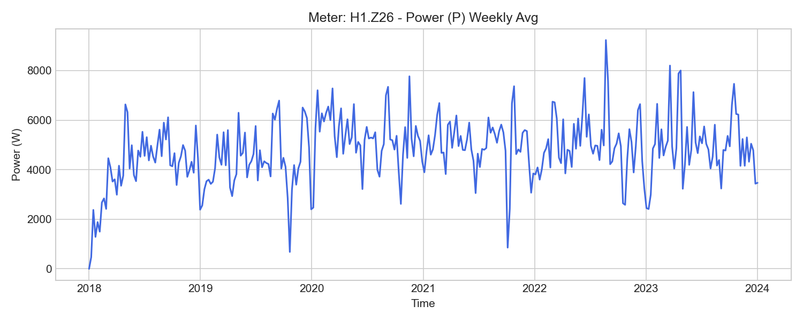

---

## H1.Z27 (emission_lab)

### 기초 통계량 (1h 해상도)

| 측정 항목 | 기록 수(시간) | 평균 | 최소 | 최대 | 무부하(0) 비율 |
|-----------|---------------|------|------|------|----------------|
| PF3 | 52,584 | 0.67 | 0.00 | 1.00 | 3.69% |
| U1 | 52,584 | 229.95 | 222.78 | 235.65 | 0.00% |
| PF1 | 52,584 | 0.89 | 0.00 | 1.00 | 1.16% |
| W3 | 52,583 | 195071.66 | 11894.85 | 358433.98 | 0.00% |
| W_in | 52,583 | 43804084.93 | 38248549.20 | 44343566.07 | 0.00% |
| W2 | 52,583 | 197403.64 | 12021.30 | 365860.36 | 0.00% |
| P2 | 52,584 | 6706.66 | 0.00 | 64409.18 | 2.95% |
| W_out | 48,521 | 0.63 | 0.55 | 0.96 | 0.00% |
| PF | 52,584 | 0.78 | 0.00 | 0.99 | 1.09% |
| f | 52,584 | 50.00 | 49.95 | 50.07 | 0.00% |
| P | 52,584 | 20760.42 | 0.00 | 190219.16 | 1.16% |
| W | 52,583 | 614684.18 | 38248.00 | 1133262.01 | 0.00% |
| P1 | 52,584 | 7474.40 | 0.00 | 63232.31 | 1.16% |
| I3 | 52,584 | 31.69 | -39.82 | 294.81 | 0.16% |
| PF2 | 52,584 | 0.65 | 0.00 | 1.00 | 2.88% |
| I2 | 52,584 | 31.24 | -141.90 | 299.81 | 0.16% |
| I1 | 52,584 | 36.09 | 0.00 | 291.95 | 0.00% |
| U3 | 52,584 | 230.23 | 222.67 | 236.16 | 0.00% |
| U2 | 52,584 | 229.64 | 222.33 | 236.24 | 0.00% |
| P3 | 52,584 | 6566.97 | 0.00 | 62852.87 | 3.73% |
| W1 | 52,583 | 222271.95 | 14331.85 | 408532.86 | 0.00% |

### 주간(Weekly) 전력(Power) 트렌드

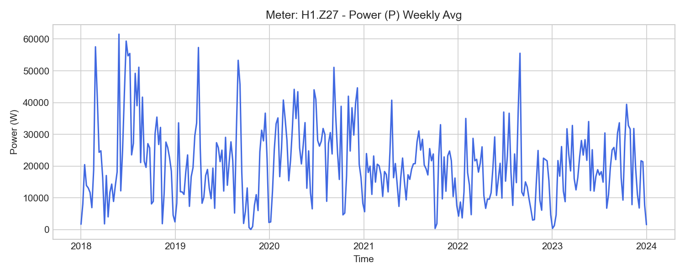

---

## H1.Z28 (emission_lab)

### 기초 통계량 (1h 해상도)

| 측정 항목 | 기록 수(시간) | 평균 | 최소 | 최대 | 무부하(0) 비율 |
|-----------|---------------|------|------|------|----------------|
| P1 | 52,584 | 3348.23 | -22902.79 | 53963.22 | 0.00% |
| W_out | 52,583 | 1185852.57 | 127611.28 | 117463048.00 | 0.00% |
| U1 | 52,584 | 229.98 | 222.77 | 235.68 | 0.00% |
| W1 | 52,583 | 145398.83 | 34506.84 | 230919.65 | 0.00% |
| W | 52,583 | 493361.64 | 98631.90 | 812139.65 | 0.00% |
| I3 | 52,584 | -44.89 | -176.40 | 116.36 | 0.00% |
| U2 | 52,584 | 229.69 | 222.36 | 236.29 | 0.00% |
| I2 | 52,584 | -71.11 | -258.00 | 60.68 | 0.00% |
| U3 | 52,584 | 230.27 | 222.67 | 236.20 | 0.00% |
| PF | 52,584 | 0.29 | -0.98 | 0.99 | 0.00% |
| W_in | 52,575 | 813167.17 | 209707.17 | 1336020.19 | 0.00% |
| P | 52,584 | 12776.17 | -57163.26 | 145150.34 | 0.00% |
| W3 | 52,583 | 139385.51 | 32884.28 | 222527.12 | 0.00% |
| W2 | 52,583 | 209356.44 | 31240.78 | 359605.53 | 0.00% |
| P3 | 52,584 | 3420.48 | -17106.68 | 37352.51 | 0.00% |
| I1 | 52,584 | -66.92 | -241.80 | 179.59 | 0.00% |
| PF2 | 52,584 | 0.35 | -0.99 | 1.00 | 0.00% |
| P2 | 52,584 | 6010.76 | -19902.93 | 53834.62 | 0.00% |
| f | 52,584 | 50.00 | 49.95 | 50.07 | 0.00% |
| PF1 | 52,584 | 0.20 | -0.99 | 1.00 | 0.00% |
| PF3 | 52,584 | 0.32 | -0.99 | 1.00 | 0.00% |

### 주간(Weekly) 전력(Power) 트렌드

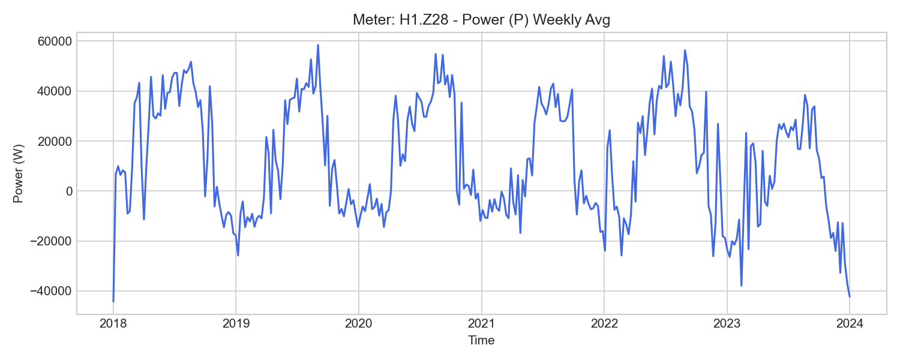

---

## H1.Z29 (emission_lab)

### 기초 통계량 (1h 해상도)

| 측정 항목 | 기록 수(시간) | 평균 | 최소 | 최대 | 무부하(0) 비율 |
|-----------|---------------|------|------|------|----------------|
| W_out | 52,583 | 1793921.18 | 227754.94 | 3385109.55 | 0.00% |
| U2 | 52,584 | 229.71 | 222.38 | 236.32 | 0.00% |
| PF3 | 52,584 | 0.09 | -1.00 | 1.00 | 2.96% |
| P3 | 52,584 | -15445.12 | -88301.91 | 54828.93 | 2.92% |
| U1 | 52,584 | 229.98 | 222.79 | 235.71 | 0.00% |
| W2 | 52,583 | -474982.58 | -913612.46 | -43580.64 | 0.00% |
| U3 | 52,584 | 230.28 | 222.70 | 236.23 | 0.00% |
| W1 | 52,583 | -508415.70 | -981837.43 | -44717.60 | 0.00% |
| P1 | 52,584 | -17815.06 | -98479.60 | 53961.66 | 0.00% |
| P | 52,584 | -49798.20 | -278708.05 | 163249.24 | 0.00% |
| W_in | 52,575 | 106413002.80 | 104692600.00 | 106684445.18 | 0.00% |
| I1 | 52,584 | 101.50 | -294.73 | 294.38 | 0.00% |
| PF2 | 52,584 | 0.13 | -1.00 | 1.00 | 0.00% |
| PF | 52,584 | 0.13 | -0.99 | 0.99 | 0.00% |
| P2 | 52,584 | -16538.72 | -91926.54 | 54458.65 | 0.00% |
| W | 52,583 | -1419422.68 | -2742657.08 | -123062.34 | 0.00% |
| f | 52,584 | 50.00 | 49.95 | 50.07 | 0.00% |
| PF1 | 52,584 | 0.14 | -1.00 | 1.00 | 0.00% |
| W3 | 52,583 | -436024.85 | -847207.96 | -34764.11 | 0.00% |
| I2 | 52,584 | 100.84 | -103.48 | 275.78 | 0.00% |
| I3 | 52,584 | 97.98 | -13.27 | 270.96 | 0.00% |

### 주간(Weekly) 전력(Power) 트렌드

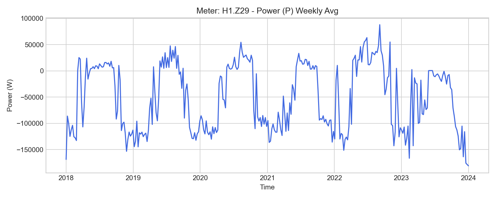

---

## H2.Z35 (grid_transformer)

### 기초 통계량 (1h 해상도)

| 측정 항목 | 기록 수(시간) | 평균 | 최소 | 최대 | 무부하(0) 비율 |
|-----------|---------------|------|------|------|----------------|
| W | 52,585 | 1896509.60 | 306935.11 | 2322042.64 | 0.00% |
| U2 | 23,581 | 231.59 | 225.54 | 235.77 | 0.00% |
| P | 23,581 | 85542.21 | -124923.93 | 166860.42 | 0.00% |
| PF2 | 23,581 | 0.95 | -1.00 | 1.00 | 0.00% |
| PF1 | 23,581 | 0.95 | -1.00 | 1.00 | 0.00% |
| Q | 23,581 | 12228.18 | -10127.24 | 70122.81 | 0.00% |
| P3 | 23,581 | 28277.26 | -40590.26 | 56838.09 | 0.00% |
| W_in | 23,581 | 1373955.16 | 306863.25 | 2339881.03 | 0.00% |
| P1 | 23,581 | 29089.17 | -42540.81 | 57776.99 | 0.00% |
| U3 | 23,581 | 232.04 | 225.86 | 235.99 | 0.00% |
| PF3 | 23,581 | 0.95 | -1.00 | 1.00 | 0.00% |
| I1 | 23,581 | 131.36 | 13.65 | 270.11 | 0.00% |
| P2 | 23,581 | 28184.14 | -41789.04 | 53327.43 | 0.00% |
| f | 23,581 | 50.06 | 49.97 | 50.14 | 0.00% |
| I3 | 23,581 | 127.67 | 13.42 | 266.15 | 0.00% |
| WQ_in | 23,580 | 210382.20 | 46064.64 | 360817.87 | 0.00% |
| U1 | 23,581 | 231.60 | 225.44 | 235.59 | 0.00% |
| W_out | 16,061 | 1191.30 | 0.00 | 17901.95 | 88.35% |
| PF | 23,581 | 0.95 | -1.00 | 1.00 | 0.00% |
| I2 | 23,581 | 126.83 | 15.01 | 244.24 | 0.00% |
| WQ_out | 23,581 | 13499.83 | 1411.33 | 28128.18 | 0.00% |
| WQ | 52,585 | 271802.78 | 44621.89 | 332710.74 | 0.00% |

### 주간(Weekly) 전력(Power) 트렌드

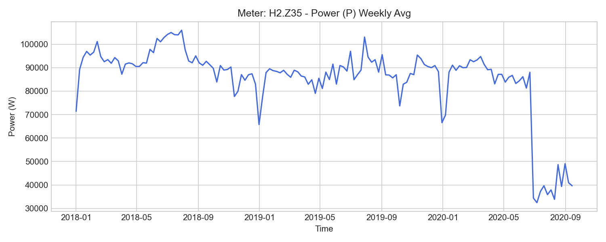

---

## H2.Z351 (grid_transformer)

### 기초 통계량 (1h 해상도)

| 측정 항목 | 기록 수(시간) | 평균 | 최소 | 최대 | 무부하(0) 비율 |
|-----------|---------------|------|------|------|----------------|
| I1 | 28,861 | 102.27 | 11.83 | 218.17 | 0.00% |
| W3 | 28,860 | 285552.61 | -1740.49 | 570773.50 | 0.00% |
| W_in | 28,860 | 922675.99 | 1285.18 | 1822361.65 | 0.00% |
| PF1 | 28,861 | 0.79 | -1.00 | 1.00 | 0.00% |
| I3 | 28,861 | 101.56 | 13.25 | 214.91 | 0.00% |
| W | 28,860 | 857833.42 | -5054.15 | 1696448.64 | 0.00% |
| W_out | 27,984 | 62637.63 | 6304.91 | 125451.87 | 0.00% |
| P3 | 28,861 | 19840.94 | -42555.43 | 49068.53 | 0.00% |
| PF3 | 28,861 | 0.79 | -1.00 | 1.00 | 0.00% |
| PF2 | 28,861 | 0.79 | -1.00 | 1.00 | 0.00% |
| W2 | 28,860 | 281192.04 | -1612.61 | 553648.24 | 0.00% |
| W1 | 28,860 | 291088.77 | -1701.51 | 572026.89 | 0.00% |
| U3 | 28,861 | 232.08 | 225.89 | 237.26 | 0.00% |
| I2 | 28,861 | 99.10 | 11.27 | 211.63 | 0.00% |
| PF | 28,861 | 0.79 | -1.00 | 1.00 | 0.00% |
| P2 | 28,861 | 19243.28 | -42943.27 | 48022.70 | 0.00% |
| U1 | 28,861 | 231.79 | 225.45 | 237.24 | 0.00% |
| P1 | 28,861 | 19884.26 | -43044.88 | 49047.89 | 0.00% |
| U2 | 28,861 | 231.57 | 225.18 | 237.63 | 0.00% |
| P | 28,861 | 58969.15 | -128543.57 | 146139.12 | 0.00% |
| f | 28,861 | 50.00 | 49.95 | 50.07 | 0.00% |

### 주간(Weekly) 전력(Power) 트렌드

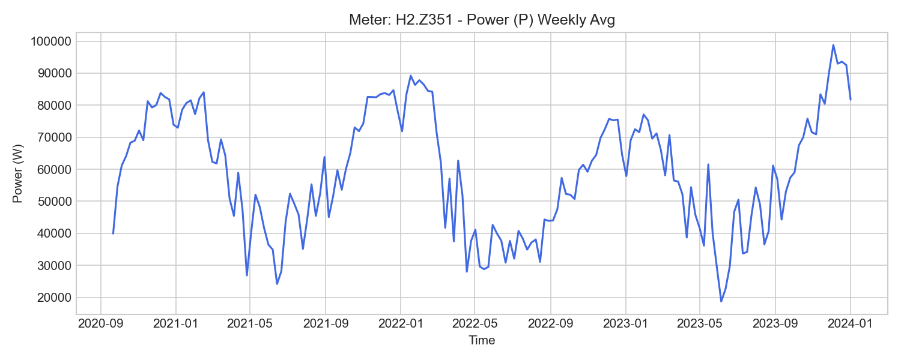

---

## H2.Z36 (grid_transformer)

### 기초 통계량 (1h 해상도)

| 측정 항목 | 기록 수(시간) | 평균 | 최소 | 최대 | 무부하(0) 비율 |
|-----------|---------------|------|------|------|----------------|
| I3 | 23,581 | 127.27 | 12.59 | 260.39 | 0.00% |
| U2 | 23,581 | 231.60 | 225.57 | 235.84 | 0.00% |
| f | 23,581 | 50.10 | 49.97 | 50.20 | 0.00% |
| P3 | 23,581 | 28177.83 | -39983.01 | 56179.60 | 0.00% |
| WQ_in | 23,580 | 196110.43 | 43083.32 | 335955.88 | 0.00% |
| W_in | 23,581 | 1368210.18 | 306999.75 | 2327347.12 | 0.00% |
| WQ_out | 23,581 | 16675.66 | 1930.67 | 34269.67 | 0.00% |
| P | 23,581 | 85084.30 | -122892.73 | 163734.04 | 0.00% |
| I1 | 23,581 | 129.40 | 13.55 | 259.51 | 0.00% |
| WQ | 52,585 | 246877.89 | 41098.15 | 301707.19 | 0.00% |
| PF | 23,581 | 0.95 | -1.00 | 1.00 | 0.00% |
| Q | 23,581 | 11067.74 | -10651.57 | 65617.86 | 0.00% |
| P2 | 23,581 | 28219.89 | -41258.59 | 52873.60 | 0.00% |
| I2 | 23,581 | 126.72 | 14.82 | 241.11 | 0.00% |
| PF3 | 23,581 | 0.95 | -0.99 | 1.00 | 0.00% |
| W | 52,585 | 1887315.91 | 307071.50 | 2310021.46 | 0.00% |
| PF2 | 23,581 | 0.95 | -1.00 | 1.00 | 0.00% |
| U3 | 23,581 | 232.11 | 225.89 | 236.15 | 0.00% |
| W_out | 19,736 | 942.65 | 0.00 | 17384.68 | 90.52% |
| PF1 | 23,581 | 0.95 | -1.00 | 1.00 | 0.00% |
| P1 | 23,581 | 28694.63 | -41573.14 | 56670.91 | 0.00% |
| U1 | 23,581 | 231.65 | 225.45 | 235.66 | 0.00% |

### 주간(Weekly) 전력(Power) 트렌드

---

## H2.Z361 (grid_transformer)

### 기초 통계량 (1h 해상도)

| 측정 항목 | 기록 수(시간) | 평균 | 최소 | 최대 | 무부하(0) 비율 |
|-----------|---------------|------|------|------|----------------|
| P3 | 28,861 | 19696.03 | -41682.97 | 48448.64 | 0.00% |
| PF1 | 28,861 | 0.79 | -1.00 | 1.00 | 0.00% |
| PF | 28,861 | 0.79 | -1.00 | 1.00 | 0.00% |
| I1 | 28,861 | 100.72 | 11.65 | 210.51 | 0.00% |
| P | 28,861 | 58607.79 | -125622.16 | 144059.53 | 0.00% |
| PF3 | 28,861 | 0.79 | -1.00 | 1.00 | 0.00% |
| U3 | 28,861 | 232.04 | 225.87 | 237.21 | 0.00% |
| W1 | 28,860 | 288095.19 | -1704.64 | 565321.94 | 0.00% |
| P2 | 28,861 | 19259.29 | -42155.63 | 47807.63 | 0.00% |
| U1 | 28,861 | 231.77 | 225.42 | 237.21 | 0.00% |
| W3 | 28,860 | 284096.78 | -1738.84 | 566575.75 | 0.00% |
| f | 28,861 | 50.00 | 49.95 | 50.07 | 0.00% |
| I2 | 28,861 | 98.62 | 11.16 | 209.48 | 0.00% |
| U2 | 28,861 | 231.57 | 225.17 | 237.62 | 0.00% |
| W_in | 28,860 | 917127.04 | 1241.78 | 1808846.23 | 0.00% |
| W | 28,860 | 853972.87 | -5075.96 | 1685969.81 | 0.00% |
| W_out | 27,984 | 60996.15 | 6285.21 | 122427.01 | 0.00% |
| P1 | 28,861 | 19652.10 | -41783.56 | 47804.33 | 0.00% |
| PF2 | 28,861 | 0.79 | -1.00 | 1.00 | 0.00% |
| W2 | 28,860 | 281780.91 | -1632.75 | 554072.09 | 0.00% |
| I3 | 28,861 | 100.67 | 11.93 | 212.06 | 0.00% |

### 주간(Weekly) 전력(Power) 트렌드

---

## V.Z81 (grid_transformer)

### 기초 통계량 (1h 해상도)

| 측정 항목 | 기록 수(시간) | 평균 | 최소 | 최대 | 무부하(0) 비율 |
|-----------|---------------|------|------|------|----------------|
| U1 | 52,584 | 229.80 | 222.96 | 235.33 | 0.00% |
| U2 | 52,584 | 229.57 | 222.75 | 235.82 | 0.00% |
| PF1 | 52,584 | 0.10 | -0.97 | 1.00 | 0.00% |
| P3 | 52,584 | 2421.57 | -52619.90 | 79711.58 | 0.00% |
| PF | 52,584 | 0.10 | -0.95 | 1.00 | 0.00% |
| P1 | 52,584 | 1955.27 | -56332.34 | 77434.52 | 0.00% |
| P2 | 52,584 | 1191.80 | -55438.17 | 75776.95 | 0.00% |
| P | 52,584 | 5567.59 | -162558.21 | 232923.06 | 0.00% |
| W3 | 52,583 | 229111.14 | 121751.24 | 289231.45 | 0.00% |
| W | 52,583 | 618939.02 | 341380.18 | 781463.06 | 0.00% |
| U3 | 52,584 | 230.03 | 223.06 | 235.62 | 0.00% |
| W_in | 52,575 | -5522728100.75 | -5547013552.00 | 421588743.86 | 0.00% |
| W_out | 52,583 | 491363.46 | 47840.65 | 1013491.54 | 0.00% |
| I3 | 52,584 | 119.35 | -172.54 | 379.93 | 0.00% |
| f | 52,584 | 50.00 | 49.95 | 50.07 | 0.00% |
| PF3 | 52,584 | 0.12 | -0.94 | 1.00 | 0.00% |
| I1 | 52,584 | 120.74 | -129.26 | 369.16 | 0.00% |
| W2 | 52,583 | 187771.75 | 110763.38 | 230430.20 | 0.00% |
| PF2 | 52,584 | 0.07 | -0.96 | 1.00 | 0.00% |
| I2 | 52,584 | 126.67 | -2.16 | 358.92 | 0.00% |
| W1 | 52,583 | 202096.74 | 108865.04 | 261851.03 | 0.00% |

### 주간(Weekly) 전력(Power) 트렌드

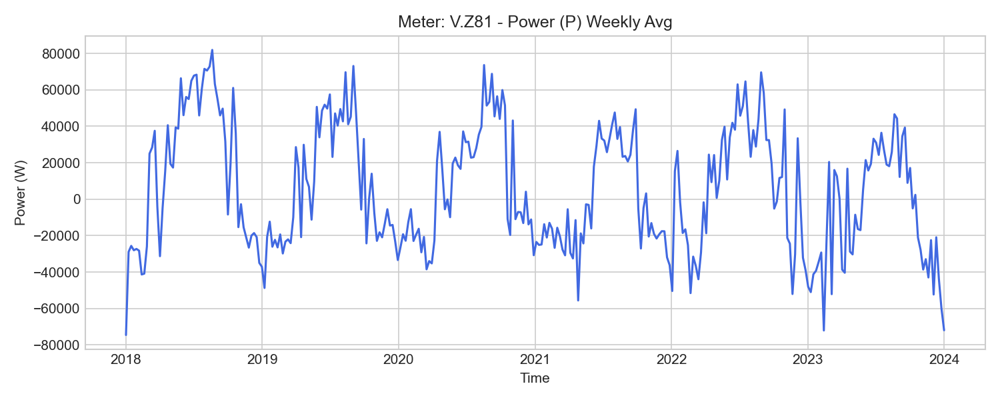

---

## V.Z82 (grid_transformer)

### 기초 통계량 (1h 해상도)

| 측정 항목 | 기록 수(시간) | 평균 | 최소 | 최대 | 무부하(0) 비율 |
|-----------|---------------|------|------|------|----------------|
| U2 | 52,584 | 229.61 | 222.82 | 235.84 | 0.00% |
| PF2 | 52,584 | 0.29 | -0.99 | 1.00 | 0.00% |
| I2 | 52,584 | 71.61 | -251.61 | 422.18 | 0.00% |
| PF1 | 52,584 | 0.29 | -0.99 | 1.00 | 0.00% |
| W_out | 52,583 | 373114.98 | 106477.66 | 713005.28 | 0.00% |
| P3 | 52,584 | 7172.97 | -50168.83 | 84428.86 | 0.00% |
| W_in | 52,180 | 1214004.03 | 217257.44 | 2027516.00 | 0.00% |
| f | 52,584 | 50.00 | 49.95 | 50.07 | 0.00% |
| W | 52,583 | 836250.49 | 99073.44 | 1360189.87 | 0.00% |
| U3 | 52,584 | 230.07 | 223.14 | 235.61 | 0.00% |
| W1 | 52,583 | 289202.46 | 34772.10 | 478819.40 | 0.00% |
| U1 | 52,584 | 229.87 | 223.11 | 235.41 | 0.00% |
| P | 52,584 | 23157.41 | -151618.90 | 249927.77 | 0.00% |
| W2 | 52,583 | 281401.72 | 31810.09 | 457600.83 | 0.00% |
| PF3 | 52,584 | 0.30 | -0.99 | 1.00 | 0.00% |
| I3 | 52,584 | 76.78 | -50.11 | 434.24 | 0.00% |
| P2 | 52,584 | 7821.54 | -53170.83 | 82244.90 | 0.00% |
| PF | 52,584 | 0.30 | -0.98 | 1.00 | 0.00% |
| I1 | 52,584 | 80.85 | -88.84 | 428.47 | 0.00% |
| P1 | 52,584 | 8162.95 | -50054.16 | 83254.00 | 0.00% |
| W3 | 52,583 | 265645.57 | 32491.25 | 423769.47 | 0.00% |

### 주간(Weekly) 전력(Power) 트렌드

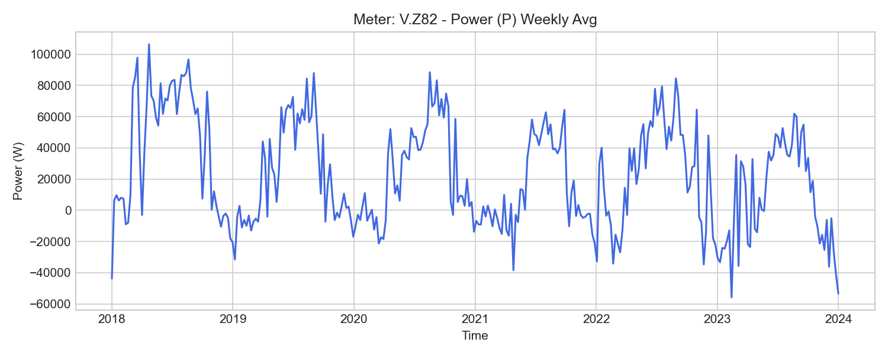

---

## H1.W11 (heat_generation)

### 기초 통계량 (1h 해상도)

| 측정 항목 | 기록 수(시간) | 평균 | 최소 | 최대 | 무부하(0) 비율 |
|-----------|---------------|------|------|------|----------------|
| W | 52,583 | 7650016.80 | 960200.00 | 13934700.00 | 0.00% |
| P | 52,584 | 245946.55 | 0.00 | 1150231.67 | 5.00% |
| Trl | 52,584 | 67.23 | 18.91 | 83.19 | 0.00% |
| qv | 52,584 | 47.29 | 0.00 | 66.16 | 0.01% |
| Tdiff | 52,584 | 4964.31 | -7851.58 | 38713.42 | 0.00% |
| V | 52,584 | 1422106271.63 | 124369100.00 | 2626128900.00 | 0.00% |
| Tvl | 52,584 | 72.20 | 19.00 | 88.76 | 0.00% |

### 주간(Weekly) 전력(Power) 트렌드

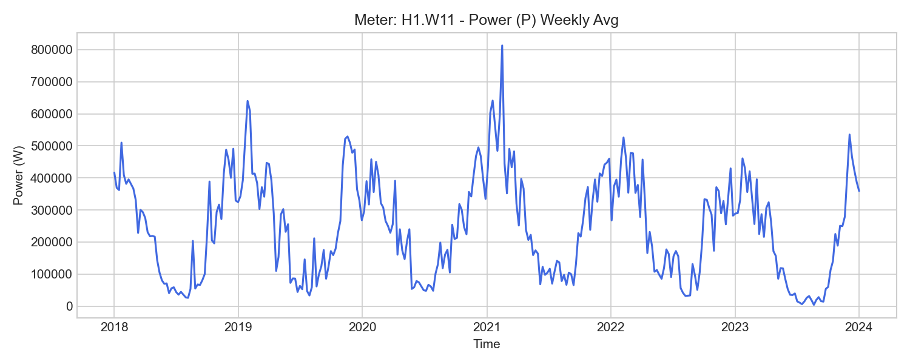

---

## H1.K11 (hvac_thermal)

### 기초 통계량 (1h 해상도)

| 측정 항목 | 기록 수(시간) | 평균 | 최소 | 최대 | 무부하(0) 비율 |
|-----------|---------------|------|------|------|----------------|
| Trl | 52,544 | 10.09 | -1.59 | 36.00 | 0.00% |
| P | 52,526 | 7667.11 | -0.00 | 440755.00 | 15.10% |
| qv | 52,526 | 7.73 | 0.00 | 18.20 | 11.29% |
| V | 52,525 | 227898734.52 | 25467000.00 | 435215100.00 | 0.00% |
| Tvl | 52,538 | 9.33 | -2.00 | 37.00 | 0.00% |
| W | 52,499 | 214027.30 | 10700.00 | 420300.00 | 0.00% |
| Tdiff | 52,584 | -765.48 | -9366.33 | 10539.58 | 0.01% |

### 주간(Weekly) 전력(Power) 트렌드

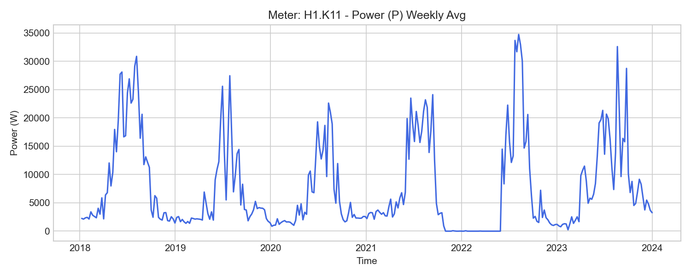

---

## H1.K12 (hvac_thermal)

### 기초 통계량 (1h 해상도)

| 측정 항목 | 기록 수(시간) | 평균 | 최소 | 최대 | 무부하(0) 비율 |
|-----------|---------------|------|------|------|----------------|
| V | 52,525 | 226618437.95 | 46052500.00 | 363378600.00 | 0.00% |
| Trl | 52,526 | 13.74 | 5.00 | 37.30 | 0.00% |
| P | 52,526 | 14480.14 | 0.00 | 114834.16 | 54.74% |
| qv | 52,526 | 6.02 | 0.00 | 27.99 | 54.27% |
| W | 52,513 | 503632.73 | 84100.00 | 848800.00 | 0.00% |
| Tdiff | 52,584 | -877.28 | -15597.17 | 17580.36 | 0.02% |
| Tvl | 52,529 | 12.88 | 4.00 | 37.00 | 0.00% |

### 주간(Weekly) 전력(Power) 트렌드

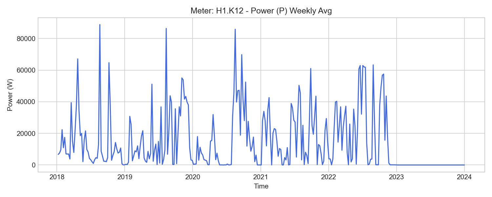

---

## H1.K14 (hvac_thermal)

### 기초 통계량 (1h 해상도)

| 측정 항목 | 기록 수(시간) | 평균 | 최소 | 최대 | 무부하(0) 비율 |
|-----------|---------------|------|------|------|----------------|
| Trl | 52,578 | 13.75 | -1.48 | 34.00 | 0.00% |
| V | 52,525 | 310550205.62 | 29753100.00 | 579499500.00 | 0.00% |
| Tdiff | 52,584 | -1130.79 | -13808.25 | 8325.00 | 0.00% |
| P | 52,525 | 14781.95 | 0.00 | 725101.67 | 45.01% |
| W | 52,522 | 437089.83 | 28800.00 | 810800.00 | 0.00% |
| qv | 52,526 | 10.37 | 0.00 | 52.33 | 43.61% |
| Tvl | 52,526 | 12.62 | -1.54 | 33.00 | 0.00% |

### 주간(Weekly) 전력(Power) 트렌드

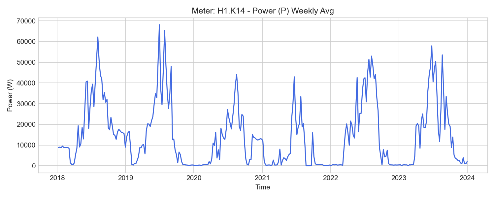

---

## H1.K15 (hvac_thermal)

### 기초 통계량 (1h 해상도)

| 측정 항목 | 기록 수(시간) | 평균 | 최소 | 최대 | 무부하(0) 비율 |
|-----------|---------------|------|------|------|----------------|
| qv | 52,526 | 0.98 | -0.00 | 122.58 | 61.39% |
| W | 52,524 | 205733.58 | 65460.00 | 324190.00 | 0.00% |
| P | 52,526 | 4912.11 | 0.00 | 189893.75 | 65.33% |
| V | 52,525 | 48744408.57 | 17404320.00 | 67661710.00 | 0.00% |
| Tvl | 52,582 | 12.68 | -43.76 | 37.00 | 0.00% |
| Tdiff | 52,584 | -6488.03 | -22126.00 | 16914.50 | 0.00% |
| Trl | 52,584 | 19.16 | -151.81 | 42.28 | 0.00% |

### 주간(Weekly) 전력(Power) 트렌드

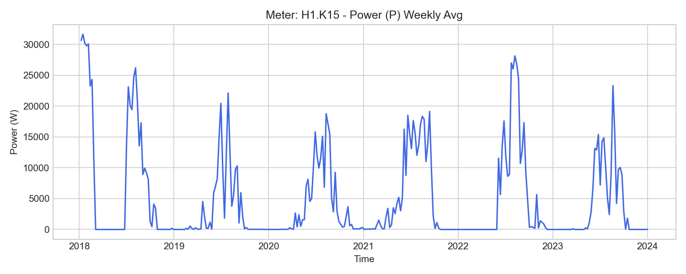

---

## H2.K21 (hvac_thermal)

### 기초 통계량 (1h 해상도)

| 측정 항목 | 기록 수(시간) | 평균 | 최소 | 최대 | 무부하(0) 비율 |
|-----------|---------------|------|------|------|----------------|
| Trl | 52,526 | 15.69 | 5.00 | 30.00 | 0.00% |
| P | 52,526 | 8321.08 | 0.00 | 127931.75 | 58.99% |
| W | 52,516 | 255003.59 | 17000.00 | 459600.00 | 0.00% |
| V | 52,525 | 397735453.16 | 39500593.33 | 668229000.00 | 0.00% |
| Tvl | 52,526 | 15.25 | 4.35 | 30.00 | 0.00% |
| Tdiff | 52,584 | -383.57 | -6850.85 | 2929.00 | 0.01% |
| qv | 52,526 | 11.92 | 0.00 | 50.48 | 57.05% |

### 주간(Weekly) 전력(Power) 트렌드

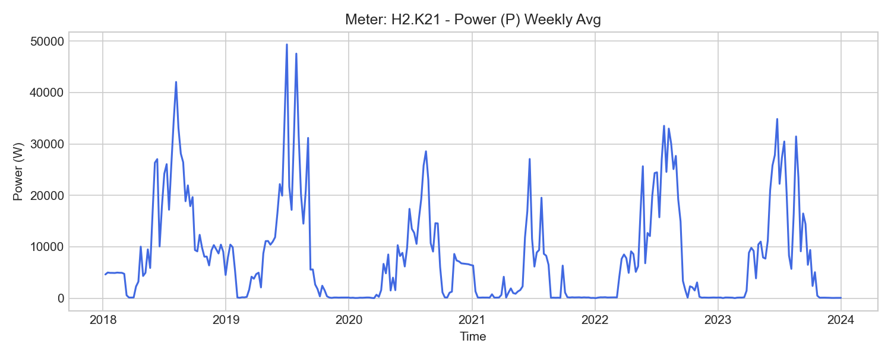

---

## H2.Z66 (local_cooling)

### 기초 통계량 (1h 해상도)

| 측정 항목 | 기록 수(시간) | 평균 | 최소 | 최대 | 무부하(0) 비율 |
|-----------|---------------|------|------|------|----------------|
| U2 | 52,584 | 231.43 | 225.20 | 237.74 | 0.00% |
| PF2 | 52,584 | 0.32 | 0.00 | 0.85 | 0.40% |
| P | 52,584 | 4123.61 | -1249.55 | 17710.50 | 0.40% |
| W_out | 45,064 | 0.00 | 0.00 | 0.00 | 100.00% |
| W | 52,585 | 143281.46 | 33867.92 | 250644.42 | 0.00% |
| f | 52,584 | 50.13 | 48.70 | 50.22 | 0.00% |
| PF1 | 52,584 | 0.81 | 0.00 | 0.88 | 0.40% |
| P2 | 52,584 | 1370.18 | 0.00 | 5859.11 | 0.40% |
| I2 | 52,584 | 7.94 | 0.00 | 30.25 | 0.40% |
| WQ | 52,585 | 98717.93 | 22725.13 | 173122.97 | 0.00% |
| P1 | 52,584 | 1361.07 | 0.00 | 5802.65 | 0.40% |
| Q | 52,584 | 2861.96 | 0.00 | 11780.97 | 0.40% |
| PF3 | 52,584 | 0.23 | 0.00 | 0.84 | 45.16% |
| P3 | 52,584 | 1561.46 | 0.00 | 6049.01 | 45.16% |
| WQ_in | 52,583 | 98715.10 | 22725.13 | 173115.68 | 0.00% |
| U1 | 52,584 | 231.86 | 225.56 | 237.40 | 0.00% |
| I3 | 52,584 | 8.21 | 0.00 | 31.31 | 45.16% |
| PF | 52,584 | 0.61 | 0.00 | 0.86 | 0.40% |
| WQ_out | 45,064 | 0.00 | 0.00 | 0.00 | 100.00% |
| W_in | 52,583 | 143277.37 | 33867.92 | 250633.92 | 0.00% |
| U3 | 52,584 | 232.20 | 225.89 | 237.58 | 0.00% |
| I1 | 52,584 | 8.04 | 0.00 | 30.58 | 0.40% |

### 주간(Weekly) 전력(Power) 트렌드

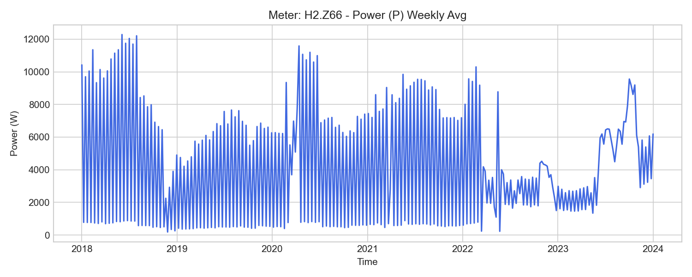

---

## H2.Z67 (local_cooling)

### 기초 통계량 (1h 해상도)

| 측정 항목 | 기록 수(시간) | 평균 | 최소 | 최대 | 무부하(0) 비율 |
|-----------|---------------|------|------|------|----------------|
| U3 | 52,584 | 232.32 | 226.05 | 237.69 | 0.00% |
| PF1 | 52,584 | 0.80 | 0.00 | 0.90 | 1.37% |
| P3 | 52,547 | 1359.15 | -0.89 | 6604.46 | 54.36% |
| W | 52,585 | 124684.75 | 9911.01 | 205074.63 | 0.00% |
| I3 | 52,547 | 7.18 | 0.00 | 34.47 | 54.36% |
| P1 | 52,584 | 1222.43 | 0.00 | 6128.65 | 1.37% |
| U2 | 52,584 | 231.23 | 224.57 | 237.53 | 0.00% |
| W_out | 45,064 | -0.01 | -0.03 | 0.00 | 68.34% |
| I1 | 52,584 | 7.09 | 0.00 | 34.07 | 1.37% |
| WQ | 52,585 | 87819.29 | 6865.66 | 145427.05 | 0.00% |
| WQ_in | 52,583 | 87817.10 | 6865.66 | 145427.02 | 0.00% |
| W_in | 52,583 | 124681.68 | 9911.01 | 205074.58 | 0.00% |
| U1 | 52,584 | 231.96 | 225.69 | 237.47 | 0.00% |
| I2 | 52,584 | 7.06 | 0.00 | 33.20 | 1.37% |
| PF | 52,584 | 0.54 | -0.05 | 0.82 | 1.36% |
| PF3 | 52,547 | 0.21 | -0.07 | 0.82 | 54.36% |
| Q | 52,584 | 2634.31 | 0.00 | 12520.40 | 1.36% |
| PF2 | 52,584 | 0.22 | -0.16 | 0.83 | 1.37% |
| WQ_out | 45,064 | 0.00 | 0.00 | 0.00 | 100.00% |
| f | 52,584 | 50.06 | 49.06 | 50.13 | 0.00% |
| P | 52,584 | 3711.44 | -0.89 | 18632.36 | 1.36% |
| P2 | 52,584 | 1223.29 | -3.89 | 6187.06 | 1.37% |

### 주간(Weekly) 전력(Power) 트렌드

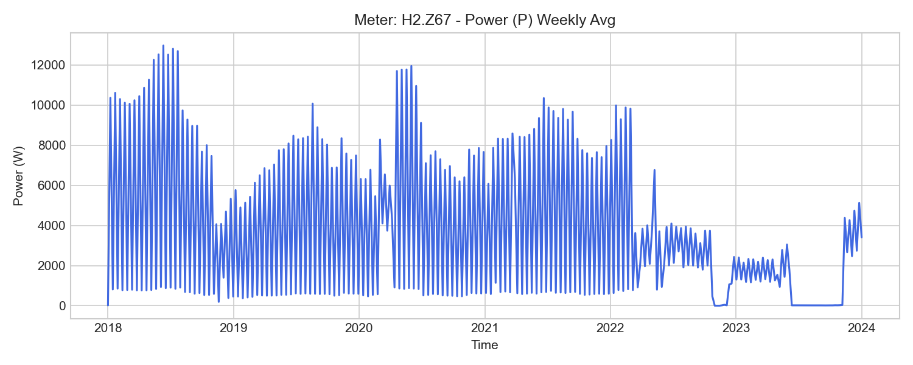

---

## H2.ZE66 (local_cooling)

### 기초 통계량 (1h 해상도)

| 측정 항목 | 기록 수(시간) | 평균 | 최소 | 최대 | 무부하(0) 비율 |
|-----------|---------------|------|------|------|----------------|
| I3 | 15,585 | 7.21 | 0.00 | 29.29 | 33.10% |
| W_in | 15,584 | 25211.40 | 789.26 | 60063.66 | 0.00% |
| W3 | 15,584 | 8537.49 | 267.42 | 20386.06 | 0.00% |
| U1 | 15,585 | 231.85 | 225.32 | 237.02 | 0.00% |
| P3 | 15,585 | 1367.07 | -0.05 | 5150.47 | 0.01% |
| PF | 15,543 | 0.58 | 0.46 | 11.33 | 0.00% |
| W_out | 14,418 | 0.00 | 0.00 | 0.00 | 0.00% |
| U2 | 15,585 | 231.46 | 224.92 | 237.35 | 0.00% |
| PF2 | 15,585 | 0.30 | 0.09 | 1.00 | 0.00% |
| W | 15,584 | 25212.08 | 789.26 | 60063.72 | 0.00% |
| W1 | 15,584 | 8343.14 | 261.25 | 19838.95 | 0.00% |
| P | 15,585 | 3795.49 | -0.07 | 14301.18 | 0.00% |
| I2 | 15,585 | 6.65 | 0.00 | 23.07 | 0.27% |
| PF3 | 15,585 | 0.96 | 0.82 | 1.00 | 0.00% |
| I1 | 15,585 | 6.69 | 0.00 | 23.32 | 0.27% |
| U3 | 15,585 | 232.14 | 225.75 | 237.19 | 0.00% |
| P1 | 15,585 | 1253.65 | -0.00 | 4688.37 | 0.01% |
| W2 | 15,584 | 8332.89 | 260.59 | 19842.52 | 0.00% |
| P2 | 15,585 | 1253.88 | -0.06 | 4733.93 | 0.00% |
| PF1 | 15,585 | 0.90 | 0.83 | 1.00 | 0.00% |
| f | 15,585 | 50.00 | 49.95 | 50.07 | 0.00% |

### 주간(Weekly) 전력(Power) 트렌드

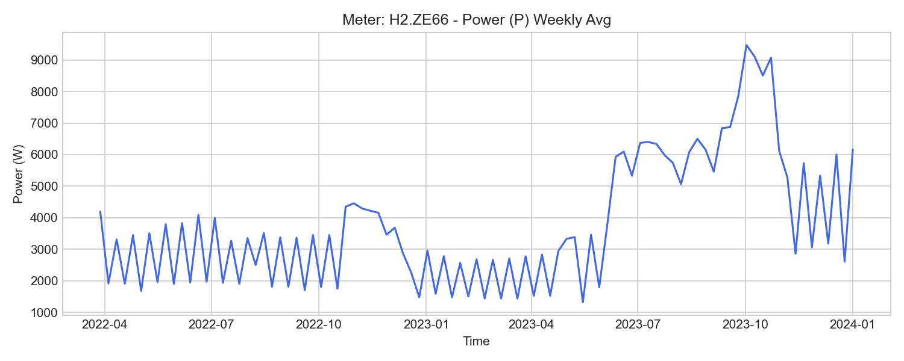

---

## H2.ZE67 (local_cooling)

### 기초 통계량 (1h 해상도)

| 측정 항목 | 기록 수(시간) | 평균 | 최소 | 최대 | 무부하(0) 비율 |
|-----------|---------------|------|------|------|----------------|
| P2 | 15,585 | 565.13 | -0.73 | 4636.81 | 0.01% |
| f | 15,585 | 50.00 | 49.95 | 50.07 | 0.00% |
| PF | 15,585 | 0.47 | 0.38 | 8.45 | 0.00% |
| I1 | 15,585 | 3.13 | 0.03 | 23.64 | 0.00% |
| PF2 | 15,585 | 0.11 | -0.05 | 0.76 | 0.00% |
| W2 | 15,584 | 5463.42 | 273.98 | 9079.66 | 0.00% |
| W3 | 15,582 | 5585.28 | 281.51 | 9300.59 | 0.00% |
| U3 | 15,585 | 232.10 | 225.76 | 237.15 | 0.00% |
| P | 15,585 | 1716.66 | -0.21 | 13969.10 | 0.01% |
| U2 | 15,585 | 231.40 | 224.91 | 237.29 | 0.00% |
| PF3 | 15,503 | 0.97 | 0.82 | 1.00 | 0.00% |
| W_out | 14,417 | 0.08 | 0.00 | 0.13 | 0.00% |
| W | 15,584 | 16558.32 | 830.48 | 27578.27 | 0.00% |
| I2 | 15,585 | 3.13 | 0.03 | 23.59 | 0.00% |
| P1 | 15,585 | 572.69 | -0.03 | 4614.64 | 0.01% |
| PF1 | 15,585 | 0.88 | 0.82 | 0.98 | 0.00% |
| U1 | 15,585 | 231.84 | 225.35 | 237.02 | 0.00% |
| I3 | 15,503 | 3.96 | 0.00 | 55.36 | 64.79% |
| W1 | 15,584 | 5509.29 | 274.99 | 9198.05 | 0.00% |
| W_in | 15,584 | 16561.17 | 830.49 | 27580.85 | 0.00% |
| P3 | 15,585 | 664.89 | -0.01 | 248380.21 | 0.35% |

### 주간(Weekly) 전력(Power) 트렌드

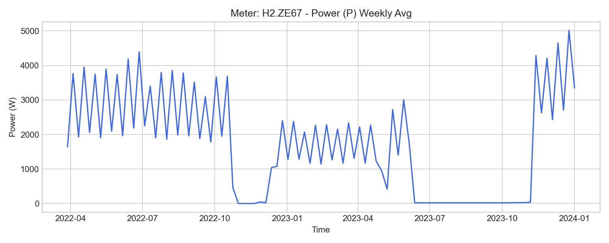

---

## H3.Z45 (local_cooling)

### 기초 통계량 (1h 해상도)

| 측정 항목 | 기록 수(시간) | 평균 | 최소 | 최대 | 무부하(0) 비율 |
|-----------|---------------|------|------|------|----------------|
| I1 | 51,839 | 4.60 | 0.00 | 105.46 | 0.01% |
| U1 | 51,840 | 231.54 | 225.07 | 238.43 | 0.00% |
| WQ_out | 49,886 | 1147.83 | -0.00 | 8792.53 | 1.05% |
| W_out | 49,886 | 14.32 | 0.00 | 17.82 | 19.64% |
| PF1 | 51,840 | 0.68 | 0.00 | 1.00 | 0.01% |
| U2 | 51,840 | 231.35 | 224.89 | 239.01 | 0.00% |
| WQ | 52,585 | 43836.96 | 4066.33 | 60950.29 | 0.00% |
| U3 | 51,840 | 231.81 | 225.27 | 237.35 | 0.00% |
| I2 | 51,837 | 4.23 | 0.00 | 105.26 | 15.14% |
| P1 | 51,840 | 869.90 | 0.00 | 21226.76 | 0.01% |
| W | 52,585 | 77188.17 | 6709.41 | 142195.06 | 0.00% |
| P2 | 51,840 | 793.30 | 0.00 | 21430.64 | 15.14% |
| PF | 51,840 | 0.72 | 0.24 | 1.00 | 0.00% |
| Q | 51,840 | 1005.90 | -1742.77 | 35408.14 | 0.00% |
| I3 | 51,840 | 4.84 | 0.33 | 107.67 | 0.00% |
| WQ_in | 51,840 | 45511.07 | 4066.33 | 64849.03 | 0.00% |
| P | 51,840 | 2581.24 | 0.22 | 64647.32 | 0.00% |
| f | 51,840 | 50.12 | 48.45 | 50.19 | 0.00% |
| PF3 | 51,840 | 0.71 | 0.17 | 1.00 | 0.00% |
| P3 | 51,840 | 922.61 | 47.98 | 21990.61 | 0.00% |
| W_in | 51,840 | 78209.58 | 6709.41 | 142212.46 | 0.00% |
| PF2 | 51,840 | 0.69 | -0.03 | 1.00 | 15.14% |

### 주간(Weekly) 전력(Power) 트렌드

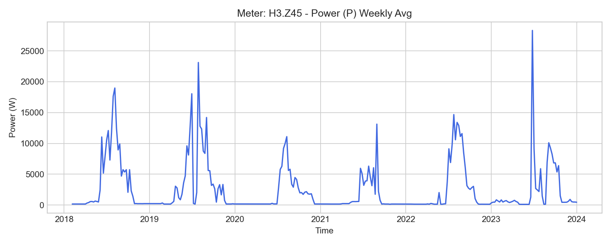

---

## H2.T.Z30 (office_distribution)

### 기초 통계량 (1h 해상도)

| 측정 항목 | 기록 수(시간) | 평균 | 최소 | 최대 | 무부하(0) 비율 |
|-----------|---------------|------|------|------|----------------|
| WQ | 52,529 | -76825.40 | -172618.85 | -5452.37 | 0.00% |
| P2 | 52,584 | 5569.79 | 945.26 | 24532.75 | 0.00% |
| W_in | 52,584 | 515717.68 | 55224.87 | 929334.24 | 0.00% |
| U2 | 52,584 | 231.58 | 225.14 | 237.76 | 0.00% |
| U3 | 52,584 | 232.18 | 225.92 | 237.50 | 0.00% |
| f | 52,584 | 50.10 | 48.07 | 50.20 | 0.00% |
| P | 52,584 | 16645.29 | 178.13 | 71716.07 | 0.00% |
| PF2 | 52,584 | 0.88 | 0.61 | 1.00 | 0.00% |
| PF3 | 52,584 | 0.91 | 0.56 | 1.00 | 0.00% |
| P1 | 52,584 | 5598.81 | 1684.81 | 23321.94 | 0.00% |
| I2 | 52,584 | 26.30 | 6.54 | 107.00 | 0.00% |
| PF1 | 52,584 | 0.91 | 0.72 | 0.99 | 0.00% |
| I3 | 52,584 | 25.01 | 5.89 | 121.60 | 0.00% |
| W_out | 45,064 | 0.00 | 0.00 | 0.00 | 100.00% |
| U1 | 52,584 | 231.74 | 224.75 | 237.33 | 0.00% |
| WQ_out | 52,584 | 84531.00 | 6879.17 | 181528.39 | 0.00% |
| Q | 52,584 | -3162.77 | -6194.84 | 5763.08 | 0.00% |
| P3 | 52,584 | 5472.15 | 1026.47 | 27925.75 | 0.00% |
| I1 | 52,584 | 25.68 | 8.60 | 101.64 | 0.00% |
| PF | 52,584 | 0.91 | 0.72 | 1.00 | 0.00% |
| WQ_in | 52,529 | 7786.78 | 1627.76 | 8909.53 | 0.00% |
| W | 45,064 | 580519.37 | 201976.77 | 929334.24 | 0.00% |

### 주간(Weekly) 전력(Power) 트렌드

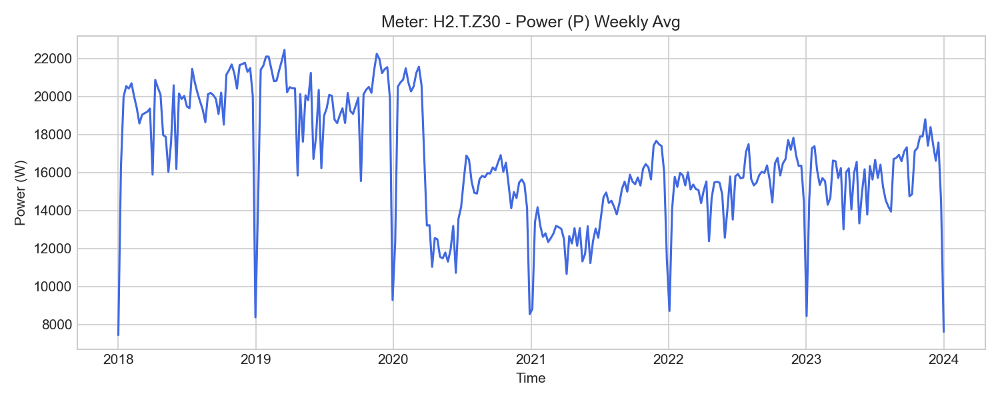

---

## H2.T.Z32 (office_distribution)

### 기초 통계량 (1h 해상도)

| 측정 항목 | 기록 수(시간) | 평균 | 최소 | 최대 | 무부하(0) 비율 |
|-----------|---------------|------|------|------|----------------|
| I2 | 52,584 | 13.31 | 1.55 | 41.44 | 0.00% |
| W | 45,064 | 152688.25 | 42875.32 | 279852.35 | 0.00% |
| WQ | 52,515 | 162918.21 | 13289.29 | 352784.49 | 0.00% |
| Q | 52,584 | 6468.48 | -634.93 | 19291.08 | 0.00% |
| f | 52,584 | 50.09 | 49.35 | 50.19 | 0.00% |
| I1 | 52,584 | 12.98 | 0.65 | 45.26 | 0.00% |
| PF3 | 52,584 | 0.61 | 0.34 | 0.99 | 0.00% |
| PF | 52,584 | 0.69 | 0.40 | 1.00 | 0.00% |
| WQ_out | 52,515 | 1352.33 | 196.37 | 1681.97 | 0.00% |
| U1 | 52,584 | 231.73 | 224.76 | 237.40 | 0.00% |
| U3 | 52,584 | 232.13 | 225.79 | 237.52 | 0.00% |
| P2 | 52,584 | 1989.06 | 337.18 | 8104.81 | 0.00% |
| PF1 | 52,584 | 0.66 | 0.23 | 0.98 | 0.00% |
| I3 | 52,584 | 11.05 | 0.43 | 39.11 | 0.00% |
| WQ_in | 52,584 | 164072.42 | 13209.25 | 354466.46 | 0.00% |
| PF2 | 52,584 | 0.72 | 0.44 | 1.00 | 0.00% |
| P1 | 52,584 | 1709.60 | 124.13 | 7505.87 | 0.00% |
| W_out | 45,064 | 0.00 | 0.00 | 0.00 | 100.00% |
| P | 52,584 | 5093.28 | 29.69 | 17633.13 | 0.00% |
| U2 | 52,584 | 231.63 | 225.08 | 237.89 | 0.00% |
| P3 | 52,584 | 1395.06 | 76.14 | 7317.81 | 0.00% |
| W_in | 52,584 | 134711.14 | 12373.05 | 279852.35 | 0.00% |

### 주간(Weekly) 전력(Power) 트렌드

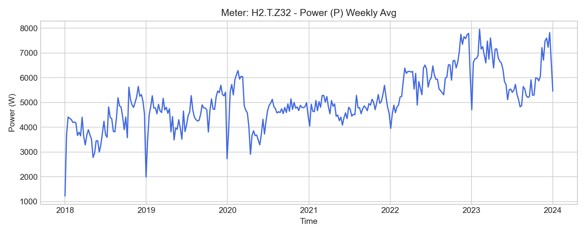

---

## H4.Z50 (office_distribution)

### 기초 통계량 (1h 해상도)

| 측정 항목 | 기록 수(시간) | 평균 | 최소 | 최대 | 무부하(0) 비율 |
|-----------|---------------|------|------|------|----------------|
| I1 | 47,991 | 7.04 | 0.59 | 72.57 | 0.00% |
| PF1 | 47,991 | 0.86 | 0.50 | 1.00 | 0.00% |
| W_in | 47,991 | 116288.11 | 15748.74 | 205182.06 | 0.00% |
| W | 52,585 | 124057.93 | 15749.85 | 205183.67 | 0.00% |
| WQ_in | 47,991 | 43038.82 | 6230.24 | 75645.56 | 0.00% |
| U1 | 47,991 | 232.09 | 225.57 | 237.20 | 0.00% |
| Q | 47,991 | 1447.19 | 9.38 | 4249.13 | 0.00% |
| I3 | 47,991 | 6.66 | 1.17 | 57.26 | 0.00% |
| U2 | 47,991 | 231.53 | 224.77 | 236.12 | 0.00% |
| W_out | 40,471 | 0.00 | 0.00 | 0.00 | 100.00% |
| U3 | 47,991 | 231.77 | 225.41 | 236.39 | 0.00% |
| P | 47,991 | 3952.19 | 76.14 | 41804.53 | 0.00% |
| P1 | 47,991 | 1482.66 | 69.24 | 16663.65 | 0.00% |
| WQ_out | 47,990 | 20.51 | 1.19 | 49.61 | 0.00% |
| I2 | 47,991 | 5.78 | 1.24 | 59.50 | 0.00% |
| PF2 | 47,991 | 0.85 | 0.55 | 1.00 | 0.00% |
| WQ | 52,585 | 45865.80 | 6229.82 | 75596.87 | 0.00% |
| f | 47,991 | 50.06 | 49.98 | 50.13 | 0.00% |
| PF | 47,991 | 0.86 | 0.62 | 1.00 | 0.00% |
| P3 | 47,991 | 1324.36 | 189.51 | 13059.04 | 0.00% |
| PF3 | 47,991 | 0.81 | 0.52 | 1.00 | 0.00% |
| P2 | 47,991 | 1146.53 | 241.35 | 13412.44 | 0.00% |

### 주간(Weekly) 전력(Power) 트렌드

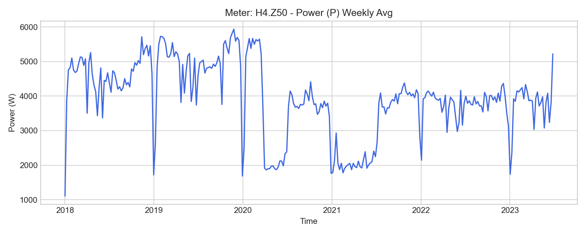

---

## H4.Z51 (office_distribution)

### 기초 통계량 (1h 해상도)

| 측정 항목 | 기록 수(시간) | 평균 | 최소 | 최대 | 무부하(0) 비율 |
|-----------|---------------|------|------|------|----------------|
| PF | 47,991 | 0.77 | 0.34 | 0.96 | 0.00% |
| W_in | 47,991 | 130602.71 | 18710.44 | 228441.30 | 0.00% |
| U3 | 47,991 | 231.83 | 225.43 | 236.44 | 0.00% |
| I3 | 47,991 | 7.24 | 2.16 | 21.85 | 0.00% |
| I2 | 47,991 | 9.08 | 1.76 | 23.14 | 0.00% |
| WQ_in | 40,471 | 0.00 | 0.00 | 0.00 | 100.00% |
| PF3 | 47,991 | 0.70 | 0.29 | 0.97 | 0.00% |
| f | 47,991 | 50.07 | 49.99 | 50.15 | 0.00% |
| I1 | 47,991 | 7.99 | 2.10 | 24.28 | 0.00% |
| PF2 | 47,991 | 0.78 | 0.12 | 0.99 | 0.00% |
| U2 | 47,991 | 231.57 | 224.81 | 236.18 | 0.00% |
| WQ_out | 47,991 | 85555.87 | 10812.70 | 158434.03 | 0.00% |
| W_out | 40,471 | 0.00 | 0.00 | 0.00 | 100.00% |
| WQ | 52,585 | -91925.70 | -158435.62 | -10815.68 | 0.00% |
| P2 | 47,991 | 1681.79 | 65.45 | 5083.60 | 0.00% |
| P1 | 47,991 | 1472.14 | 165.00 | 5232.48 | 0.00% |
| U1 | 47,991 | 232.07 | 225.57 | 237.20 | 0.00% |
| Q | 47,991 | -3084.87 | -4749.80 | -635.43 | 0.00% |
| W | 52,585 | 139154.47 | 18713.73 | 228444.36 | 0.00% |
| P3 | 47,991 | 1227.49 | 231.42 | 4774.99 | 0.00% |
| PF1 | 47,991 | 0.78 | 0.31 | 0.97 | 0.00% |
| P | 47,991 | 4375.49 | 7.41 | 13311.09 | 0.00% |

### 주간(Weekly) 전력(Power) 트렌드

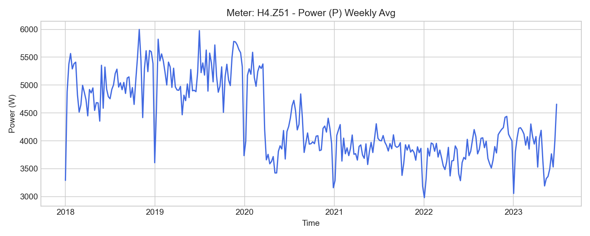

---

## H4.ZE50 (office_distribution)

### 기초 통계량 (1h 해상도)

| 측정 항목 | 기록 수(시간) | 평균 | 최소 | 최대 | 무부하(0) 비율 |
|-----------|---------------|------|------|------|----------------|
| U3 | 15,588 | 231.86 | 225.24 | 237.16 | 0.00% |
| P | 15,588 | 2882.74 | 551.73 | 26045.90 | 0.00% |
| P3 | 15,588 | 877.52 | 156.14 | 9015.98 | 0.00% |
| PF2 | 15,588 | 0.84 | 0.55 | 0.99 | 0.00% |
| PF | 15,588 | 0.83 | 0.68 | 1.00 | 0.00% |
| U2 | 15,588 | 231.60 | 224.57 | 237.59 | 0.00% |
| f | 15,588 | 50.00 | 49.95 | 50.07 | 0.00% |
| W_in | 15,587 | 22894.68 | 887.40 | 45794.17 | 0.00% |
| W2 | 15,587 | 6535.54 | 265.00 | 12778.60 | 0.00% |
| U1 | 15,588 | 231.99 | 225.32 | 237.06 | 0.00% |
| P2 | 15,588 | 803.34 | 71.74 | 7873.13 | 0.00% |
| W1 | 15,587 | 9511.26 | 346.06 | 19070.59 | 0.00% |
| I1 | 15,588 | 5.73 | 1.08 | 46.95 | 0.00% |
| P1 | 15,588 | 1201.88 | 175.89 | 10767.25 | 0.00% |
| PF1 | 15,588 | 0.88 | 0.72 | 1.00 | 0.00% |
| W | 15,587 | 22894.54 | 887.40 | 45793.98 | 0.00% |
| I2 | 15,588 | 4.13 | 0.54 | 34.83 | 0.00% |
| PF3 | 15,588 | 0.84 | 0.64 | 1.00 | 0.00% |
| W3 | 15,587 | 6847.74 | 276.34 | 13944.79 | 0.00% |
| I3 | 15,588 | 4.29 | 0.98 | 39.95 | 0.00% |

### 주간(Weekly) 전력(Power) 트렌드

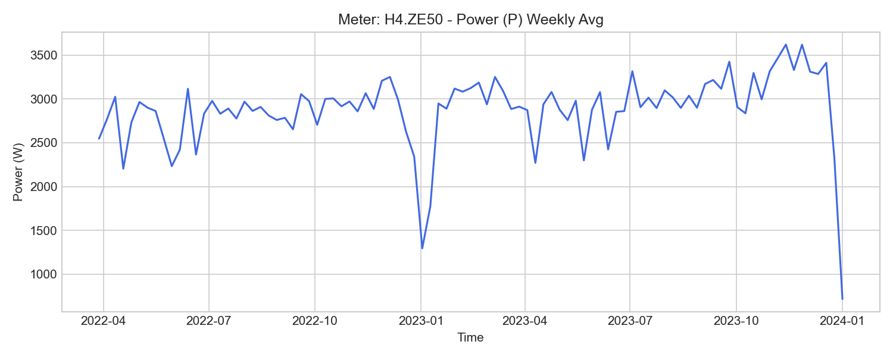

---

## H4.ZE51 (office_distribution)

### 기초 통계량 (1h 해상도)

| 측정 항목 | 기록 수(시간) | 평균 | 최소 | 최대 | 무부하(0) 비율 |
|-----------|---------------|------|------|------|----------------|
| W | 15,587 | 41297.38 | 1485.72 | 82025.86 | 0.00% |
| I2 | 15,588 | 10.26 | 5.46 | 25.73 | 0.00% |
| W3 | 15,587 | 12549.29 | 461.08 | 23935.25 | 0.00% |
| P1 | 15,588 | 1827.44 | 184.14 | 6219.32 | 0.00% |
| P2 | 15,588 | 1834.15 | 182.55 | 5773.23 | 0.00% |
| U2 | 15,588 | 231.61 | 224.57 | 237.61 | 0.00% |
| PF | 15,588 | 0.76 | 0.58 | 0.96 | 0.00% |
| PF1 | 15,588 | 0.80 | 0.45 | 0.98 | 0.00% |
| W_in | 15,587 | 41297.81 | 1485.72 | 82026.42 | 0.00% |
| U3 | 15,588 | 231.86 | 225.24 | 237.16 | 0.00% |
| PF3 | 15,588 | 0.73 | 0.51 | 0.96 | 0.00% |
| W1 | 15,587 | 13496.47 | 426.85 | 28909.42 | 0.00% |
| W_out | 1 | 0.00 | 0.00 | 0.00 | 0.00% |
| PF2 | 15,588 | 0.78 | 0.62 | 1.00 | 0.00% |
| U1 | 15,588 | 232.00 | 225.33 | 237.07 | 0.00% |
| P3 | 15,588 | 1506.24 | 358.88 | 6310.72 | 0.00% |
| I1 | 15,588 | 9.86 | 2.54 | 28.76 | 0.00% |
| f | 15,588 | 50.00 | 49.95 | 50.07 | 0.00% |
| W2 | 15,587 | 15251.63 | 597.78 | 29181.20 | 0.00% |
| I3 | 15,588 | 8.76 | 4.10 | 28.42 | 0.00% |
| P | 15,588 | 5167.83 | 1005.38 | 14768.23 | 0.00% |

### 주간(Weekly) 전력(Power) 트렌드

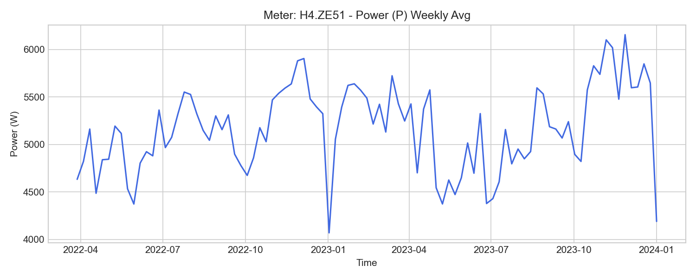

---

## H1.Z310 (pv)

### 기초 통계량 (1h 해상도)

| 측정 항목 | 기록 수(시간) | 평균 | 최소 | 최대 | 무부하(0) 비율 |
|-----------|---------------|------|------|------|----------------|
| PF3 | 30,817 | -0.49 | -1.00 | -0.00 | 0.00% |
| W_out | 30,804 | 167120.06 | 642.96 | 328211.74 | 0.00% |
| W | 30,809 | -167071.92 | -328192.28 | -642.32 | 0.00% |
| W_in | 30,816 | 11.17 | 0.10 | 12.02 | 0.00% |
| U1 | 30,817 | 230.24 | 223.88 | 236.38 | 0.00% |
| P3 | 30,817 | -3540.71 | -26752.04 | -0.06 | 0.00% |
| W3 | 30,816 | -55764.26 | -109506.76 | -214.47 | 0.00% |
| f | 30,817 | 50.00 | 49.95 | 50.07 | 0.00% |
| W1 | 30,809 | -55789.60 | -109604.29 | -214.35 | 0.00% |
| U3 | 30,817 | 230.55 | 223.88 | 236.88 | 0.00% |
| I3 | 30,817 | 15.65 | 0.29 | 115.62 | 0.00% |
| PF1 | 30,817 | -0.49 | -1.00 | 0.12 | 0.00% |
| W2 | 30,809 | -55530.99 | -109081.98 | -213.49 | 0.00% |
| P | 30,817 | -10611.47 | -80127.39 | 6.86 | 0.00% |
| I2 | 30,817 | 15.61 | 0.28 | 115.33 | 0.00% |
| P2 | 30,817 | -3526.95 | -26654.07 | -0.52 | 0.00% |
| PF2 | 30,817 | -0.50 | -1.00 | -0.01 | 0.00% |
| U2 | 30,817 | 229.92 | 223.47 | 237.03 | 0.00% |
| I1 | 30,817 | 15.67 | 0.29 | 115.58 | 0.00% |
| P1 | 30,817 | -3543.87 | -26721.28 | 8.58 | 0.00% |
| PF | 30,817 | -0.47 | -1.00 | 0.03 | 0.00% |

### 주간(Weekly) 전력(Power) 트렌드

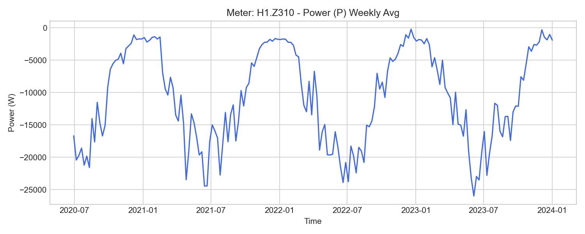

---

## H2.Z311 (pv)

### 기초 통계량 (1h 해상도)

| 측정 항목 | 기록 수(시간) | 평균 | 최소 | 최대 | 무부하(0) 비율 |
|-----------|---------------|------|------|------|----------------|
| f | 30,841 | 50.00 | 49.95 | 50.07 | 0.00% |
| W3 | 30,840 | -178288.91 | -339109.93 | -458.34 | 0.00% |
| P | 30,841 | -31741.69 | -235951.63 | 6.13 | 0.00% |
| U2 | 30,841 | 231.64 | 225.30 | 238.13 | 0.00% |
| U1 | 30,841 | 231.93 | 225.64 | 237.74 | 0.00% |
| W_in | 30,840 | 33.81 | 2.28 | 64.91 | 0.00% |
| PF3 | 30,841 | -0.49 | -1.00 | 0.02 | 0.00% |
| I2 | 30,841 | 48.02 | 0.69 | 422.64 | 0.00% |
| W | 30,833 | -499959.35 | -980592.12 | -1374.88 | 0.00% |
| PF | 30,841 | -0.46 | -1.00 | 0.01 | 0.00% |
| P1 | 30,841 | -10585.27 | -78600.20 | 1.93 | 0.00% |
| PF1 | 30,841 | -0.49 | -1.00 | 0.01 | 0.00% |
| P2 | 30,841 | -10573.23 | -78656.96 | 2.00 | 0.00% |
| W_out | 30,829 | 534868.24 | 1377.17 | 1017256.25 | 0.00% |
| W2 | 30,840 | -166579.14 | -326636.06 | -458.19 | 0.00% |
| W1 | 30,840 | -166759.57 | -327007.67 | -458.35 | 0.00% |
| I3 | 30,841 | 48.04 | 0.69 | 422.72 | 0.00% |
| U3 | 30,841 | 232.12 | 225.96 | 237.63 | 0.00% |
| PF2 | 30,841 | -0.49 | -1.00 | 0.01 | 0.00% |
| P3 | 30,841 | -10583.38 | -78694.47 | 2.64 | 0.00% |
| I1 | 30,841 | 48.04 | 0.70 | 422.22 | 0.00% |

### 주간(Weekly) 전력(Power) 트렌드

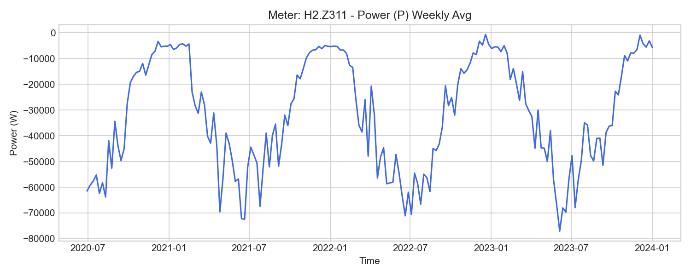

---

## H3.Z312 (pv)

### 기초 통계량 (1h 해상도)

| 측정 항목 | 기록 수(시간) | 평균 | 최소 | 최대 | 무부하(0) 비율 |
|-----------|---------------|------|------|------|----------------|
| W_in | 30,817 | 14.21 | 0.11 | 16.70 | 0.00% |
| W | 30,810 | -300511.08 | -586741.53 | -1487.63 | 0.00% |
| P | 30,817 | -18985.29 | -144831.38 | 9.29 | 0.00% |
| I1 | 30,817 | 27.71 | 0.00 | 206.78 | 0.16% |
| PF | 30,817 | -0.47 | -1.00 | 0.03 | 0.00% |
| I3 | 30,817 | 27.67 | 0.00 | 206.73 | 0.00% |
| W2 | 30,817 | -100190.64 | -195527.93 | -496.00 | 0.00% |
| PF3 | 30,817 | -0.49 | -1.00 | 1.00 | 0.00% |
| U2 | 30,817 | 231.37 | 225.11 | 239.36 | 0.00% |
| P2 | 30,817 | -6326.74 | -48369.93 | 0.23 | 0.16% |
| W1 | 30,810 | -100270.00 | -195811.67 | -496.04 | 0.00% |
| PF1 | 30,817 | -0.49 | -1.00 | 1.00 | 0.00% |
| I2 | 30,817 | 27.68 | 0.00 | 206.85 | 0.16% |
| U1 | 30,817 | 231.75 | 225.45 | 238.84 | 0.00% |
| U3 | 30,817 | 231.97 | 225.70 | 237.85 | 0.00% |
| P3 | 30,817 | -6322.68 | -48195.21 | 0.62 | 0.00% |
| P1 | 30,817 | -6335.91 | -48266.24 | 8.81 | 0.16% |
| W3 | 30,817 | -100093.75 | -195402.07 | -495.59 | 0.00% |
| W_out | 30,804 | 300719.46 | 1488.93 | 586887.48 | 0.00% |
| PF2 | 30,817 | -0.50 | -1.00 | 1.00 | 0.00% |
| f | 30,817 | 50.00 | 49.95 | 50.07 | 0.00% |

### 주간(Weekly) 전력(Power) 트렌드

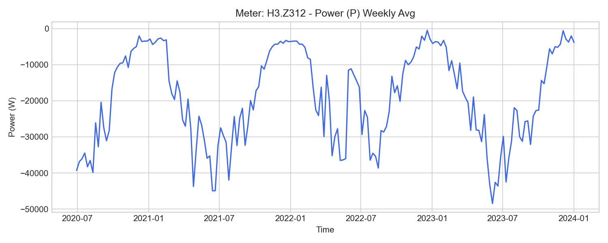

---

## V.Z84 (pv)

### 기초 통계량 (1h 해상도)

| 측정 항목 | 기록 수(시간) | 평균 | 최소 | 최대 | 무부하(0) 비율 |
|-----------|---------------|------|------|------|----------------|
| P | 39,529 | -14557.55 | -113631.96 | 11.24 | 0.00% |
| U2 | 39,529 | 229.67 | 223.41 | 235.70 | 0.00% |
| U3 | 39,529 | 230.20 | 223.91 | 235.53 | 0.00% |
| U1 | 39,529 | 229.88 | 223.55 | 235.16 | 0.00% |
| I2 | 39,529 | -24.39 | -183.15 | 0.00 | 0.00% |
| W_out | 39,528 | 294989.55 | 850.78 | 573208.85 | 0.00% |
| PF2 | 39,529 | -0.45 | -0.97 | 0.50 | 0.00% |
| I1 | 39,529 | -21.36 | -163.78 | 0.00 | 0.00% |
| P1 | 39,529 | -4646.30 | -36602.63 | 21.08 | 0.00% |
| P3 | 39,529 | -4647.23 | -36451.24 | 12.09 | 0.00% |
| W | 39,528 | -294989.55 | -573208.85 | -850.78 | 0.00% |
| P2 | 39,529 | -5264.29 | -40578.08 | 1.73 | 0.00% |
| W_in | 39,528 | 4.78 | 0.01 | 15.07 | 0.00% |
| PF1 | 39,529 | -0.45 | -1.00 | 0.08 | 0.00% |
| PF3 | 39,529 | -0.44 | -0.98 | 0.50 | 0.00% |
| I3 | 39,529 | -21.42 | -163.27 | 0.00 | 0.00% |

### 주간(Weekly) 전력(Power) 트렌드

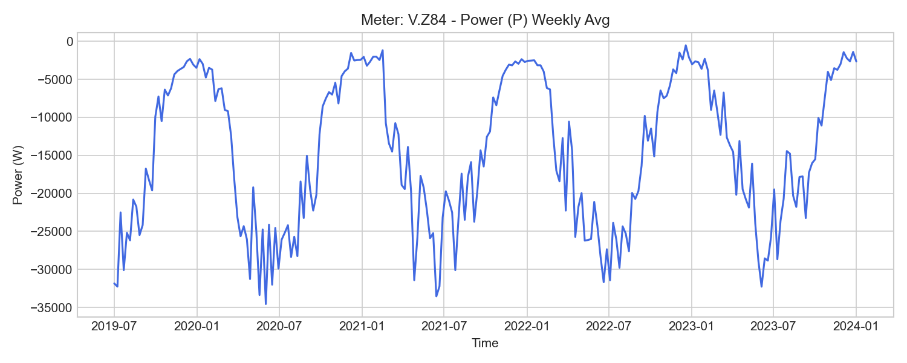

---

## V.ZE84 (pv)

### 기초 통계량 (1h 해상도)

| 측정 항목 | 기록 수(시간) | 평균 | 최소 | 최대 | 무부하(0) 비율 |
|-----------|---------------|------|------|------|----------------|
| P | 9,680 | -8310.89 | -61858.06 | 1.05 | 0.00% |
| f | 9,680 | 50.00 | 49.95 | 50.08 | 0.00% |
| PF2 | 9,680 | -0.46 | -0.97 | -0.04 | 0.00% |
| P2 | 9,680 | -4532.29 | -32894.58 | 0.00 | 0.00% |
| PF1 | 9,680 | -0.30 | -0.98 | 1.00 | 0.00% |
| W3 | 9,437 | 10431.53 | 10334.74 | 10440.80 | 0.00% |
| PF | 9,680 | -0.41 | -0.97 | 0.00 | 0.00% |
| P3 | 9,680 | 10.78 | -476.53 | 3073.57 | 2.50% |
| W_out | 9,679 | 82190.00 | 43343.33 | 124950.62 | 0.00% |
| PF3 | 9,438 | 0.12 | -0.85 | 0.29 | 0.00% |
| I1 | 9,680 | -18.45 | -129.02 | -0.46 | 0.00% |
| I2 | 9,680 | -21.12 | -148.17 | -0.46 | 0.00% |
| W2 | 9,676 | -64042.90 | -86817.93 | -42943.96 | 0.00% |
| W1 | 9,678 | 10433.56 | -9482.45 | 28114.09 | 0.00% |
| U1 | 9,680 | 230.35 | 223.79 | 235.70 | 0.00% |
| U3 | 9,680 | 230.35 | 223.97 | 235.79 | 0.00% |
| U2 | 9,680 | 229.78 | 223.28 | 235.82 | 0.00% |
| W_in | 9,672 | 0.32 | 0.24 | 0.36 | 0.00% |
| P1 | 9,680 | -3789.37 | -28963.48 | 7418.67 | 0.00% |
| I3 | 9,438 | -16.20 | -47.10 | -0.47 | 0.00% |
| W | 9,678 | -43182.28 | -85859.59 | -5406.98 | 0.00% |

### 주간(Weekly) 전력(Power) 트렌드

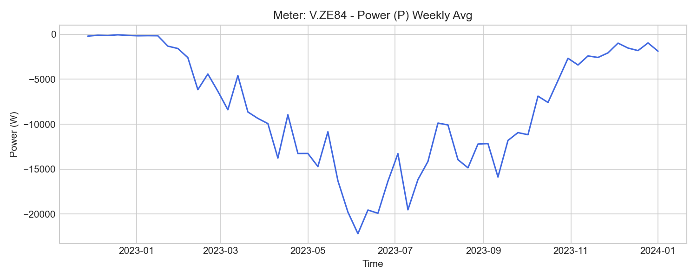

---

## H2.Z61 (server_power)

### 기초 통계량 (1h 해상도)

| 측정 항목 | 기록 수(시간) | 평균 | 최소 | 최대 | 무부하(0) 비율 |
|-----------|---------------|------|------|------|----------------|
| f | 52,584 | 50.09 | 0.00 | 50.23 | 0.12% |
| WQ_in | 52,584 | 290977.90 | 28773.18 | 548389.11 | 0.00% |
| PF3 | 52,584 | 0.82 | 0.00 | 0.93 | 0.12% |
| PF1 | 52,584 | 0.76 | -0.38 | 0.81 | 0.12% |
| I2 | 52,584 | 22.41 | 0.00 | 28.41 | 0.12% |
| P2 | 52,584 | 4189.94 | -2.97 | 5480.32 | 0.12% |
| Q | 52,584 | 9777.22 | -125.42 | 13455.28 | 1.14% |
| I1 | 52,584 | 24.01 | 0.00 | 30.59 | 0.12% |
| PF | 52,584 | 0.80 | 0.00 | 0.84 | 0.12% |
| P3 | 52,584 | 4681.90 | 0.00 | 6001.32 | 0.12% |
| U2 | 52,584 | 231.06 | 0.00 | 237.68 | 0.12% |
| WQ_out | 45,064 | 0.86 | 0.00 | 1.47 | 0.01% |
| WQ | 52,585 | 290991.95 | 28783.09 | 548397.03 | 0.00% |
| U3 | 52,584 | 231.76 | 0.00 | 237.44 | 0.12% |
| U1 | 52,584 | 231.39 | 0.00 | 237.19 | 0.12% |
| P | 52,584 | 12956.43 | -0.24 | 16882.78 | 1.14% |
| I3 | 52,584 | 24.71 | 0.00 | 31.40 | 0.12% |
| W | 52,585 | 384872.56 | 39186.19 | 727515.85 | 0.00% |
| P1 | 52,584 | 4235.45 | -8.61 | 5454.15 | 0.12% |
| PF2 | 52,584 | 0.81 | -0.07 | 0.86 | 0.12% |
| W_in | 52,584 | 384852.95 | 39173.04 | 727503.57 | 0.00% |
| W_out | 45,064 | 0.00 | 0.00 | 0.00 | 100.00% |

### 주간(Weekly) 전력(Power) 트렌드

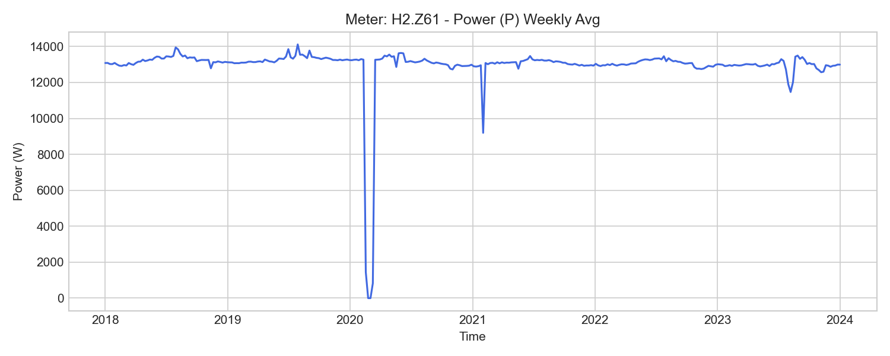

---

## H2.Z62 (server_power)

### 기초 통계량 (1h 해상도)

| 측정 항목 | 기록 수(시간) | 평균 | 최소 | 최대 | 무부하(0) 비율 |
|-----------|---------------|------|------|------|----------------|
| I1 | 52,584 | 3.43 | 0.00 | 25.68 | 0.12% |
| I3 | 52,584 | 3.93 | 0.00 | 30.61 | 0.12% |
| WQ_out | 45,064 | 2472.28 | 0.00 | 2779.09 | 11.04% |
| WQ | 52,585 | 7537.01 | 141.38 | 20714.29 | 0.00% |
| U1 | 52,584 | 231.71 | 0.00 | 237.48 | 0.12% |
| W_out | 52,044 | 1175.80 | 22.50 | 20016.96 | 0.00% |
| I2 | 52,584 | 4.18 | 0.00 | 29.74 | 0.12% |
| U2 | 52,584 | 230.69 | 0.00 | 237.25 | 0.12% |
| W | 52,585 | -713.35 | -19260.26 | 711.30 | 0.00% |
| WQ_in | 52,583 | 9655.27 | 141.38 | 23492.15 | 0.00% |
| W_in | 52,583 | 451.33 | 78.64 | 759.74 | 0.00% |
| PF1 | 52,584 | -0.07 | -0.91 | 0.03 | 0.12% |
| Q | 52,584 | 439.20 | 0.00 | 1830.31 | 1.14% |
| U3 | 52,584 | 232.07 | 0.00 | 237.70 | 0.12% |
| PF3 | 52,584 | -0.09 | -0.94 | 0.02 | 0.12% |
| P1 | 52,584 | -410.69 | -5437.72 | 10.70 | 0.12% |
| P3 | 52,584 | -547.32 | -6600.34 | 5.90 | 0.12% |
| P | 52,584 | -367.46 | -5904.35 | 17.85 | 1.14% |
| P2 | 52,584 | 590.71 | 0.00 | 6327.12 | 0.12% |
| PF | 52,584 | -0.05 | -0.93 | 0.05 | 0.12% |
| f | 52,584 | 49.97 | 0.00 | 50.11 | 0.12% |
| PF2 | 52,584 | 0.10 | 0.00 | 0.92 | 0.12% |

### 주간(Weekly) 전력(Power) 트렌드

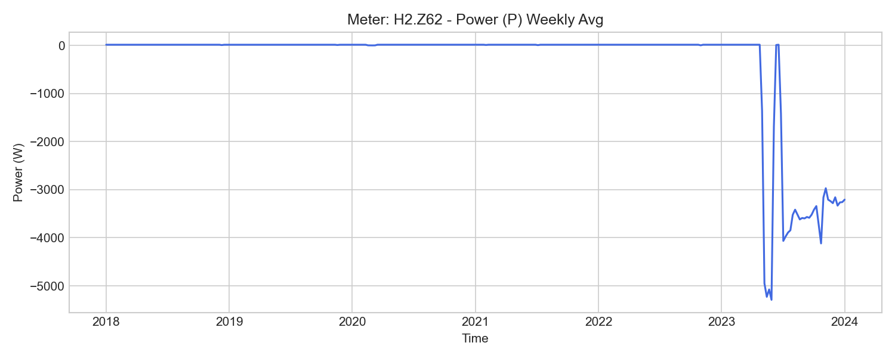

---

## H2.Z63 (server_power)

### 기초 통계량 (1h 해상도)

| 측정 항목 | 기록 수(시간) | 평균 | 최소 | 최대 | 무부하(0) 비율 |
|-----------|---------------|------|------|------|----------------|
| PF1 | 52,584 | 0.78 | -0.01 | 0.93 | 0.12% |
| P3 | 52,584 | 5250.72 | -61.59 | 7814.61 | 0.12% |
| U3 | 52,584 | 231.94 | 0.00 | 237.64 | 0.12% |
| PF2 | 52,584 | 0.78 | -0.01 | 0.94 | 0.12% |
| I2 | 52,584 | 27.34 | 0.00 | 35.32 | 0.12% |
| P2 | 52,584 | 5093.05 | -28.70 | 7682.83 | 0.12% |
| W | 52,585 | 492779.27 | 48088.88 | 865386.93 | 0.00% |
| WQ | 52,585 | -292377.01 | -572162.68 | -29723.90 | 0.00% |
| W_out | 52,561 | 1.39 | 0.00 | 4.23 | 0.35% |
| Q | 52,584 | -10219.47 | -14080.51 | 0.00 | 1.13% |
| W_in | 52,584 | 492758.04 | 48072.72 | 865389.98 | 0.00% |
| WQ_out | 52,584 | 292361.37 | 29713.63 | 572149.68 | 0.00% |
| U2 | 52,584 | 231.25 | 0.00 | 237.88 | 0.12% |
| I3 | 52,584 | 27.94 | 0.00 | 35.87 | 0.12% |
| U1 | 52,584 | 231.69 | 0.00 | 237.53 | 0.12% |
| PF3 | 52,584 | 0.78 | -0.02 | 0.94 | 0.12% |
| f | 52,584 | 50.05 | 0.00 | 50.18 | 0.12% |
| WQ_in | 52,561 | 0.00 | 0.00 | 0.00 | 100.00% |
| P | 52,584 | 15356.58 | -101.50 | 23240.53 | 1.13% |
| P1 | 52,584 | 5199.17 | -19.85 | 7741.89 | 0.12% |
| I1 | 52,584 | 28.05 | 0.00 | 35.82 | 0.12% |
| PF | 52,584 | 0.78 | -0.01 | 0.93 | 0.12% |

### 주간(Weekly) 전력(Power) 트렌드

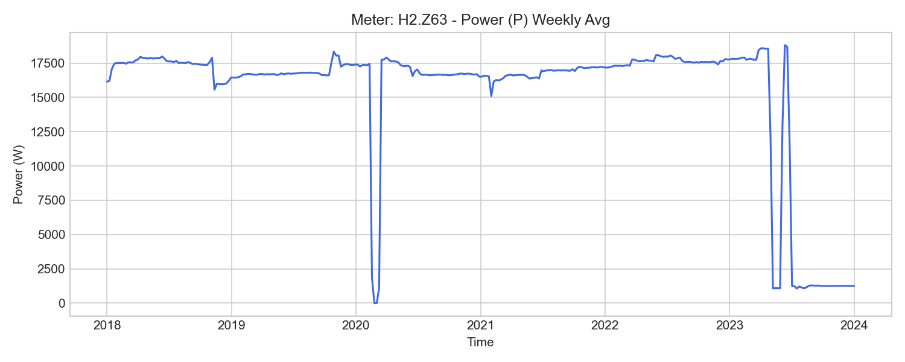

---

## H2.Z64 (server_power)

### 기초 통계량 (1h 해상도)

| 측정 항목 | 기록 수(시간) | 평균 | 최소 | 최대 | 무부하(0) 비율 |
|-----------|---------------|------|------|------|----------------|
| I1 | 52,584 | 25.58 | 0.00 | 51.79 | 0.12% |
| WQ_in | 45,064 | 0.00 | 0.00 | 0.00 | 100.00% |
| U1 | 52,584 | 231.63 | 0.00 | 237.47 | 0.12% |
| f | 52,584 | 50.04 | 0.00 | 50.18 | 0.12% |
| PF3 | 52,584 | 0.93 | 0.00 | 0.99 | 0.12% |
| P | 52,584 | 16604.81 | 0.00 | 36069.46 | 1.13% |
| Q | 52,584 | -5400.72 | -7302.77 | 0.00 | 1.13% |
| U3 | 52,584 | 231.97 | 0.00 | 237.64 | 0.12% |
| P1 | 52,584 | 5589.28 | 0.00 | 11888.66 | 0.12% |
| PF2 | 52,584 | 0.91 | 0.00 | 0.98 | 0.12% |
| PF | 52,584 | 0.92 | 0.00 | 0.99 | 0.12% |
| P2 | 52,584 | 5579.18 | 0.00 | 11956.72 | 0.12% |
| I2 | 52,584 | 25.91 | 0.00 | 52.47 | 0.12% |
| I3 | 52,584 | 26.08 | 0.00 | 53.12 | 0.12% |
| P3 | 52,584 | 5712.20 | 0.00 | 12224.64 | 0.12% |
| PF1 | 52,584 | 0.93 | 0.00 | 0.99 | 0.12% |
| U2 | 52,584 | 231.31 | 0.00 | 237.94 | 0.12% |
| W_out | 50,294 | 0.06 | 0.02 | 0.11 | 0.00% |
| W_in | 52,584 | 597628.49 | 106311.10 | 990425.26 | 0.00% |
| W | 52,585 | 597652.72 | 106337.36 | 990445.90 | 0.00% |
| WQ_out | 52,584 | 159219.98 | 16144.26 | 303015.31 | 0.00% |
| WQ | 52,585 | -159228.17 | -303020.80 | -16149.80 | 0.00% |

### 주간(Weekly) 전력(Power) 트렌드

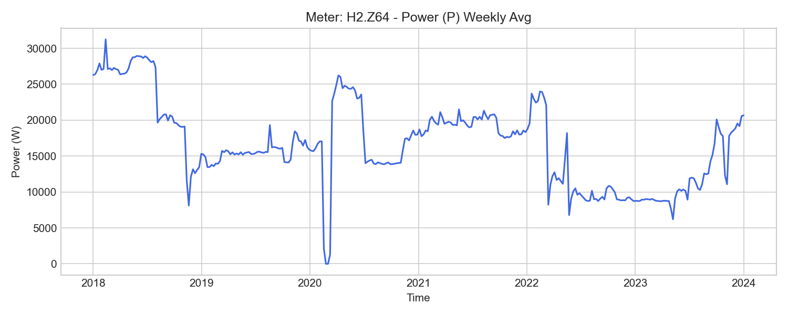

---

## H2.Z65 (server_power)

### 기초 통계량 (1h 해상도)

| 측정 항목 | 기록 수(시간) | 평균 | 최소 | 최대 | 무부하(0) 비율 |
|-----------|---------------|------|------|------|----------------|
| U2 | 52,584 | 231.27 | 224.12 | 237.58 | 0.00% |
| WQ_in | 52,448 | 0.00 | 0.00 | 0.00 | 100.00% |
| P | 52,584 | 17322.67 | 11.28 | 36994.87 | 0.00% |
| WQ | 52,585 | -153323.83 | -294152.76 | -14810.54 | 0.00% |
| P2 | 52,584 | 5764.01 | 244.85 | 12309.11 | 0.00% |
| W_out | 52,448 | -0.01 | -0.05 | 0.02 | 40.24% |
| Q | 52,584 | -5312.88 | -7363.59 | -141.05 | 0.00% |
| PF2 | 52,584 | 0.92 | 0.40 | 0.99 | 0.00% |
| I1 | 52,584 | 25.99 | 2.22 | 52.89 | 0.00% |
| I3 | 52,584 | 26.77 | 1.79 | 54.48 | 0.00% |
| U1 | 52,584 | 231.82 | 224.48 | 237.34 | 0.00% |
| f | 52,584 | 50.13 | 48.45 | 50.21 | 0.00% |
| P3 | 52,584 | 5892.86 | 325.62 | 12541.64 | 0.00% |
| PF | 52,584 | 0.93 | 0.40 | 0.99 | 0.00% |
| W_in | 52,584 | 615047.01 | 109138.80 | 1018875.59 | 0.00% |
| P1 | 52,584 | 5697.26 | 264.72 | 12144.54 | 0.00% |
| W | 52,585 | 615072.00 | 109165.78 | 1018896.82 | 0.00% |
| PF3 | 52,584 | 0.94 | 0.40 | 0.99 | 0.00% |
| PF1 | 52,584 | 0.93 | 0.33 | 0.99 | 0.00% |
| I2 | 52,584 | 26.58 | 1.77 | 53.87 | 0.00% |
| WQ_out | 52,584 | 153315.84 | 14805.31 | 294147.46 | 0.00% |
| U3 | 52,584 | 232.21 | 225.12 | 237.56 | 0.00% |

### 주간(Weekly) 전력(Power) 트렌드

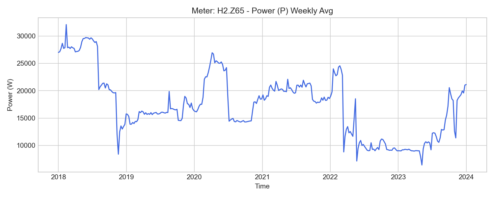

---

## H2.ZE64 (server_power)

### 기초 통계량 (1h 해상도)

| 측정 항목 | 기록 수(시간) | 평균 | 최소 | 최대 | 무부하(0) 비율 |
|-----------|---------------|------|------|------|----------------|
| W | 15,584 | 83464.33 | 3371.33 | 180986.84 | 0.00% |
| W1 | 15,584 | 27365.13 | 1123.86 | 59316.26 | 0.00% |
| W_out | 11,547 | 0.02 | 0.02 | 0.03 | 0.00% |
| P1 | 15,585 | 3734.86 | 785.81 | 7615.04 | 0.00% |
| f | 15,585 | 50.00 | 49.95 | 50.07 | 0.00% |
| I3 | 15,585 | 18.89 | 11.47 | 34.73 | 0.00% |
| PF2 | 15,585 | 0.86 | 0.69 | 0.97 | 0.00% |
| I1 | 15,585 | 18.20 | 9.93 | 33.70 | 0.00% |
| W_in | 15,584 | 83464.35 | 3371.34 | 180986.87 | 0.00% |
| U1 | 15,585 | 231.87 | 225.33 | 237.07 | 0.00% |
| PF3 | 15,585 | 0.89 | 0.56 | 0.98 | 0.00% |
| I2 | 15,585 | 18.74 | 12.77 | 34.63 | 0.00% |
| PF | 15,585 | 0.87 | 0.59 | 0.97 | 0.00% |
| W3 | 15,584 | 28636.36 | 1161.60 | 61987.21 | 0.00% |
| P2 | 15,585 | 3760.84 | 657.13 | 7709.42 | 0.00% |
| P3 | 15,585 | 3903.85 | 797.78 | 7849.78 | 0.00% |
| W2 | 15,584 | 27462.84 | 1085.87 | 59683.37 | 0.00% |
| U2 | 15,585 | 231.47 | 224.91 | 237.39 | 0.00% |
| PF1 | 15,585 | 0.88 | 0.35 | 0.98 | 0.00% |
| P | 15,585 | 11399.55 | 2243.06 | 23106.23 | 0.00% |
| U3 | 15,585 | 232.18 | 225.77 | 237.25 | 0.00% |

### 주간(Weekly) 전력(Power) 트렌드

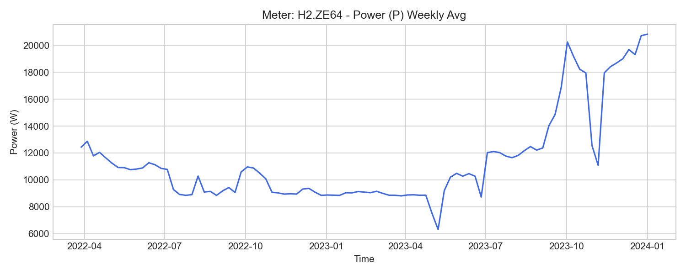

---

## H2.ZE65 (server_power)

### 기초 통계량 (1h 해상도)

| 측정 항목 | 기록 수(시간) | 평균 | 최소 | 최대 | 무부하(0) 비율 |
|-----------|---------------|------|------|------|----------------|
| P3 | 15,056 | 3684.16 | -5028.96 | 7758.41 | 0.00% |
| P | 15,056 | 11153.37 | 2301.56 | 22821.98 | 0.00% |
| PF1 | 15,056 | 0.88 | 0.35 | 0.97 | 0.00% |
| P2 | 15,056 | 3798.56 | 681.02 | 7616.96 | 0.00% |
| I3 | 15,056 | 19.03 | 11.78 | 34.36 | 0.00% |
| U3 | 15,056 | 232.14 | 225.80 | 237.20 | 0.00% |
| PF | 15,056 | 0.86 | 0.27 | 0.97 | 0.00% |
| U1 | 15,056 | 231.81 | 225.33 | 236.99 | 0.00% |
| I2 | 15,056 | 18.81 | 13.04 | 34.04 | 0.00% |
| W_in | 15,055 | 79745.31 | 2337.33 | 172061.26 | 0.00% |
| I1 | 15,056 | 17.96 | 10.13 | 33.12 | 0.00% |
| W3 | 15,055 | 22496.76 | -3081.31 | 54213.69 | 0.00% |
| W | 15,055 | 76688.34 | 1087.68 | 168979.89 | 0.00% |
| U2 | 15,056 | 231.42 | 224.89 | 237.31 | 0.00% |
| W2 | 15,055 | 27621.93 | 1203.35 | 58380.50 | 0.00% |
| W1 | 15,055 | 26569.65 | 1133.97 | 56385.70 | 0.00% |
| PF2 | 15,056 | 0.87 | 0.70 | 0.97 | 0.00% |
| P1 | 15,056 | 3670.65 | 793.43 | 7463.64 | 0.00% |
| PF3 | 15,056 | 0.84 | -0.94 | 0.98 | 0.00% |
| W_out | 11,547 | 0.01 | 0.01 | 0.01 | 0.00% |
| f | 15,056 | 50.00 | 49.95 | 50.07 | 0.00% |

### 주간(Weekly) 전력(Power) 트렌드

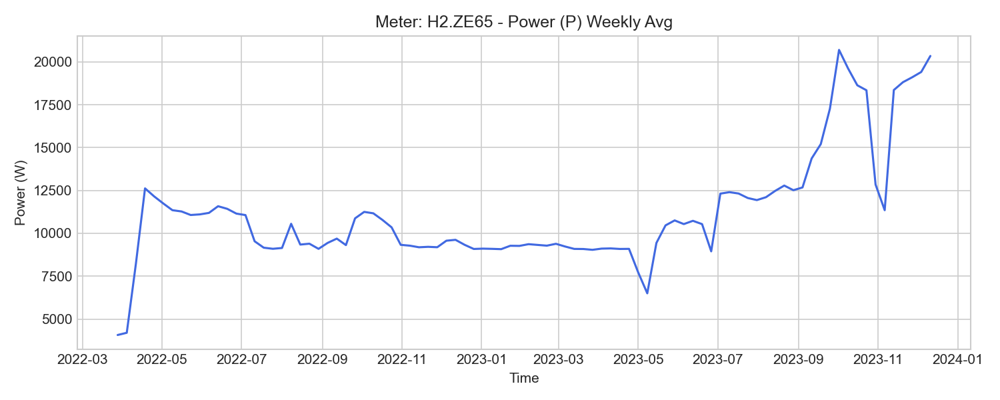

---

## H3.Z43 (server_power)

### 기초 통계량 (1h 해상도)

| 측정 항목 | 기록 수(시간) | 평균 | 최소 | 최대 | 무부하(0) 비율 |
|-----------|---------------|------|------|------|----------------|
| I2 | 51,840 | 8.82 | 0.01 | 24.07 | 0.00% |
| U3 | 51,840 | 232.10 | 225.60 | 237.73 | 0.00% |
| PF2 | 51,840 | 0.70 | -0.20 | 0.77 | 0.00% |
| f | 51,840 | 50.07 | 48.41 | 50.15 | 0.00% |
| PF3 | 51,840 | 0.44 | -0.80 | 0.76 | 7.54% |
| U1 | 51,840 | 231.74 | 225.25 | 238.69 | 0.00% |
| WQ | 52,585 | 100956.62 | 306.48 | 217162.47 | 0.00% |
| WQ_in | 51,839 | 103310.04 | 310.37 | 218335.99 | 0.00% |
| PF1 | 51,840 | 0.82 | -0.10 | 0.97 | 0.00% |
| P1 | 51,840 | 1439.01 | -0.85 | 3992.17 | 0.01% |
| I1 | 51,840 | 8.69 | 0.00 | 22.83 | 0.01% |
| PF | 51,840 | 0.81 | -0.33 | 0.97 | 0.00% |
| P | 51,840 | 4238.77 | -6.32 | 12826.29 | 0.00% |
| WQ_out | 49,886 | 949.11 | 0.00 | 1181.06 | 19.64% |
| W | 52,585 | 107276.53 | 2662.98 | 223027.86 | 0.00% |
| I3 | 51,840 | 8.43 | -0.00 | 24.14 | 7.55% |
| W_in | 51,840 | 108860.35 | 2662.98 | 223135.90 | 0.00% |
| P3 | 51,840 | 1355.01 | -6.42 | 4113.54 | 7.53% |
| P2 | 51,840 | 1426.64 | -2.35 | 4183.26 | 0.00% |
| W_out | 49,886 | 92.39 | 0.00 | 115.02 | 19.64% |
| Q | 51,840 | 4188.23 | 1.02 | 13440.84 | 0.00% |
| U2 | 51,840 | 231.59 | 223.26 | 239.34 | 0.00% |

### 주간(Weekly) 전력(Power) 트렌드

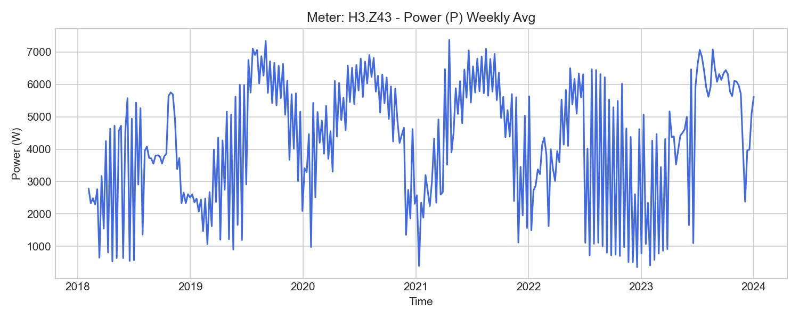

---

## H3.Z44 (server_power)

### 기초 통계량 (1h 해상도)

| 측정 항목 | 기록 수(시간) | 평균 | 최소 | 최대 | 무부하(0) 비율 |
|-----------|---------------|------|------|------|----------------|
| f | 51,840 | 50.07 | 49.24 | 50.13 | 0.00% |
| P | 51,840 | 2510.03 | -3.27 | 21766.99 | 0.11% |
| U3 | 51,840 | 231.83 | 225.32 | 237.37 | 0.00% |
| P2 | 51,840 | 832.47 | 0.00 | 7148.75 | 0.25% |
| P3 | 51,840 | 777.91 | -5.38 | 12983.60 | 0.12% |
| I1 | 51,840 | 5.02 | 0.00 | 57.66 | 0.15% |
| I2 | 51,840 | 5.01 | 0.00 | 53.52 | 0.25% |
| I3 | 51,840 | 4.51 | 0.00 | 55.96 | 0.12% |
| U1 | 51,840 | 231.49 | 225.05 | 238.35 | 0.00% |
| W_in | 51,839 | 60944.45 | 2559.45 | 132577.74 | 0.00% |
| PF2 | 51,840 | 0.73 | 0.00 | 0.84 | 0.25% |
| U2 | 51,840 | 231.24 | 224.78 | 238.90 | 0.00% |
| W_out | 49,886 | 85.10 | 0.00 | 106.00 | 19.64% |
| PF3 | 51,840 | 0.52 | -0.29 | 1.00 | 0.12% |
| PF1 | 51,840 | 0.84 | 0.00 | 1.00 | 0.15% |
| WQ_out | 49,886 | 814.40 | 0.00 | 1013.57 | 19.64% |
| WQ | 52,585 | 50764.08 | 444.69 | 112543.08 | 0.00% |
| W | 52,585 | 60040.37 | 2559.22 | 132473.80 | 0.00% |
| P1 | 51,840 | 897.00 | 0.00 | 12009.70 | 0.15% |
| PF | 51,840 | 0.84 | -0.29 | 1.00 | 0.11% |
| Q | 51,840 | 2183.38 | -4.23 | 13804.00 | 0.11% |
| WQ_in | 51,839 | 52267.60 | 444.72 | 113554.63 | 0.00% |

### 주간(Weekly) 전력(Power) 트렌드

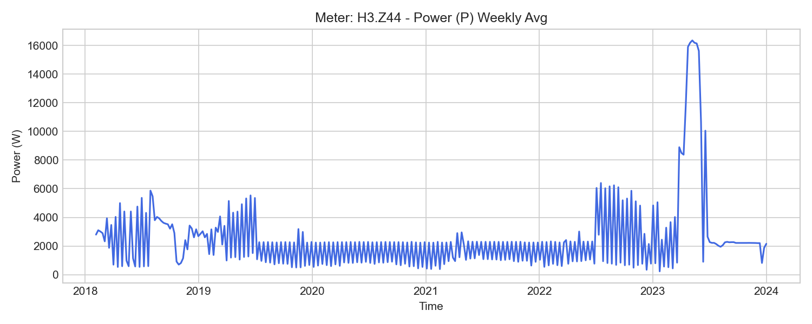

---

## H3.Z46 (server_power)

### 기초 통계량 (1h 해상도)

| 측정 항목 | 기록 수(시간) | 평균 | 최소 | 최대 | 무부하(0) 비율 |
|-----------|---------------|------|------|------|----------------|
| WQ_out | 52,584 | 66895.83 | 9933.51 | 113705.35 | 0.00% |
| P2 | 52,584 | 1931.51 | -1.19 | 3979.05 | 0.02% |
| U1 | 52,584 | 231.30 | 224.50 | 238.62 | 0.00% |
| I2 | 52,584 | 9.26 | 0.00 | 17.73 | 0.02% |
| PF | 52,584 | 0.92 | 0.31 | 0.99 | 0.00% |
| W | 52,585 | 179165.55 | 25596.49 | 327994.39 | 0.00% |
| f | 52,584 | 50.05 | 49.97 | 50.15 | 0.00% |
| I3 | 52,584 | 8.05 | 0.45 | 19.87 | 0.00% |
| P3 | 52,584 | 1755.17 | 35.11 | 4424.94 | 0.00% |
| P | 52,584 | 5754.63 | 3.70 | 11461.05 | 0.00% |
| W_in | 52,584 | 179156.97 | 25590.08 | 327990.41 | 0.00% |
| WQ | 52,585 | -60232.09 | -95157.68 | -9936.07 | 0.00% |
| Q | 52,584 | -1607.28 | -2878.92 | 4729.84 | 0.00% |
| I1 | 52,584 | 9.89 | 0.00 | 18.53 | 0.05% |
| U3 | 52,584 | 231.75 | 224.88 | 237.49 | 0.00% |
| PF2 | 52,584 | 0.90 | -0.07 | 0.97 | 0.02% |
| PF1 | 52,584 | 0.90 | -0.01 | 0.98 | 0.05% |
| U2 | 52,584 | 231.13 | 224.71 | 238.86 | 0.00% |
| W_out | 45,064 | 0.00 | 0.00 | 0.00 | 100.00% |
| WQ_in | 45,077 | 7776.13 | 0.01 | 19348.67 | 0.00% |
| PF3 | 52,584 | 0.94 | 0.30 | 0.98 | 0.00% |
| P1 | 52,584 | 2071.20 | -0.28 | 3956.99 | 0.05% |

### 주간(Weekly) 전력(Power) 트렌드

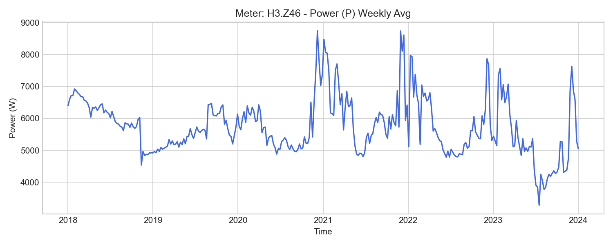

---

## H3.Z71 (server_power)

### 기초 통계량 (1h 해상도)

| 측정 항목 | 기록 수(시간) | 평균 | 최소 | 최대 | 무부하(0) 비율 |
|-----------|---------------|------|------|------|----------------|
| PF3 | 52,584 | 0.93 | 0.57 | 0.98 | 0.00% |
| P | 52,584 | 7919.24 | 11.70 | 17497.26 | 0.00% |
| W_out | 52,554 | 0.00 | 0.00 | 0.00 | 100.00% |
| I3 | 52,584 | 11.41 | 2.16 | 22.05 | 0.00% |
| WQ_out | 52,584 | 79145.03 | 10279.21 | 144507.13 | 0.00% |
| PF | 52,584 | 0.91 | 0.53 | 1.00 | 0.00% |
| W_in | 52,584 | 248616.91 | 33282.95 | 448649.05 | 0.00% |
| P2 | 52,584 | 2756.80 | 227.46 | 4567.19 | 0.00% |
| I1 | 52,584 | 12.73 | 1.60 | 24.44 | 0.00% |
| WQ | 52,585 | -72398.52 | -136898.54 | -9550.88 | 0.00% |
| W | 52,585 | 248628.61 | 33291.19 | 448656.28 | 0.00% |
| P1 | 52,584 | 2679.37 | 245.49 | 5509.31 | 0.00% |
| Q | 52,584 | -2437.22 | -3577.75 | 3870.45 | 0.00% |
| I2 | 52,584 | 13.20 | 2.00 | 20.26 | 0.00% |
| PF2 | 52,584 | 0.90 | 0.15 | 0.98 | 0.00% |
| P3 | 52,584 | 2478.03 | 326.50 | 4891.86 | 0.00% |
| PF1 | 52,584 | 0.91 | 0.49 | 0.98 | 0.00% |
| U1 | 52,584 | 231.62 | 225.08 | 234.91 | 0.00% |
| f | 52,584 | 50.09 | 50.01 | 50.17 | 0.00% |
| U2 | 52,584 | 232.01 | 224.66 | 234.85 | 0.00% |
| U3 | 52,584 | 232.50 | 225.73 | 235.30 | 0.00% |
| WQ_in | 52,554 | 6754.00 | 0.00 | 7610.88 | 0.32% |

### 주간(Weekly) 전력(Power) 트렌드

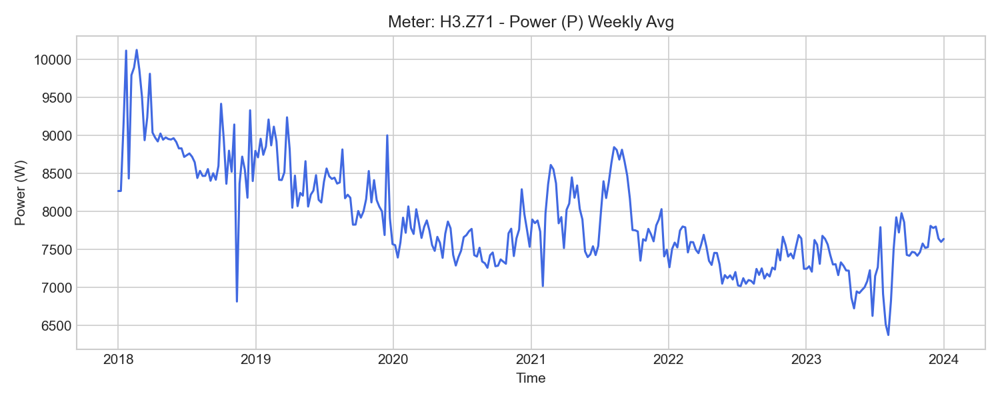

---

## H3.ZE43 (server_power)

### 기초 통계량 (1h 해상도)

| 측정 항목 | 기록 수(시간) | 평균 | 최소 | 최대 | 무부하(0) 비율 |
|-----------|---------------|------|------|------|----------------|
| W | 15,685 | 28311.47 | 10.02 | 63206.17 | 0.00% |
| I3 | 15,686 | 8.33 | 0.00 | 64.26 | 14.75% |
| f | 15,686 | 50.00 | 49.95 | 50.07 | 0.00% |
| PF1 | 15,686 | 0.77 | -0.96 | 0.98 | 0.00% |
| I1 | 15,686 | 8.59 | 0.61 | 21.33 | 0.00% |
| W_out | 502 | 2.78 | 1.12 | 3.73 | 0.00% |
| W1 | 15,685 | 8519.28 | -1176.40 | 20373.03 | 0.00% |
| PF3 | 15,686 | 0.79 | 0.22 | 1.00 | 0.00% |
| PF2 | 15,686 | 0.70 | 0.65 | 0.75 | 0.00% |
| U2 | 15,686 | 231.38 | 224.92 | 238.77 | 0.00% |
| W2 | 15,685 | 10409.45 | 258.54 | 22165.70 | 0.00% |
| P2 | 15,686 | 1396.54 | -0.01 | 3817.50 | 0.00% |
| PF | 15,686 | 0.73 | 0.00 | 1.54 | 0.00% |
| I2 | 15,686 | 8.73 | 0.62 | 21.55 | 0.00% |
| W3 | 15,685 | 9385.96 | 103.53 | 20678.88 | 0.00% |
| P | 15,686 | 4028.38 | -53.44 | 11458.44 | 0.00% |
| W_in | 15,685 | 29475.43 | 362.07 | 64384.12 | 0.00% |
| P1 | 15,686 | 1321.00 | -3935.69 | 3816.61 | 0.04% |
| U1 | 15,686 | 231.70 | 225.22 | 238.10 | 0.00% |
| P3 | 15,686 | 1316.66 | -0.01 | 3824.33 | 0.13% |
| U3 | 15,686 | 231.93 | 225.58 | 237.31 | 0.00% |

### 주간(Weekly) 전력(Power) 트렌드

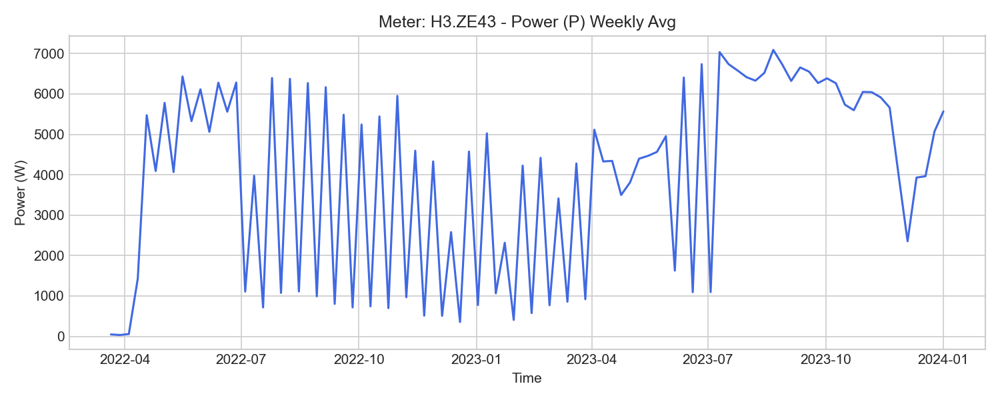

---

## H3.ZE44 (server_power)

### 기초 통계량 (1h 해상도)

| 측정 항목 | 기록 수(시간) | 평균 | 최소 | 최대 | 무부하(0) 비율 |
|-----------|---------------|------|------|------|----------------|
| P | 15,686 | 3679.08 | -36.35 | 21787.70 | 0.00% |
| W1 | 15,685 | 9019.97 | -444.31 | 136897.89 | 0.00% |
| P2 | 15,686 | 1182.63 | -0.04 | 7986.73 | 0.03% |
| PF | 15,686 | 0.73 | 0.01 | 0.86 | 0.00% |
| U3 | 15,686 | 231.92 | 225.59 | 237.29 | 0.00% |
| W_in | 15,685 | 26644.34 | 92.43 | 58345.65 | 0.00% |
| W_out | 15,518 | 0.67 | 0.00 | 0.68 | 0.00% |
| I1 | 15,686 | 8.11 | 0.00 | 57.85 | 0.06% |
| P3 | 15,686 | 1283.88 | -9.59 | 850248.56 | 0.03% |
| PF1 | 15,686 | 0.77 | -0.94 | 1.00 | 0.00% |
| I2 | 15,686 | 7.66 | 0.00 | 39.13 | 0.06% |
| W3 | 15,685 | 8521.68 | 18.04 | 1385027.50 | 0.00% |
| U2 | 15,686 | 231.34 | 224.89 | 238.71 | 0.00% |
| PF2 | 15,686 | 0.70 | 0.16 | 1.00 | 0.00% |
| U1 | 15,686 | 231.71 | 225.26 | 238.10 | 0.00% |
| f | 15,686 | 50.00 | 49.95 | 50.07 | 0.00% |
| I3 | 15,686 | 7.30 | 0.00 | 56.22 | 13.39% |
| W2 | 15,685 | 8752.09 | 73.53 | 18635.48 | 0.00% |
| P1 | 15,686 | 1315.73 | -2731.67 | 73831.51 | 0.02% |
| W | 15,685 | 26198.72 | 12.59 | 57761.87 | 0.00% |
| PF3 | 15,686 | 0.79 | 0.20 | 1.00 | 0.00% |

### 주간(Weekly) 전력(Power) 트렌드

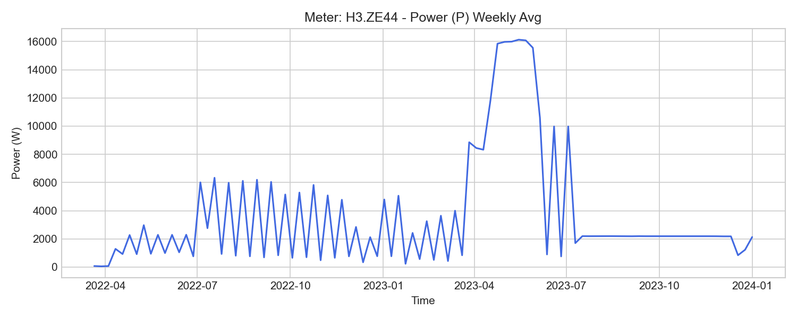

---

## H1.K16 (server_thermal)

### 기초 통계량 (1h 해상도)

| 측정 항목 | 기록 수(시간) | 평균 | 최소 | 최대 | 무부하(0) 비율 |
|-----------|---------------|------|------|------|----------------|
| W | 44,676 | 109126.00 | 590.00 | 215120.00 | 0.00% |
| qv | 44,677 | 1.99 | 0.00 | 3.87 | 1.29% |
| Tvl | 44,677 | 8.41 | -1.90 | 37.00 | 0.00% |
| P | 44,677 | 4750.14 | 0.00 | 274459.92 | 1.33% |
| Tdiff | 44,677 | -3849.50 | -24456.08 | 13347.17 | 0.00% |
| Trl | 44,677 | 12.27 | 4.54 | 37.00 | 0.00% |
| V | 44,676 | 61315360.56 | 1348980.00 | 90928350.00 | 0.00% |

### 주간(Weekly) 전력(Power) 트렌드

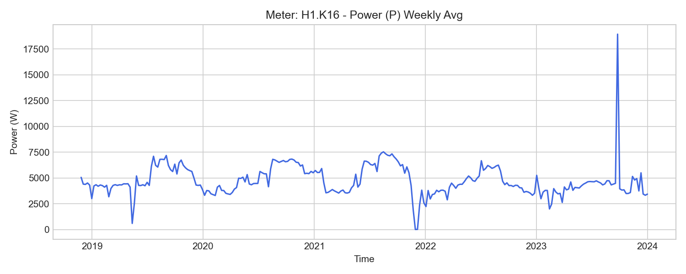

---

## H2.T.Z31 (ventilation)

### 기초 통계량 (1h 해상도)

| 측정 항목 | 기록 수(시간) | 평균 | 최소 | 최대 | 무부하(0) 비율 |
|-----------|---------------|------|------|------|----------------|
| P2 | 52,584 | 2508.83 | 0.00 | 7357.09 | 0.02% |
| W | 45,064 | 245553.35 | 75841.52 | 424457.33 | 0.00% |
| PF1 | 52,584 | 0.79 | 0.32 | 1.00 | 0.00% |
| U2 | 52,584 | 231.86 | 225.35 | 238.13 | 0.00% |
| P1 | 52,584 | 2719.79 | 33.38 | 7535.85 | 0.00% |
| PF | 52,584 | 0.80 | 0.31 | 1.00 | 0.00% |
| P | 52,584 | 7700.83 | 3.70 | 21902.90 | 0.00% |
| PF3 | 52,584 | 0.62 | -0.11 | 1.00 | 1.23% |
| W_out | 45,064 | 0.01 | 0.00 | 0.01 | 38.71% |
| I2 | 52,584 | 16.41 | 0.00 | 44.42 | 0.02% |
| Q | 52,584 | 8506.84 | -327.09 | 22918.33 | 0.00% |
| WQ | 52,539 | 240752.59 | 23722.34 | 470806.40 | 0.00% |
| I3 | 52,584 | 16.56 | -0.00 | 46.79 | 1.23% |
| WQ_in | 52,583 | 241130.69 | 23462.70 | 471673.88 | 0.00% |
| W_in | 52,583 | 217062.34 | 19509.59 | 424457.34 | 0.00% |
| U3 | 52,584 | 232.41 | 225.50 | 237.80 | 0.00% |
| WQ_out | 52,539 | 560.34 | 23.98 | 867.48 | 0.00% |
| f | 52,584 | 50.05 | 48.87 | 50.12 | 0.00% |
| U1 | 52,584 | 231.92 | 225.52 | 237.59 | 0.00% |
| P3 | 52,584 | 2468.88 | -1.01 | 7973.29 | 1.25% |
| PF2 | 52,584 | 0.75 | 0.00 | 1.00 | 0.02% |
| I1 | 52,584 | 17.25 | 0.23 | 45.21 | 0.00% |

### 주간(Weekly) 전력(Power) 트렌드

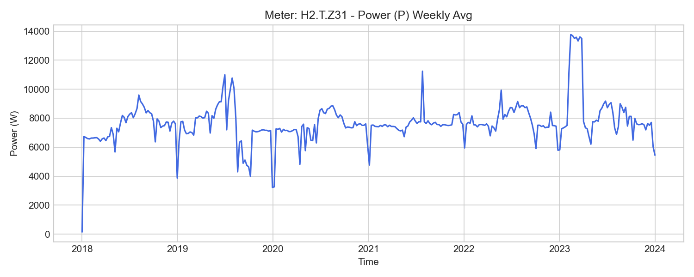

---

## H2.Z68 (ventilation)

### 기초 통계량 (1h 해상도)

| 측정 항목 | 기록 수(시간) | 평균 | 최소 | 최대 | 무부하(0) 비율 |
|-----------|---------------|------|------|------|----------------|
| W_out | 45,064 | 0.00 | 0.00 | 0.00 | 100.00% |
| U1 | 52,584 | 231.95 | 224.81 | 237.53 | 0.00% |
| WQ_out | 45,064 | 0.00 | 0.00 | 0.00 | 100.00% |
| U2 | 52,584 | 231.53 | 225.24 | 237.86 | 0.00% |
| PF2 | 52,584 | 0.64 | 0.00 | 0.96 | 0.02% |
| WQ | 52,585 | 115315.29 | 12785.40 | 213921.16 | 0.00% |
| I3 | 52,584 | 6.97 | 0.21 | 10.67 | 0.00% |
| P1 | 52,584 | 944.48 | 0.00 | 1737.80 | 0.02% |
| P | 52,584 | 2905.17 | 3.70 | 6298.67 | 0.00% |
| Q | 52,584 | 3803.30 | 7.37 | 7738.71 | 0.00% |
| f | 52,584 | 50.09 | 49.09 | 50.18 | 0.00% |
| W_in | 52,584 | 87727.20 | 9769.69 | 162366.35 | 0.00% |
| WQ_in | 52,584 | 115309.59 | 12781.52 | 213917.52 | 0.00% |
| W | 52,585 | 87731.52 | 9772.39 | 162368.77 | 0.00% |
| P3 | 52,584 | 924.35 | 30.52 | 1589.42 | 0.00% |
| PF3 | 52,584 | 0.57 | 0.48 | 0.86 | 0.00% |
| U3 | 52,584 | 232.25 | 225.03 | 237.64 | 0.00% |
| I2 | 52,584 | 6.81 | 0.00 | 10.54 | 0.02% |
| PF1 | 52,584 | 0.59 | 0.00 | 0.90 | 0.02% |
| I1 | 52,584 | 6.87 | 0.00 | 11.12 | 0.02% |
| P2 | 52,584 | 1000.51 | 0.00 | 1682.13 | 0.02% |
| PF | 52,584 | 0.60 | 0.48 | 0.90 | 0.00% |

### 주간(Weekly) 전력(Power) 트렌드

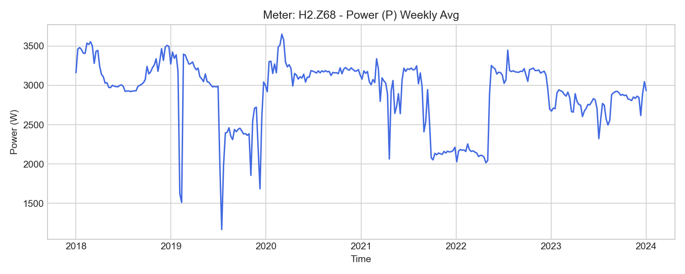

---

## H2.Z69 (ventilation)

### 기초 통계량 (1h 해상도)

| 측정 항목 | 기록 수(시간) | 평균 | 최소 | 최대 | 무부하(0) 비율 |
|-----------|---------------|------|------|------|----------------|
| PF3 | 52,584 | 0.54 | 0.45 | 0.77 | 0.00% |
| WQ_out | 45,064 | 0.00 | 0.00 | 0.00 | 100.00% |
| P1 | 52,584 | 602.78 | 0.00 | 1599.85 | 0.08% |
| PF1 | 52,584 | 0.52 | 0.00 | 0.89 | 0.08% |
| U1 | 52,584 | 231.91 | 225.55 | 237.45 | 0.00% |
| P3 | 52,584 | 675.15 | 29.14 | 1596.75 | 0.00% |
| P2 | 52,584 | 609.60 | 0.00 | 1610.39 | 0.08% |
| PF2 | 52,584 | 0.53 | 0.00 | 0.92 | 0.08% |
| U3 | 52,584 | 232.19 | 224.95 | 237.54 | 0.00% |
| U2 | 52,584 | 231.53 | 225.27 | 237.87 | 0.00% |
| WQ_in | 52,584 | 87946.27 | 9103.73 | 165959.91 | 0.00% |
| I3 | 52,584 | 5.34 | 0.23 | 9.82 | 0.00% |
| P | 52,584 | 1884.27 | 3.70 | 4806.15 | 0.00% |
| Q | 52,584 | 2984.02 | 7.36 | 4988.66 | 0.00% |
| WQ | 52,585 | 87950.74 | 9106.80 | 165962.72 | 0.00% |
| I2 | 52,584 | 4.93 | 0.00 | 9.75 | 0.08% |
| PF | 52,584 | 0.53 | 0.46 | 0.79 | 0.00% |
| f | 52,584 | 50.05 | 49.21 | 50.13 | 0.00% |
| I1 | 52,584 | 5.00 | 0.00 | 9.75 | 0.08% |
| W_in | 52,584 | 56351.02 | 6090.32 | 105128.69 | 0.00% |
| W_out | 45,064 | 0.00 | 0.00 | 0.00 | 100.00% |
| W | 52,585 | 56353.84 | 6092.31 | 105130.47 | 0.00% |

### 주간(Weekly) 전력(Power) 트렌드

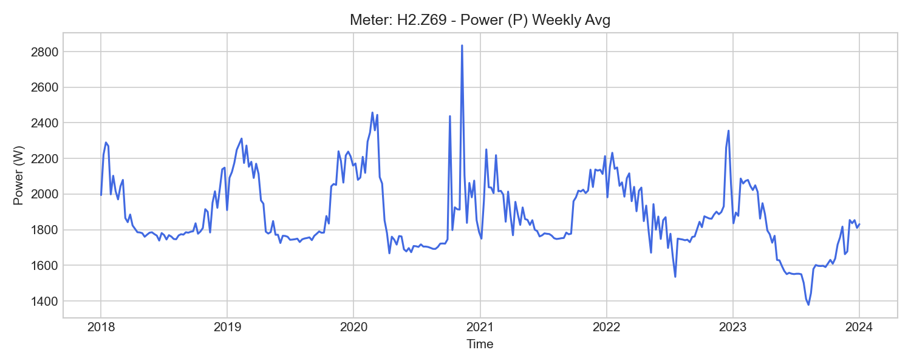

---

## H2.Z70 (ventilation)

### 기초 통계량 (1h 해상도)

| 측정 항목 | 기록 수(시간) | 평균 | 최소 | 최대 | 무부하(0) 비율 |
|-----------|---------------|------|------|------|----------------|
| WQ_in | 52,583 | 114359.11 | 11009.92 | 219733.77 | 0.00% |
| U2 | 52,584 | 231.39 | 225.08 | 237.68 | 0.00% |
| PF | 52,584 | 0.64 | 0.38 | 1.00 | 0.00% |
| I3 | 52,584 | 6.45 | 0.18 | 28.17 | 0.00% |
| W_in | 52,584 | 55299.72 | 5252.04 | 104431.96 | 0.00% |
| PF3 | 52,584 | 0.53 | 0.36 | 0.81 | 0.00% |
| P1 | 52,584 | 699.23 | 0.00 | 4365.89 | 0.02% |
| P | 52,584 | 1886.20 | 3.70 | 12979.90 | 0.00% |
| WQ | 52,585 | 114357.12 | 11009.15 | 219724.34 | 0.00% |
| I1 | 52,577 | 6.56 | 0.00 | 27.97 | 0.02% |
| PF1 | 52,584 | 0.69 | 0.00 | 0.99 | 0.02% |
| WQ_out | 52,538 | 5.99 | 0.77 | 10.19 | 0.00% |
| f | 52,584 | 50.05 | 49.22 | 50.15 | 0.00% |
| P2 | 52,555 | 597.31 | 0.00 | 4283.85 | 30.46% |
| I2 | 52,555 | 6.36 | -0.00 | 27.31 | 30.41% |
| Q | 52,584 | 3968.88 | -15.16 | 14364.67 | 0.00% |
| U3 | 52,584 | 232.21 | 225.81 | 237.54 | 0.00% |
| W_out | 45,064 | 0.00 | 0.00 | 0.00 | 100.00% |
| W | 52,585 | 55302.54 | 5252.13 | 104432.57 | 0.00% |
| PF2 | 52,555 | 0.32 | 0.00 | 0.89 | 30.46% |
| P3 | 52,584 | 593.29 | 22.08 | 4364.59 | 0.00% |
| U1 | 52,584 | 231.83 | 225.41 | 237.33 | 0.00% |

### 주간(Weekly) 전력(Power) 트렌드

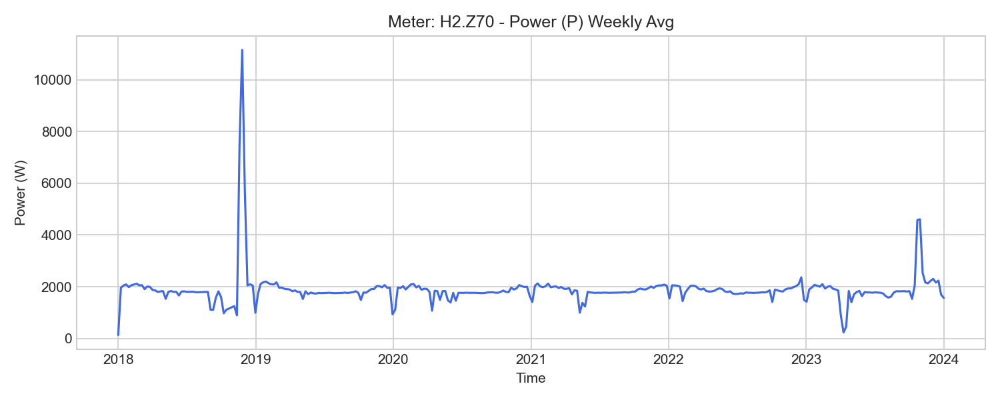

---

## H3.Z42 (ventilation)

### 기초 통계량 (1h 해상도)

| 측정 항목 | 기록 수(시간) | 평균 | 최소 | 최대 | 무부하(0) 비율 |
|-----------|---------------|------|------|------|----------------|
| U3 | 51,840 | 231.93 | 225.43 | 237.52 | 0.00% |
| W_in | 51,840 | 294497.28 | 18498.35 | 628305.70 | 0.00% |
| I2 | 51,840 | 20.76 | 0.00 | 49.96 | 0.12% |
| WQ_out | 51,839 | 2282.93 | 113.05 | 5152.88 | 0.00% |
| WQ | 51,833 | 62370.53 | 4983.46 | 128208.42 | 0.00% |
| PF | 51,840 | 0.82 | 0.41 | 1.00 | 0.00% |
| P2 | 51,840 | 3871.74 | 0.00 | 9639.90 | 0.12% |
| U1 | 51,840 | 231.62 | 225.15 | 238.55 | 0.00% |
| U2 | 51,840 | 231.41 | 224.85 | 239.13 | 0.00% |
| PF2 | 51,840 | 0.67 | 0.00 | 0.99 | 0.12% |
| W | 49,886 | 304573.68 | 30928.91 | 627703.14 | 0.00% |
| WQ_in | 51,833 | 64653.71 | 5097.32 | 133361.30 | 0.00% |
| I1 | 51,840 | 20.47 | 0.00 | 49.40 | 0.12% |
| Q | 51,840 | 2371.20 | -667.39 | 15047.97 | 0.00% |
| I3 | 51,840 | 21.80 | 0.40 | 55.03 | 0.00% |
| f | 51,840 | 50.05 | 48.81 | 50.13 | 0.00% |
| PF3 | 51,840 | 0.83 | 0.39 | 1.00 | 0.00% |
| P3 | 51,840 | 4111.97 | 71.46 | 10896.72 | 0.00% |
| P1 | 51,840 | 3758.34 | 0.00 | 9340.32 | 0.12% |
| PF1 | 51,840 | 0.79 | 0.00 | 0.99 | 0.12% |
| W_out | 49,886 | 484.22 | 0.00 | 602.56 | 19.64% |
| P | 51,840 | 11756.04 | 3.70 | 42492.63 | 0.00% |

### 주간(Weekly) 전력(Power) 트렌드

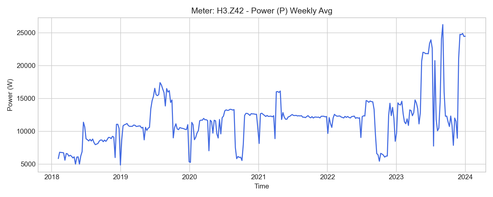

---

## WeatherStation.Weather (weather_station)

### 기초 통계량 (1h 해상도)

| 측정 항목 | 기록 수(시간) | 평균 | 최소 | 최대 | 무부하(0) 비율 |
|-----------|---------------|------|------|------|----------------|
| Igm | 52,608 | 133.59 | 0.00 | 990.36 | 32.86% |
| Ua | 52,608 | 72.80 | 15.13 | 100.00 | 0.00% |
| rho | 52,608 | 1.22 | 1.11 | 1.35 | 0.00% |
| Dp | 52,608 | 6.92 | -18.07 | 22.13 | 0.00% |
| Ah | 52,608 | 9.23 | 1.36 | 21.99 | 0.00% |
| Igc | 52,608 | 133.63 | 0.00 | 990.52 | 34.91% |
| H | 52,608 | 29.52 | -7.91 | 73.50 | 0.00% |
| Dc | 52,608 | 175.32 | 13.66 | 330.49 | 0.00% |
| Sc | 52,608 | 1.66 | 0.17 | 10.29 | 0.00% |
| Ta | 52,608 | 12.40 | -11.20 | 39.35 | 0.00% |

---

## H2.T.Z34 (workshop_test)

### 기초 통계량 (1h 해상도)

| 측정 항목 | 기록 수(시간) | 평균 | 최소 | 최대 | 무부하(0) 비율 |
|-----------|---------------|------|------|------|----------------|
| WQ_in | 52,583 | 194363.14 | 30997.20 | 304888.87 | 0.00% |
| I1 | 52,584 | 122.85 | 0.00 | 227.67 | 0.12% |
| U2 | 52,584 | 231.25 | 0.00 | 237.90 | 0.12% |
| W_in | 52,584 | 2833721.59 | 392450.97 | 5021610.44 | 0.00% |
| f | 52,584 | 50.04 | 0.00 | 50.19 | 0.12% |
| WQ | 52,583 | 135268.41 | 29253.74 | 191950.21 | 0.00% |
| I2 | 52,584 | 128.20 | 0.00 | 212.20 | 0.12% |
| PF2 | 52,584 | 0.99 | 0.00 | 1.00 | 0.12% |
| P1 | 52,584 | 28188.83 | 0.00 | 51477.24 | 0.12% |
| WQ_out | 52,584 | 59093.63 | 1741.31 | 158318.09 | 0.00% |
| PF | 52,584 | 0.99 | 0.00 | 1.00 | 0.12% |
| P3 | 52,584 | 30641.98 | 0.00 | 48595.72 | 0.12% |
| W | 45,064 | 3170143.54 | 1214338.92 | 5021610.44 | 0.00% |
| I3 | 52,584 | 133.26 | 0.00 | 211.09 | 0.12% |
| P2 | 52,584 | 29376.95 | 0.00 | 48717.02 | 0.12% |
| U3 | 52,584 | 231.87 | 0.00 | 237.55 | 0.12% |
| PF1 | 52,584 | 0.99 | 0.00 | 1.00 | 0.12% |
| P | 52,584 | 87007.56 | 0.00 | 146988.76 | 1.14% |
| W_out | 45,064 | 0.00 | 0.00 | 0.00 | 100.00% |
| U1 | 52,584 | 231.54 | 0.00 | 237.35 | 0.12% |
| PF3 | 52,584 | 0.99 | 0.00 | 1.00 | 0.12% |
| Q | 52,584 | 2117.14 | -24509.28 | 29033.88 | 1.14% |

### 주간(Weekly) 전력(Power) 트렌드

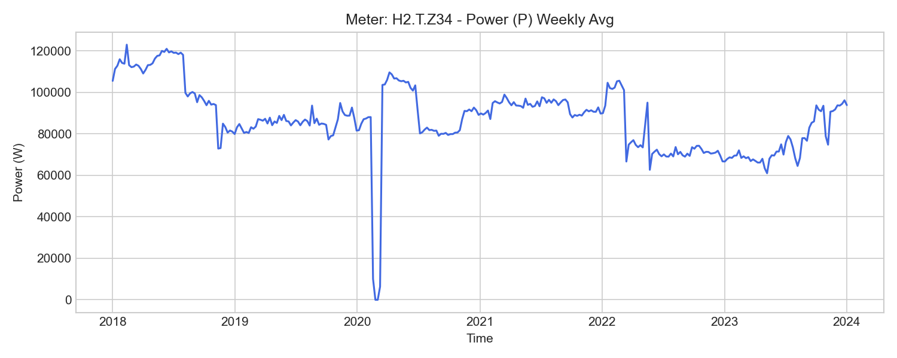

---

## H2.ZE74 (workshop_test)

### 기초 통계량 (1h 해상도)

| 측정 항목 | 기록 수(시간) | 평균 | 최소 | 최대 | 무부하(0) 비율 |
|-----------|---------------|------|------|------|----------------|
| W3 | 15,680 | 1832.83 | 3.35 | 3216.36 | 0.00% |
| W_in | 15,680 | 3597.45 | 25.66 | 6417.00 | 0.00% |
| P1 | 15,681 | 57.38 | 7.69 | 519.80 | 0.00% |
| I2 | 15,681 | 1.40 | 0.65 | 8.99 | 0.00% |
| I3 | 15,681 | 1.24 | 0.58 | 2.49 | 0.00% |
| P2 | 15,681 | 145.14 | -57.14 | 1963.84 | 0.00% |
| W2 | 15,680 | 1218.60 | -1.90 | 2276.81 | 0.00% |
| P | 15,681 | 407.56 | 82.25 | 2727.38 | 0.00% |
| PF | 15,681 | 0.46 | 0.23 | 0.90 | 0.00% |
| W | 15,680 | 3594.63 | 24.60 | 6414.15 | 0.00% |
| f | 15,681 | 50.00 | 49.95 | 50.07 | 0.00% |
| PF3 | 15,681 | 0.73 | 0.02 | 0.96 | 0.00% |
| U2 | 15,681 | 226.78 | 76.04 | 237.14 | 0.00% |
| W_out | 7,365 | 0.06 | 0.06 | 0.06 | 0.00% |
| I1 | 15,681 | 0.95 | 0.71 | 3.95 | 0.00% |
| U1 | 15,681 | 230.53 | 201.07 | 237.14 | 0.00% |
| P3 | 15,681 | 204.96 | 1.39 | 504.52 | 0.00% |
| PF2 | 15,681 | 0.41 | -0.83 | 0.95 | 0.00% |
| U3 | 15,681 | 230.98 | 201.29 | 236.82 | 0.00% |
| W1 | 15,680 | 543.20 | 21.52 | 920.98 | 0.00% |
| PF1 | 15,681 | 0.25 | 0.05 | 0.89 | 0.00% |

### 주간(Weekly) 전력(Power) 트렌드

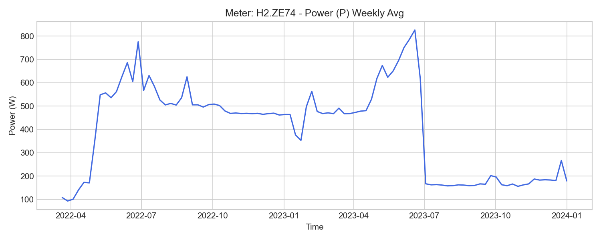

---

