# CMS 라이브 스트리밍 및 서빙 파이프라인 검증 결과 보고서

문서 버전: narrative-md v1
작성일: 2026-06-01 KST
작성 주체: Orchestrator
기준 산출물: Markdown-first report package와 연결된 scratch 검증 기록. 기존 HTML 초안은 active package에서 제외하고 archive/reference 성격으로만 취급한다.
문서 형식: Markdown, 논문형 연결 서술

## 초록

본 보고서는 CMS 라이브 스트리밍 및 모델 서빙 후보 생성 경로가 실제 운영 구조에 들어가기 전에 어떤 범위까지 검증되었는지를 정리한다. 검증의 핵심 질문은 라이브 또는 replay 이벤트가 MongoDB raw buffer에 수신된 뒤 processor에 의해 안전하게 읽히고, PostgreSQL scratch 또는 candidate 성격의 출력으로 변환되며, 이 과정에서 품질 상태와 모델 마스크가 적절하게 부여되고, 재시작과 장애 조건에서도 canonical table이 오염되지 않는지에 있었다. 검증은 production canonical에 직접 쓰는 방식이 아니라 AWS scratch schema와 MongoDB scratch collection을 사용하여 수행되었다. 그 결과 corrected_resampled family policy, QA state와 model mask, 1,603 series 규모의 제한 window 처리, 24시간 aggregate soak, checkpoint 기반 재시작, representative failure injection, daemon-style latency, canonical write guard는 각 gate의 수용 기준을 만족하였다. 다만 TC2는 독립 검토가 timeout 되었으므로 제한 검증으로 남으며, TC4는 harmonized raw event만으로 corrected_resampled reference를 완전히 재현할 수 없음을 확인한 diagnostic gate이다. 실제 model inference dry-run은 model artifact와 registry가 없어 TC13에서 차단되었고, promotion procedure와 monitoring/runbook은 그 이후 단계로 보류되었다.

주요어: CMS, live streaming, MongoDB raw buffer, PostgreSQL scratch, corrected_resampled, QA state, model mask, checkpoint, canonical write guard

## 1. 서론

CMS 데이터 파이프라인에서 라이브 스트리밍 경로는 단순히 최근 값을 빠르게 저장하는 기능만을 의미하지 않는다. 이 경로는 sparse live event를 수신하고, event time과 ingest sequence를 기준으로 처리 순서를 보존하며, 모델이 소비할 수 있는 시간 해상도의 후보 row를 생성하고, 결측이나 지연, 중복, out-of-order event 같은 품질 문제를 모델 입력 정책과 분리하여 기록해야 한다. 특히 champion model이 corrected_resampled 계열로 학습되었다면 serving input도 해당 contract와 의미적으로 호환되어야 한다. 따라서 live path는 raw diagnostic lane과 model serving lane을 구분하여 설계되어야 한다.

이번 검증은 이 구분을 전제로 수행되었다. Harmonized 계열은 live event에 가까운 raw/proxy 입력으로 사용되었고, corrected_resampled 계열은 model serving contract와 비교할 reference로 사용되었다. MongoDB는 장기 정본 저장소가 아니라 recent raw buffer와 cursor 관리 영역으로 사용되었다. PostgreSQL에서는 production canonical table 대신 scratch schema를 사용하여 1분, 15분, 1시간 후보와 품질 상태를 저장하였다. 이 구조는 운영 전 안전성을 확인하기 위한 실험 경로이며, production-ready 또는 live-ready 선언을 포함하지 않는다.

그림 1은 harmonized 입력, corrected_resampled reference, MongoDB raw buffer, streaming processor, PostgreSQL scratch/candidate, canonical, model layer가 어떻게 분리되는지를 보여준다. 이 그림에서 중요한 점은 MongoDB가 canonical fact를 대체하지 않고, PostgreSQL canonical도 processor의 직접 write 대상이 아니라는 점이다.

## 2. 데이터셋과 검증 범위

검증에 사용된 데이터 제품은 네 가지로 구분된다. `*_harmonized.csv.gz`는 1,603 series 규모의 live raw/proxy 입력으로 사용되었으며, MongoDB scratch raw buffer에 적재된 뒤 processor polling 입력이 되었다. `*_corrected_resampled_1min.csv.gz`는 champion model 학습 입력과 같은 계열의 기준 자료로 사용되었고, 1분 후보 생성 정책을 검증하는 reference 역할을 하였다. `*_corrected_resampled_15min.csv.gz`와 `*_corrected_resampled_1h.csv.gz`는 각각 15분과 1시간 후보가 reference와 일치하는지를 확인하는 기준으로 사용되었다.

검증은 gate 방식으로 구성되었다. TC1은 observed-or-null batch 성격의 기초 확인이었고, TC2는 synthetic streaming diagnostic이었다. TC3은 corrected_resampled family policy가 15분과 1시간 후보를 올바르게 만들 수 있는지 확인하였다. TC4는 harmonized live reconstruction이 corrected_resampled를 완전히 재현할 수 있는지 검토한 diagnostic gate였다. TC5부터 TC7-lite는 QA state와 model mask가 1,603 series 및 24시간 aggregate 범위에서 유지되는지를 검토하였다. TC8과 TC9는 checkpoint 기반 restart/resume과 idempotent upsert를 확인하였다. TC10은 대표 장애 주입을 통해 quarantine, retry, rollback, late update 처리의 안전성을 확인하였다. TC11은 finite daemon-style loop에서 latency를 측정하였다. TC12는 canonical write guard를 확인하였다. TC13은 model artifact와 registry 부재로 real inference dry-run을 수행하지 못하였다.

그림 2는 각 gate가 어느 검증 목적에 대응하는지를 요약한다. 본 보고서의 결론은 이 gate들이 제공한 증거 수준에 맞추어 제한적으로 해석되어야 한다. AWS scratch에서 통과한 gate는 production deployment나 장기 daemon 운영의 완전한 대체 증거가 아니다.

## 3. 방법

라이브 스트리밍 검증의 기본 구조는 MongoDB 수신, processor polling, PostgreSQL scratch 출력, readback verification 순서로 구성되었다. Raw event는 MongoDB scratch collection에 저장되었고, processor는 `ingest_seq`, checkpoint, watermark를 기준으로 새 이벤트만 읽었다. Processor는 event time을 기준으로 1분 후보를 생성하고, measurement family policy에 따라 15분 및 1시간 후보를 만들었다. 각 후보 row에는 값 자체뿐 아니라 lineage, QA state, `model_input_available`, `model_mask`, `mask_reason`이 함께 기록되었다.

Raw diagnostic lane에서는 observed-or-null 원칙을 적용하였다. 이 lane은 interpolation, forward-fill, gap correction, outlier correction을 수행하지 않고, grid에 값이 없으면 null로 남긴다. 반대로 champion model serving lane에서는 corrected_resampled contract와의 호환성이 중요하다. 따라서 TC3 계열은 1분 reference, 15분 reference, 1시간 reference 및 W/WQ derived rule을 기준으로 후보 생성 결과를 비교하였다. 이 비교는 serving input distribution을 학습 데이터 계열과 맞추기 위한 검증이었다.

재시작과 장애 검증에서는 checkpoint가 핵심 상태로 취급되었다. TC8과 TC9에서는 중복 replay가 들어와도 checkpoint 이하의 old sequence가 다시 처리되지 않아야 했고, PostgreSQL serving output은 `(run_id, resolution, meter_urn, measurement, ts)` key 기준으로 idempotent upsert되어야 했다. TC10에서는 bad timestamp, bad value, duplicate source timestamp, out-of-order event, late event, simulated MongoDB transient failure, simulated PostgreSQL write interruption을 주입하였다. 이 경우 잘못된 raw event는 quarantine 또는 QA state로 분류되어야 하며, PostgreSQL write interruption은 rollback 뒤 retry 가능해야 한다.

TC11은 운영 daemon을 그대로 검증한 것이 아니라 finite daemon-style loop로 producer, MongoDB polling processor, PostgreSQL upsert 경로를 대표 측정한 실험이다. 이 gate에서 측정한 latency는 test environment의 대표값이며, production SLO로 확정할 수 없다. 다만 MongoDB 수신 이후 1분, 15분, 1시간 row가 생성되는 경로와 대략적인 지연 범위를 확인하는 근거가 된다.

그림 3은 TC11에서 latency가 측정된 경로를 나타낸다. 측정 단위는 producer insert 이후 processor가 MongoDB에서 event를 읽고 PostgreSQL scratch row를 upsert하기까지의 구간이다.

## 4. 결과

Corrected_resampled family policy 검증은 TC3에서 통과하였다. 대표 gate와 full comparable-row gate를 통해 15분 후보와 1시간 후보가 reference와 일치하는지 확인하였고, W/WQ derived rule도 별도 확인되었다. Full 비교 gate에서는 15분 row 6,404개가 모두 match 되었고, 1시간 row 1,601개도 모두 match 되었다. Derived check row 16개 역시 모두 match 되었다. 이 결과는 serving lane이 corrected_resampled 계열을 기준으로 후보를 만들 수 있음을 보여주지만, comparable row 범위에서의 결과라는 caveat를 가진다.

TC4는 pass가 아니라 diagnostic 결과로 해석해야 한다. Harmonized raw/proxy event만 사용하여 corrected_resampled reference를 재구성하려 할 때 divergence가 발생하였다. 이 결과는 pipeline failure라기보다 corrected_resampled에 offline issue correction이 포함되어 있으며, sparse live event만으로 그 결과를 항상 재현할 수 없다는 경계를 보여준다. 따라서 live path에서는 mismatch를 즉시 root-cause blocker로 판정하기보다 `corrected_reference_divergence`, `no_source_event`, `model_input_null` 같은 QA state로 기록하고, model mask를 통해 안전한 소비 여부를 분리하는 방식이 타당하다.

TC5부터 TC7-lite는 이러한 품질 상태와 모델 마스크 정책을 검증하였다. TC5 대표 gate에서는 MongoDB input 148건과 serving row 325건이 생성되었고, unclassified row가 0건으로 확인되었다. TC6의 1,603 series 1시간 scale gate에서는 source series 1,603개, Mongo input 68,208건, serving row 104,195건이 확인되었으며, unclassified row와 mask 위반이 0건이었다. TC7-lite의 24시간 aggregate soak에서는 Mongo input 1,267,166건과 expected virtual serving row 2,500,680건이 aggregate 기준으로 일치하였다. 이 단계는 raw serving row 2,500,680건을 PostgreSQL에 전량 insert한 검증은 아니며, 시간별 aggregate로 scale과 mask rule을 확인한 제한 검증이다.

그림 4는 품질 상태와 모델 마스크가 분리되는 방식을 보여준다. 값이 reference와 일치하는 row는 모델 입력으로 사용할 수 있지만, reference divergence, source 부재, null, quarantine 상태는 모델 입력에서 제외되거나 별도 검토 대상으로 남아야 한다.

TC8과 TC9는 restart/resume 및 idempotent upsert를 확인하였다. TC8은 representative 5 series, 1시간 window 범위에서 source document 148건과 duplicate replay document 10건을 사용하였다. 최종 Mongo count는 158건이었고 final checkpoint는 148로 유지되었으며, serving row 325건에서 duplicate serving key는 0건이었다. TC9는 1,603 series 전체를 사용하였지만 window는 1시간으로 제한되었다. 이 gate에서는 source document 68,208건, duplicate replay document 100건, final checkpoint 68,208, serving row 104,195건, duplicate serving key 0건이 확인되었다. 따라서 TC9는 full 1603-series restart/resume test이지만 전체 기간 production load는 아니다.

TC10은 representative failure-injection gate로 통과하였다. Bad timestamp와 bad value는 quarantine으로 분류되었고, duplicate source timestamp와 out-of-order event는 QA state로 남았다. Late event는 late update로 처리되었으며, simulated MongoDB transient failure와 simulated PostgreSQL write interruption은 retry 또는 rollback 이후 처리되었다. 이 결과는 장애 조건에서 raw event 품질 문제와 processor/DB 일시 오류가 canonical contamination으로 이어지지 않도록 하는 기본 안전성을 보여준다. 이 gate도 실제 DB crash나 network partition을 검증한 것은 아니며, synthetic representative failure injection이다.

TC11은 daemon-style streaming latency gate로 통과하였다. Producer는 65건을 insert하였고, MongoDB count와 processor read row도 65건으로 일치하였다. Processor tick은 13회였으며 final checkpoint는 65였다. 출력은 1분 row 65건, 15분 row 5건, 1시간 row 2건으로 확인되었다. Latency는 1분 row 생성 기준 p50 1.767초, p95 2.141초, 최대 2.249초였다. 15분 row는 p50 12.635초, p95 26.111초, 최대 27.665초였고, 1시간 row는 p50 3.807초, p95 5.194초, 최대 5.348초였다. 이 수치는 finite representative loop에서 얻은 값이므로 운영 SLA로 사용하기 전에는 장기 daemon soak와 SLO-grade p50/p95/p99 측정이 필요하다.

TC12는 canonical write guard 관점에서 통과한 상태로 정리되었다. Working role의 canonical write 권한을 제거하고 scratch/candidate write path를 분리함으로써 runner-level guard와 권한-level guard가 같은 방향을 갖도록 조정되었다. Readback에서는 `canonical.measurement_15min`과 `canonical.measurement_1h`에 해당 run_id row가 생성되지 않았음이 확인되었다. 이 결과는 canonical 오염 가능성을 낮추는 근거가 되지만, promotion procedure 자체가 검증된 것은 아니므로 TC14가 별도로 필요하다.

TC13은 차단되었다. Model artifact 후보가 없고 `ml.model_registry`가 준비되지 않았기 때문에 real inference dry-run을 수행할 수 없었다. Candidate row가 준비되어 있더라도 model artifact, feature schema, null policy, mask policy가 없다면 실제 prediction row를 생성할 수 없다. 따라서 TC14 candidate-to-canonical promotion dry-run과 TC15 monitoring/runbook은 TC13이 해소된 뒤 수행해야 한다.

## 5. 논의

이번 검증의 가장 중요한 결론은 live streaming path를 단일한 성공/실패 pipeline으로 해석하면 안 된다는 점이다. Harmonized live event는 sparse하고 지연, 중복, 결측, out-of-order 특성을 가질 수 있다. 이 입력을 corrected_resampled reference와 비교할 때 divergence가 발생하더라도 그것이 즉시 service failure를 의미하지 않는다. Divergence는 QA state로 기록되고, model mask로 모델 입력 여부가 통제되어야 한다. TC4의 diagnostic 결과와 TC5부터 TC7-lite의 mask 검증은 이 설계 방향을 뒷받침한다.

두 번째 결론은 serving input contract가 champion model의 학습 데이터 계열과 연결되어야 한다는 점이다. Model이 corrected_resampled 계열로 학습되었다면 live serving candidate도 corrected_resampled-compatible semantics를 가져야 한다. Raw observed-or-null lane은 진단과 보존에 적합하지만, 모델 입력으로 직접 쓰기에는 학습 분포와 어긋날 수 있다. 따라서 raw lane과 serving lane의 분리가 유지되어야 하며, model input에는 `model_input_available`과 `model_mask`가 반드시 동반되어야 한다.

세 번째 결론은 현재 확보된 증거가 production readiness의 일부 조건만을 덮는다는 점이다. Scratch 환경에서 QA state, mask, restart/resume, failure injection, representative latency, canonical write guard가 통과되었더라도, 실제 장기 daemon 운영, DB crash와 network partition, model inference, monitoring, alerting, promotion runbook은 아직 별도 검증이 필요하다. 특히 TC13의 model artifact/registry 부재는 후속 운영 검증의 순서를 결정하는 핵심 차단 조건이다.

## 6. 결론

AWS scratch 기준의 CMS live streaming 및 serving pipeline 검증은 데이터 수신, candidate 생성, QA state 분류, model mask, checkpoint 기반 재시작, 대표 장애 처리, daemon-style latency, canonical write guard 측면에서 의미 있는 근거를 확보하였다. TC3, TC5, TC6, TC7-lite, TC8, TC9, TC10, TC11, TC12는 각자의 제한 범위 안에서 통과한 것으로 정리된다. TC2는 독립 검토가 timeout 되어 제한 검증으로 남고, TC4는 pass가 아니라 live reconstruction의 경계를 밝힌 diagnostic 결과로 보아야 한다. TC13은 model artifact와 registry 부재로 차단되었다.

따라서 다음 작업은 더 많은 scratch row를 생성하는 것이 아니라 model artifact, model registry, feature schema, null policy, mask policy를 확보하여 TC13 real inference dry-run을 재개하는 것이다. TC13이 통과한 뒤 candidate-to-canonical promotion dry-run인 TC14와 monitoring/runbook 정리인 TC15를 수행하는 순서가 적절하다. 이 순서를 지켜야 scratch 성공 결과가 production promotion 안전성이나 service-ready 선언으로 과대 해석되는 것을 피할 수 있다.

## 부록 A. Mermaid와 Markdown 렌더링 기준

Markdown 문서 안에 Mermaid source를 코드 블록으로 넣을 수는 있지만, Discord와 일반 Markdown preview는 Mermaid code block을 그림으로 렌더링하지 않을 수 있다. 따라서 본 패키지는 본문에서 렌더링된 SVG를 참조하고, 수정 가능한 Mermaid source는 `diagrams/*.mmd`로 분리해 보관한다. 중복된 inline Mermaid 예시는 유지하지 않는다.
