# CMS 라이브 스트리밍 및 서빙 파이프라인 구조 보고서

문서 버전: narrative-md v1
작성일: 2026-06-01 KST
작성 주체: Orchestrator
기준 산출물: Markdown-first report package와 연결된 pipeline diagram package. 기존 HTML 초안은 active package에서 제외하고 archive/reference 성격으로만 취급한다.
문서 형식: Markdown, 논문형 연결 서술

## 초록

본 문서는 CMS 데이터 처리 체계를 원천 파일 보관, historical batch, live/replay serving, candidate, canonical, model, application, 운영 orchestration의 연속된 pipeline으로 정리한다. 설계의 핵심은 MongoDB와 PostgreSQL의 책임을 혼합하지 않고, raw/live buffer, staging, canonical fact, QA evidence, model serving candidate, application read model을 분리하는 것이다. 원천 압축 파일은 archive manifest로 먼저 고정되고, corrected_resampled 제품은 champion model 학습 및 serving contract의 기준으로 사용된다. Historical batch lane은 장기 canonical fact를 만들고, live/replay lane은 최근 event를 candidate row와 QA state로 변환한다. Candidate row가 canonical로 이동하려면 QA evidence, 권한 분리, idempotency, rollback plan, controlled promotion path가 필요하다. 현재 확보된 검증 근거는 scratch 및 representative gate 중심이며, model inference와 promotion/monitoring은 model artifact와 registry가 준비된 뒤 별도 검증해야 한다.

주요어: CMS, archive manifest, historical batch, live replay, candidate layer, canonical layer, QA evidence, model registry, Airflow, LangGraph

## 1. 검토 배경

CMS 프로젝트의 pipeline은 단일 loader나 단일 database schema로 설명하기 어렵다. 데이터는 압축 원천 파일에서 시작하지만, 그 이후에는 파일 catalog, staging, QA, canonical fact, live raw buffer, serving candidate, model inference, application query layer로 나뉘어 이동한다. 이전 테스트에서 확인된 내용은 MongoDB raw buffer와 PostgreSQL scratch/candidate 구간이 제한된 범위에서 안전하게 동작한다는 것이다. 이 근거는 중요한 출발점이지만, 전체 pipeline 구조를 정의하지 않으면 scratch 성공 결과가 canonical promotion, model inference, production monitoring까지 포함하는 것으로 오해될 수 있다.

따라서 본 문서는 개별 test gate의 성과를 pipeline 책임 경계 안에 배치한다. Archive는 source file과 manifest를 관리한다. Historical batch는 corrected_resampled 계열과 QA gate를 통해 장기 fact를 준비한다. Live/replay lane은 harmonized sparse event를 MongoDB raw buffer로 수신한 뒤 processor가 candidate row를 생성한다. Canonical layer는 검증된 15분과 1시간 fact만 장기 보존한다. Model layer는 candidate와 feature schema, model registry, inference result를 연결한다. Application layer는 FastAPI, dashboard, Text-to-SQL을 통해 빠른 read-only 조회와 상태 확인을 담당하고, LangGraph는 일반 chat path가 아니라 report, QA review, replay planning, approval review 같은 비동기 workflow에서 선택적으로 사용한다.

그림 1은 source archive에서 application layer까지 이어지는 전체 구조를 나타낸다. 이 구조의 목적은 처리 단계를 많이 만드는 것이 아니라, 각 layer가 어떤 책임과 권한을 갖는지를 명확히 하여 데이터 오염과 운영 혼선을 줄이는 데 있다.

## 2. 입력 데이터와 기준 제품

Pipeline의 시작점은 압축 원천 파일이다. 원천 파일은 먼저 archive layer에서 파일 단위 manifest로 등록되어야 한다. Manifest에는 파일명, 제품 유형, meter/source 식별자, measurement, 시간 범위, row count, checksum, gzip validation 결과가 기록된다. 이 단계를 거치면 이후 batch load와 replay 작업은 동일한 source catalog를 참조할 수 있다. 원천 파일을 곧바로 canonical fact로 취급하지 않고, 검증 가능한 catalog로 먼저 고정하는 것이 재현성과 감사 가능성을 높인다.

Historical batch의 기준 제품은 corrected_resampled 계열이다. `corrected_resampled_1min`은 champion model 학습 입력 contract를 판단하는 중심 자료이며, `corrected_resampled_15min`과 `corrected_resampled_1h`는 장기 fact와 serving candidate를 비교하는 reference 역할을 한다. PostgreSQL의 장기 canonical 대상은 `canonical.measurement_15min`과 `canonical.measurement_1h`이다. 1분 데이터는 모델 입력 후보와 고해상도 검증에는 필요하지만, 장기 canonical fact로 바로 승격하지 않는다. 이 구분은 storage 비용과 운영 의미를 분리하기 위한 것이다.

Live/replay 입력은 harmonized 계열의 sparse event를 기준으로 한다. Harmonized event는 raw/live proxy이며, corrected_resampled와 같은 offline correction 결과를 항상 포함하지 않는다. 따라서 live/replay lane은 harmonized event를 MongoDB raw buffer에 보존하고, processor가 checkpoint와 watermark에 따라 candidate를 생성한 뒤 QA state와 model mask를 함께 기록한다. Candidate가 canonical로 이동하려면 별도의 QA evidence와 controlled promotion 절차가 필요하다.

## 3. Historical batch lane

Historical batch lane은 장기 분석과 재현 가능한 fact를 만드는 경로이다. 이 lane은 source file을 archive manifest에 등록하는 단계에서 시작한다. 파일 단위 inventory가 생성되면 loader는 AWS 내부에서 압축 파일을 검증하고 staging 영역에 적재한다. Staging에서는 row count, duplicate key, null, non-finite value, time range, measurement registry, meter registry가 확인된다. 이 검증은 데이터가 canonical로 이동하기 전에 품질 상태를 기록하는 역할을 한다.

Staging 이후에는 QA gate가 실행된다. QA gate는 coverage, row balance, divergence, duplicate key, 결측률, file-level anomaly를 기록하고, 문제가 있는 row나 file을 `qa`와 `ops` layer에 남긴다. QA 결과는 단순 pass/fail 값이 아니라 promotion evidence의 일부가 된다. Canonical promotion은 QA gate 결과, lineage, idempotency key, rollback plan을 포함한 evidence가 준비된 뒤 수행되어야 한다. 이 경로에서 일반 processor나 working role이 canonical에 직접 write하는 구조는 피해야 한다.

그림 2는 historical batch lane의 흐름을 보여준다. 핵심은 archive validation, staging load, QA gate, controlled promotion이 순서대로 분리된다는 점이다. 이 구조를 사용하면 loader 실패와 canonical 오염이 같은 사건으로 이어지지 않는다.

## 4. Live/replay serving lane

Live/replay lane은 최근 event를 model serving candidate로 변환하는 경로이다. Future live source와 archive replay source는 모두 MongoDB raw buffer에 저장될 수 있지만, lineage는 분리되어야 한다. Replay는 archive manifest의 특정 시간 구간과 연결되고, future live source는 수신 시각과 source event time을 함께 가진다. 이 구분이 있어야 replay 결과와 실제 live 수신 결과가 섞이지 않는다.

Processor는 MongoDB cursor와 checkpoint를 기준으로 새 event만 읽는다. Event time이 watermark 안에 들어오면 1분 후보가 만들어지고, measurement family policy에 따라 15분과 1시간 후보가 생성된다. Missing source, late arrival, duplicate source timestamp, out-of-order event, corrected reference divergence는 단일 failure로 뭉치지 않고 QA state로 기록된다. Model이 소비하기 어려운 row는 `model_mask`와 `mask_reason`을 통해 제외된다. 이 설계는 sparse live event의 품질 문제를 pipeline failure와 구분하는 데 필요하다.

Candidate layer는 후속 확장 제안이지만, live/replay lane을 설명할 때 중요한 위치를 차지한다. Candidate layer의 1분 output은 transient serving buffer로 제한하고, 15분과 1시간 output은 serving preview와 model dry-run의 입력으로 사용한다. Candidate가 canonical로 이동하는 절차는 promotion evidence가 준비된 뒤 TC14 성격의 dry-run에서 별도로 검증되어야 한다. 현재 TC10과 TC11은 failure handling과 daemon-style latency에 대한 대표 근거를 제공하지만, 장기 production daemon과 실제 model inference까지 포함한 검증은 완료하지 않았다.

그림 3은 live/replay event가 MongoDB raw buffer, processor, candidate output으로 이어지는 경로를 나타낸다. 이 경로에서 MongoDB는 recent buffer이고, candidate는 model input과 QA evidence를 담는 중간 산출물이다.

## 5. 저장 layer와 책임 분리

PostgreSQL layer는 책임별 schema로 나누는 편이 안전하다. `archive`는 file manifest와 source catalog를 관리한다. `staging`은 임시 load와 검증 작업 공간이다. `canonical`은 검증된 15분과 1시간 measurement fact를 장기 보존한다. `qa`는 coverage, divergence, quarantine, row quality state를 보존한다. `ops`는 run, file state, checkpoint, promotion request, retry state를 관리한다. `mart`는 dashboard, API, Text-to-SQL, model feature 소비 형태가 구체화된 뒤 생성한다.

`candidate`와 `ml`은 현재 후속 확장 제안으로 두는 것이 적절하다. Candidate는 serving 후보와 mask를 다루고, `ml`은 model registry, feature schema, inference run, prediction result를 다룬다. Candidate와 ml을 너무 일찍 canonical과 섞으면 model experiment, dry-run, production fact의 경계가 흐려진다. 반대로 candidate와 ml을 별도 layer로 두면 model artifact가 준비되지 않은 상태에서도 data quality와 serving candidate 검증을 독립적으로 진행할 수 있다.

MongoDB는 live/replay의 recent buffer와 cursor/cache를 맡는다. MongoDB에 저장된 raw event는 장기 분석 정본 fact를 대체하지 않는다. MongoDB는 수신 순서, source event time, replay lineage, transient reject를 보존하고, PostgreSQL은 검증된 fact와 QA evidence를 관리한다. 이 분리는 live processing의 속도와 canonical의 재현성을 동시에 확보하기 위한 것이다.

그림 4는 archive, staging, canonical, candidate, QA, ops, mart, ml, application layer의 책임 관계를 요약한다. Pipeline 설계에서 가장 중요한 품질 기준은 각 layer의 write 권한과 읽기 책임이 서로 섞이지 않는 것이다.

## 6. 모델 입력과 promotion 흐름

모델 입력은 corrected_resampled 기반 학습 contract와 맞아야 한다. Model registry에는 model name, model version, artifact URI, feature schema version, trained-on product, source product, resolution, target, status가 기록되어야 한다. Feature schema에는 feature name, measurement, measurement family, resolution, dtype, null policy, mask policy가 들어간다. 이 정보가 없으면 candidate row가 있어도 실제 inference input을 안정적으로 만들 수 없다.

TC13에서 model artifact와 registry가 없어 real inference dry-run이 차단된 것은 pipeline 설계상 중요한 신호이다. Candidate output이 준비되었다는 사실은 model serving 준비가 끝났다는 의미가 아니다. Model artifact, feature schema, null policy, mask policy가 있어야 `model_input_available=true`인 row만 inference input으로 변환할 수 있다. Prediction row count, masked row count, inference latency, error state는 `ml.inference_run`과 `ml.prediction_result`에 기록되어야 한다.

Promotion path는 candidate evidence를 canonical 또는 published serving table로 이동시키는 절차이다. Promotion request에는 candidate run id, QA result, lineage, idempotency key, rollback plan, approver, status가 포함되어야 한다. Promotion 대상은 15분과 1시간 해상도로 제한하는 것이 현재 구조와 맞다. 1분 candidate는 transient buffer 성격을 유지한다. TC14는 이 controlled promotion procedure를 dry-run으로 검증하는 단계가 되어야 한다.

그림 5는 candidate output, model registry, inference QA, controlled promotion의 관계를 나타낸다. 이 흐름이 확정되어야 model-serving 결과와 canonical fact가 같은 table에 무분별하게 섞이는 일을 피할 수 있다.

## 7. Application과 orchestration

FastAPI는 read-only 조회와 상태 확인을 맡는다. 현재 확정 shell은 `/health`, `/contracts`, `/live-replay/plan` 수준이며, 후속 endpoint는 run 상태, QA coverage, serving candidate, prediction 조회를 포함할 수 있다. API가 DB write나 무거운 계산을 직접 수행하는 구조는 피해야 한다. 필요한 경우 API는 ops job을 생성하거나 상태를 반환하고, 실제 작업은 권한이 분리된 batch job 또는 controlled procedure가 수행하는 편이 안전하다.

Dashboard는 coverage, QA state, latency, candidate row count, inference status, promotion status를 보여주는 화면으로 시작할 수 있다. Text-to-SQL은 canonical, qa, ops, mart, ml read-only 범위에서 시작해야 한다. Staging write, candidate write, canonical write, admin operation은 Text-to-SQL 허용 범위에 넣지 않는다. 자연어 query가 데이터 운영 명령으로 직접 확장되면 통제되지 않은 write risk가 커진다.

Airflow는 archive validation, batch load, QA daily summary, scheduled report, mart refresh, model batch inference를 scheduling하는 방향으로 설계한다. 모든 DAG는 disabled-by-default 상태에서 contract와 dependency를 먼저 맞추는 것이 적절하다. 정기 리포트는 FastAPI 아래가 아니라 Airflow, scheduler, report worker가 소유하고, FastAPI는 수동 job 등록, 상태 조회, artifact 다운로드 interface만 제공한다. LangGraph는 report packet 이후 초안 구조화, caveat 정리, claim review, approval review처럼 상태 추적이 필요한 workflow에서 선택적으로 사용한다. LangGraph가 bulk ETL이나 promotion write를 직접 수행하지 않고, 승인 상태와 evidence를 정리해 controlled job으로 넘기는 구조를 유지해야 한다.

## 8. 현재 검증 상태와 보류 조건

현재 확보된 근거는 scratch와 representative gate 중심이다. TC5부터 TC12까지 QA state, mask, scale gate, restart/resume, failure injection, daemon-style latency, canonical write guard가 확인되었다. 이 근거는 live candidate generation과 basic operational safety를 설명하는 데 유효하다. 그러나 model inference, promotion procedure, monitoring/runbook은 아직 완료된 상태가 아니다.

Model inference가 차단된 이유는 model artifact, model registry, feature schema가 준비되지 않았기 때문이다. 이 상태에서 promotion procedure와 monitoring/runbook을 완료 처리하면 pipeline readiness가 과대 해석된다. 따라서 TC13을 먼저 해소하고, candidate sample을 feature schema와 대조한 뒤 real inference dry-run을 수행해야 한다. 그 다음 TC14 promotion dry-run과 TC15 monitoring/runbook을 진행하는 순서가 자연스럽다.

Canonical write guard는 working role의 direct canonical write를 막는 방향으로 유지되어야 한다. Candidate 또는 scratch schema에서 생성된 row가 canonical에 들어가려면 controlled promotion path, QA evidence, rollback plan, 승인 상태가 필요하다. 이 원칙이 지켜지지 않으면 live processor 오류나 model experiment가 장기 fact를 오염시킬 수 있다.

## 9. 결론

CMS pipeline은 archive-first, QA-evidence-driven, canonical-protected 구조로 정리하는 것이 적절하다. Source file은 archive manifest로 먼저 등록되고, historical batch는 staging과 QA gate를 거쳐 canonical fact를 만든다. Live/replay lane은 MongoDB raw buffer를 통해 recent event를 수신하고, processor가 candidate row와 QA state를 생성한다. Candidate는 model serving과 preview의 근거이며, canonical로 직접 이동하지 않는다. Model layer는 registry와 feature schema가 준비된 뒤 inference run과 prediction result를 기록한다. Application과 orchestration layer는 조회, 상태 보고, 승인 routing, scheduling을 담당하고, bulk ETL이나 promotion write를 직접 수행하지 않는다.

이번 freshness pass에서 `data_contract.md`, `database_schema.md`, `feature_spec.md`, `project_overview.md`, `mongo_live_replay_contract.md`, `live_stream_qa_latency_matrix.md`는 CMS runtime contract 기준으로 정리했다. `pipeline_skeleton.md`와 `application_skeleton.md`는 계속 기준 문서로 유지하되, future endpoint와 implemented endpoint를 구분해 갱신해야 한다. Schema 작업은 archive, qa, ops를 먼저 정리하고, candidate와 ml은 model artifact가 확보된 뒤 DDL draft와 migration impact를 검토하는 순서가 안전하다.

## 부록 A. Mermaid와 Markdown 렌더링 기준

Markdown에는 Mermaid code block을 넣을 수 있지만, Discord와 단순 Markdown preview는 이를 그림으로 렌더링하지 않을 수 있다. 본 패키지는 본문에서 렌더링된 SVG를 참조하고, 수정 가능한 Mermaid source는 `diagrams/*.mmd`로 분리해 보관한다. 중복된 inline Mermaid 예시는 유지하지 않는다. Pipeline 구조를 수정할 때는 `.mmd` source를 먼저 갱신하고 SVG를 재생성한다.
